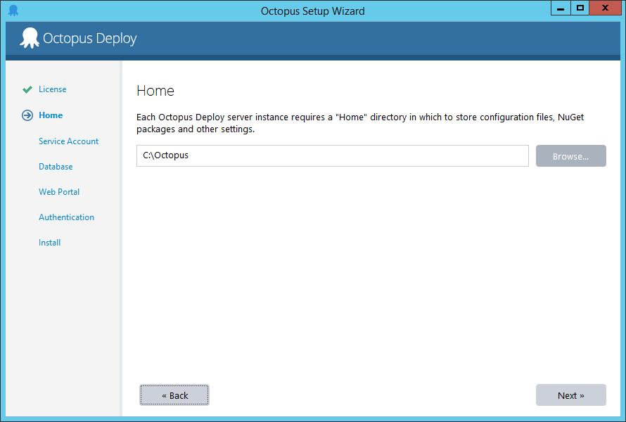
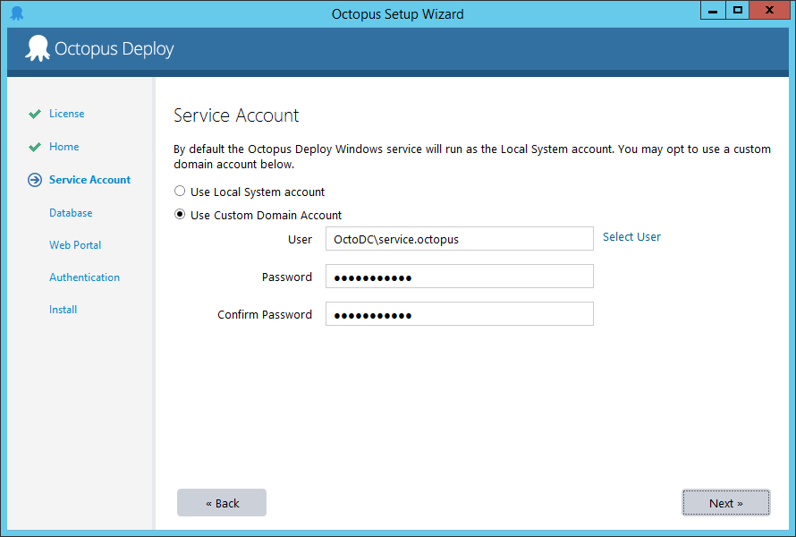
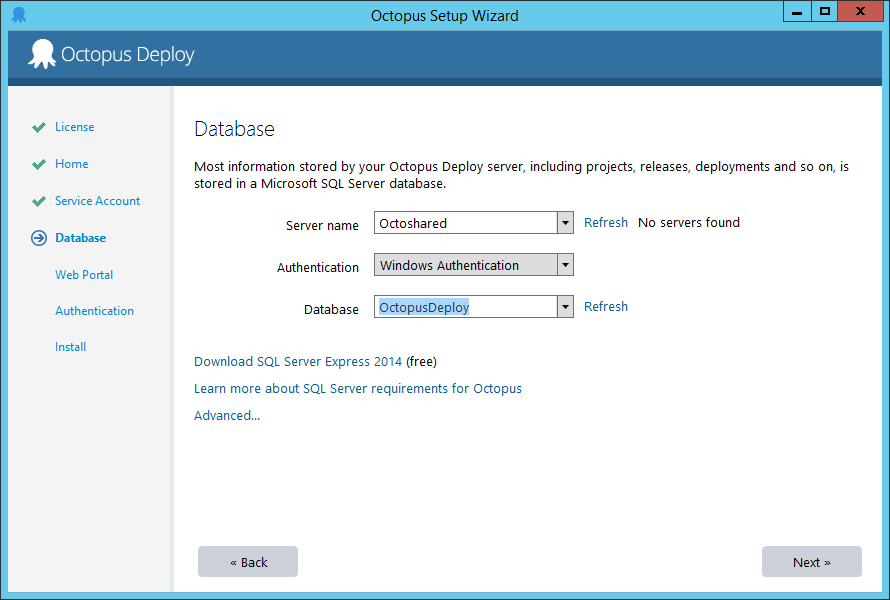
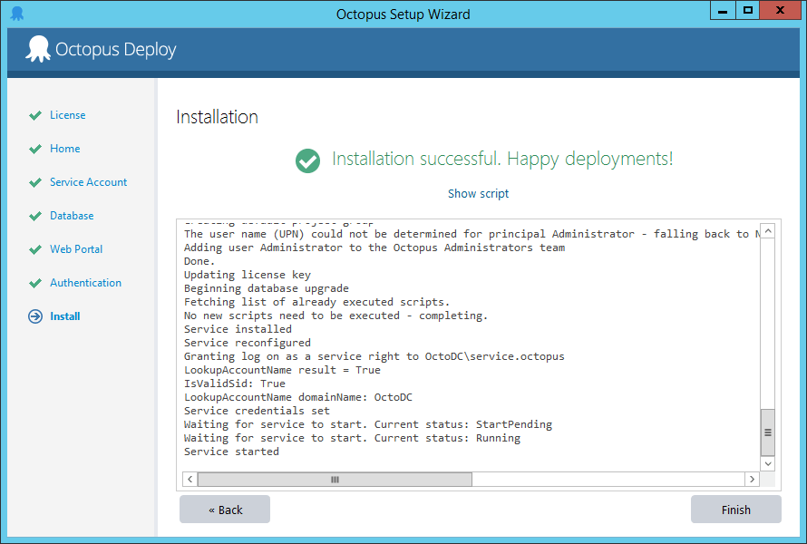
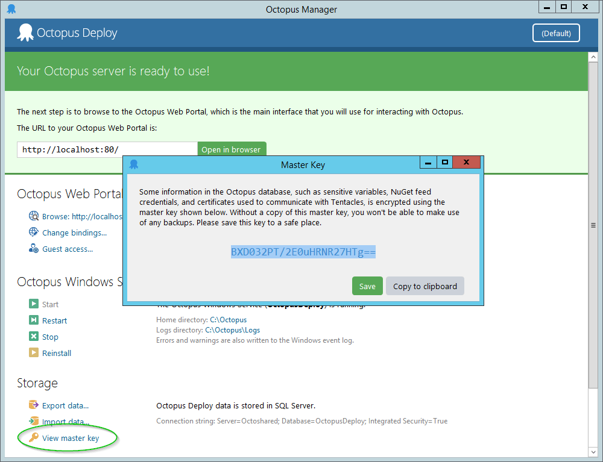
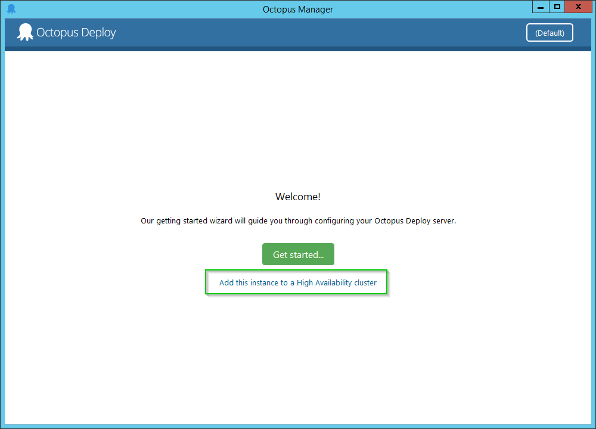
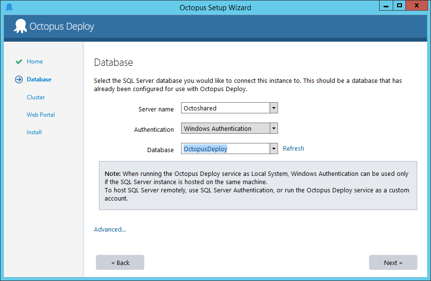
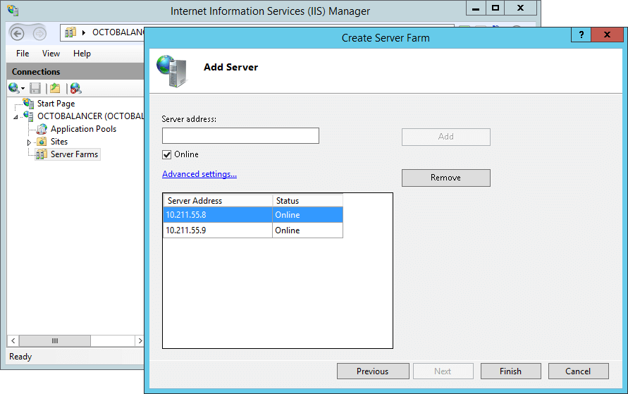

This section will walk through the different options and considerations for setting up Octopus: HA.

!toc

## Setting up Octopus: High Availability {#ConfiguringOctopusforHighAvailability-SettingupOctopus:HighAvailability}

This section will walk you through the different options and considerations for setting up Octopus: HA. For the sake of simplicity, the guide assumes that all of the servers are on-premises and are part of an Active Directory domain, as this is the most common configuration. Octopus: HA can work without the servers being part of an AD domain, but you'll need to vary the instructions accordingly.

:::hint
**Some assembly required**
While a single server Octopus installation is easy, Octopus: High Availability is designed for mission critical enterprise scenarios, and depends heavily on infrastructure and Windows components. At a minimum:

- You should be familiar with SQL Server failover clustering, or have DBAs available to create and manage the database
- You should be familiar with SANs or other approaches to sharing storage between servers
- You should be familiar with load balancing for applications
  :::

### Database {#ConfiguringOctopusforHighAvailability-Database}

Each Octopus Server node stores project, environment and deployment-related data in a shared Microsoft SQL Server database. Since this database is shared, it's important that the database server is also highly available.

From the Octopus perspective, how the database is made highly available is really up to you; to Octopus, it's just a connection string. We are not experts on SQL Server high availability, so if you have an on-site DBA team, we recommend using them. There are many [options for high availability with SQL Server](https://msdn.microsoft.com/en-us/library/ms190202.aspx), and [Brent Ozar also has a fantastic set of resources on SQL Server Failover Clustering](http://www.brentozar.com/sql/sql-server-failover-cluster/) if you are looking for an introduction and practical guide to setting it up.

Octopus: HA works with:

- SQL Server Failover Clustering (recommended)
- SQL Server AlwaysOn Availability Groups

Octopus: HA has not been tested with Log Shipping or Database Mirroring, and does not support SQL Server replication.

See also: [SQL Server Database requirements](/docs/installation/sql-server-database-requirements.md), which explains the editions and versions of SQL Server that Octopus supports, and explains the requirements for how the database must be configured.

Since each of the Octopus Server nodes will need access to the database, we recommend creating a special user account in Active Directory with **db\_owner** permission on the Octopus database, and using that account as the service account when configuring Octopus.

### Shared Storage {#ConfiguringOctopusforHighAvailability-SharedStorage}

Octopus stores a number of files that are not suitable to store in the database. These include:

- NuGet packages used by the [built-in NuGet repository inside Octopus](/docs/packaging-applications/package-repositories/index.md). These packages can often be very large.
- [Artifacts](/docs/deploying-applications/artifacts.md) collected during a deployment. Teams using Octopus sometimes use this feature to collect large log files and other files from machines during a deployment.
- Task logs, which are text files that store all of the log output from deployments and other tasks.

As with the database, from the Octopus perspective, you'll simply tell the Octopus servers where to store them as a file path within your operating system. Octopus doesn't really care what technology you use to present the shared storage, it could be a mapped network drive, or a UNC path to a file share. Each of these three types of data can be stored in a different place.

Whichever way you provide the shared storage, a few considerations to keep in mind:

- To Octopus, it needs to appear as a mapped network drive (e.g., `D:\`) or a UNC path to a file share (e.g., `\\server\path`)
- The service account that Octopus runs as needs **full control** over the directory
- Drives are mapped per-user, so you should map the drive using the same service account that Octopus is running under

#### Shared storage on-premises

The simplest way to provide shared storage, assuming the Octopus server nodes are part of the same Active Directory domain, is by creating a file share that each of the Octopus Server nodes can access. Of course, this assumes that the underlying directory is reliable, such as in a RAID array.

A better alternative is [Microsoft DFS](https://en.wikipedia.org/wiki/Distributed_File_System_(Microsoft)), or a SAN.

#### Shared storage in Microsoft Azure

If your Octopus Server is running in Microsoft Azure, you can use [Azure File Storage](https://docs.microsoft.com/en-us/azure/storage/files/storage-files-introduction) - it just presents a file share over SMB 3.0.

Once you have [created your File Share](https://docs.microsoft.com/en-us/azure/storage/files/storage-how-to-create-file-share)you can [mount the drive](https://docs.microsoft.com/en-us/azure/storage/files/storage-how-to-use-files-windows) for use by Octopus. Remember, drives are mounted per user. Make sure to map a persistent network drive for the user account the Octopus Server is running under.

#### Shared storage in Amazon AWS

If your Octopus Server is running in Amazon AWS you will need to configure your own file share using something like [Microsoft DFS](https://en.wikipedia.org/wiki/Distributed_File_System_(Microsoft)). Unfortunately [Amazon Elastic File System (EFS)](http://docs.aws.amazon.com/AWSEC2/latest/UserGuide/AmazonEFS.html) is not supported on Windows, and [Amazon Elastic Block Store (EBS) volumes](http://docs.aws.amazon.com/AWSEC2/latest/UserGuide/EBSVolumes.html) can only be mounted on a single instance.

### Octopus Server nodes {#ConfiguringOctopusforHighAvailability-OctopusServernodes}

With the shared storage and database provisioned, you can now set up each of the Octopus server nodes. An Octopus: HA configuration requires at least two nodes, and has been tested with up to four nodes.

:::hint
**Not a Windows cluster**
While multiple Octopus Server nodes form a logical "cluster" of servers, Octopus nodes do not require Windows Server Failover Clustering. They should be standalone servers.
:::

#### Configuring the first node {#ConfiguringOctopusforHighAvailability-Configuringthefirstnode}

On the first Octopus Server node, [download the Octopus Server MSI](https://octopus.com/downloads), and walk through the setup wizard. Use the Getting Started wizard to configure the first Octopus node:


The Octopus home directory is local to each specific node, and *should not be shared* between nodes. This is usually at `C:\Octopus`.



Since each node will use shared storage, ensure you use a custom service account that has permission to access the shared database:



Configure the shared SQL database:



Follow the rest of the setup guide, and install the first node.



Once the Octopus server has been configured, from Octopus Manager, copy the master key - you will need this to set up the additional nodes.



Finally, you need to tell Octopus to store artifacts, task logs and packages in the shared storage that you provisioned, that way each Octopus node can see the same files. To do this, you'll need to use the command line:

**Configure shared storage**

```powershell
Octopus.Server.exe path --artifacts \\Octoshared\OctopusData\Artifacts
Octopus.Server.exe path --taskLogs \\Octoshared\OctopusData\TaskLogs
Octopus.Server.exe path --nugetRepository \\Octoshared\OctopusData\Packages
```

(Note that all three paths are not required to be in the same file share(s))

This configuration is stored in the database, so you only have to perform this once - other nodes will read it from the database.

#### Configuring the second and additional nodes {#ConfiguringOctopusforHighAvailability-Configuringthesecondandadditionalnodes}

Once the first node has been created and started, you can add the additional nodes. Again, install the Octopus Server MSI, but instead of using the Getting Started wizard, use the link to add this server as a node for the cluster:



Connect to the same shared SQL database:



On the Cluster details page, enter the master key from the original node:


Complete the setup wizard. You'll now have a second node in the cluster!

### Load Balancer {#ConfiguringOctopusforHighAvailability-LoadBalancer}

When you configured the first Octopus server node, as well as each of the subsequent nodes, you would have configured the HTTP endpoint that the Octopus web interface is available on. The final step is to configure a load balancer, so that user traffic is directed between each of the Octopus server nodes.

Octopus can work with any load balancer technology, including hardware and software load balancers.

If you don't have a hardware load balancer available, an easy option is the [Application Request Routing module for IIS](http://www.iis.net/downloads/microsoft/application-request-routing). You can also use Apache or Nginx as a reverse load-balancing proxy.



## Migrating a Single Server to a High Availability setup {#ConfiguringOctopusforHighAvailability-MigratingaSingleServertoaHighAvailabilitysetup}

You may already have an existing Octopus Deploy server, that you wish to make highly available. The process for doing this is the same as the process above, except your existing server will be the "first node" in the cluster.

1. Provision the shared storage folder
2. Move the SQL Server database, if necessary
3. Use the `Octopus.Server.exe path` commands above to tell Octopus to use the shared storage folder
4. Move the existing task logs, packages and artifacts from the existing Octopus server node into the shared storage folders
5. Add the additional nodes and load balancer as required

## Configuring High Availability Polling Tentacles {#ConfiguringOctopusforHighAvailability-ConfiguringHighAvailabilityPollingTentacles}

Listening Tentacles require no special configuration for High Availability.  Polling Tentacles, however, poll a server at regular intervals to check if there are any tasks waiting for the Tentacle to perform. In a High Availability scenario Polling Tentacles must poll all of the Octopus Servers in your configuration. You could poll a load balancer but there is a risk, depending on your load balancer configuration, that the Tentacle will not poll all servers in a timely manner.  You could also configure the Tentacle to poll each server by registering it with one of your Octopus Servers and then adding each Octopus Server to the Tentacle.config file. There are two options to add Octopus servers, via the command line or via editing the Tentacle.config file directly:

**Tentacle.config**

Configuring the Tentacle via the command line is the preferred option with the command executed once per server; an example command using the default instance can be seen below:

```
C:\Program Files\Octopus Deploy\Tentacle>Tentacle poll-server --server=http://my.Octopus.server --apikey=API-77751F90F9EEDCEE0C0CD84F7A3CC726AD123FA6
```

For more information on this command please refer to the [Tentacle Poll Server options document](https://octopus.com/docs/api-and-integration/tentacle.exe-command-line/poll-server)

Alternatively you can edit Tentacle.config directly to add each Octopus server (this is interpreted as a JSON array of servers). This method is not recommended as the Octopus service for each server will need to be restarted to accept incoming connections via this method.

```xml
<set key="Tentacle.Communication.TrustedOctopusServers">
[
  {"Thumbprint":"77751F90F9EEDCEE0C0CD84F7A3CC726AD123FA6","CommunicationStyle":2,"Address":"https://10.0.255.160:10943","Squid":null,"SubscriptionId":"poll://g3662re9njtelsyfhm7t/"},
  {"Thumbprint":"77751F90F9EEDCEE0C0CD84F7A3CC726AD123FA6","CommunicationStyle":2,"Address":"https://10.0.255.161:10943","Squid":null,"SubscriptionId":"poll://g3662re9njtelsyfhm7t/"},
  {"Thumbprint":"77751F90F9EEDCEE0C0CD84F7A3CC726AD123FA6","CommunicationStyle":2,"Address":"https://10.0.255.162:10943","Squid":null,"SubscriptionId":"poll://g3662re9njtelsyfhm7t/"}
]
</set>
```

Notice there is an address entry for each Octopus Server in the High Availability configuration.

## Troubleshooting

### Octopus Server starts and stops again

Something has gone wrong and the Octopus Server has crashed. Look at the Octopus Server log to see what has gone wrong.

You may see a message in the Octopus Server logs like this:

```plain
Could not find a part of the path 'Z:\Octopus\TaskLogs'
```

This usually means the drive `Z:\` has not been mapped for the user account running the Octopus Server, or the mapping has not been persisted across sessions. Drives are mounted per-user, so you need to create a persistent mapping for the user account the Octopus Server is running under.

You may see a message in the Octopus Server logs like this:

```plain
Access to the path 'Z:\Octopus\TaskLogs' is denied
```

This usually means the user account running the Octopus Server does not have the correct permissions to the file share. Make sure this user account has full control over each of the folders. You may need to share permissions, and check the ACLs on the actual folders.

### Task logs are empty for certain deployments {#missing-task-logs}

Sometimes you go to a deployment and there are no steps displayed, and detailed logs are not available for the deployment. Sometimes refreshing your browser fixes it and the logs come back. The cause for this is when you have not configured [shared storage](#ConfiguringOctopusforHighAvailability-SharedStorage) correctly. The most common situation is when you have configured each node to use a folder on a local disk instead of a shared network location.

To fix this problem you should:

1. Plan some downtime for your Octopus HA cluster
2. Create shared storage as [described here](#ConfiguringOctopusforHighAvailability-SharedStorage)
3. Put your Octopus HA cluster into [Maintenance Mode](/docs/administration/maintenance-mode.md) after draining tasks from each node
3. Reconfigure your Octopus HA cluster to use the shared storage
4. Copy all of the files into the shared storage location - there shouldn't be any filename collisions since each node will generally run independent tasks
5. Bring yoour Octopus HA cluster back online

### Deployment artifacts are not available for certain deployments

This has the same root cause as missing task logs - [see above](#missing-task-logs).

### Packages in the built-in repository are not available for some deployments

This has the same root cause as missing task logs - [see above](#missing-task-logs).
