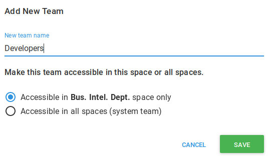
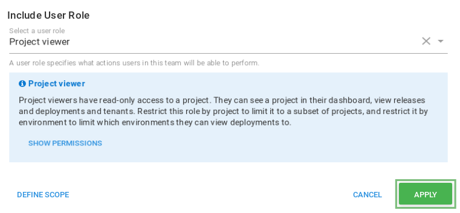
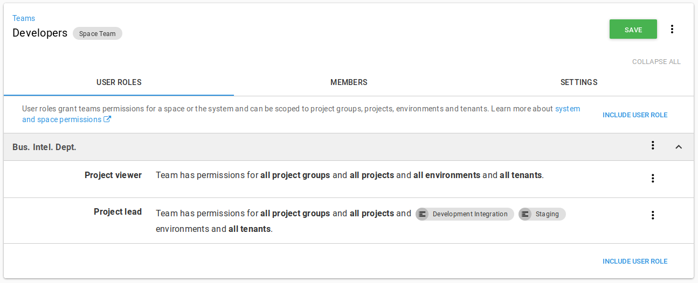
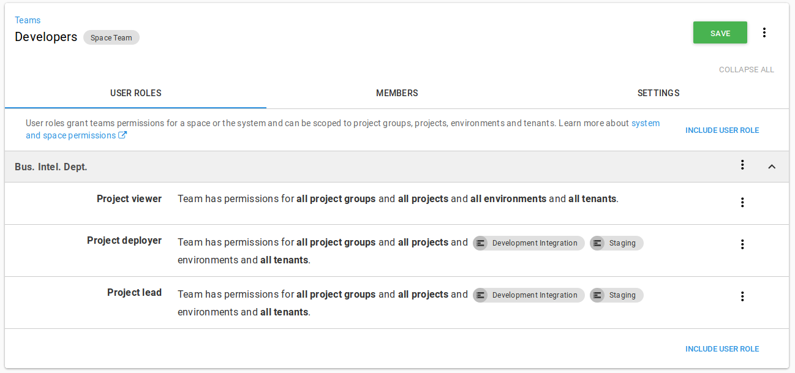

## Creating teams for users with mixed environment privileges in 2019.1 and later {#Creatingteamsforauserwithmixedenvironmentprivileges2019-1}

## Creating the "Developers" Team {#Creatingteamsforauserwithmixedenvironmentprivileges-Creatingthe&quot;Developers&quot;Team}

Start by clicking the **Teams** tab under **Configuration** in the Octopus Deploy web portal.  Then click **Add team**.

When you create the team, it is possible to change the visibility of the team to either:

 - Visible only within the space we are in.
 - Visible to all spaces.

For this example, we'll choose this team to only be visible in the space we are currently in.

Give the team an appropriate name like *Developers* and click **Save**.

## Add the Project Viewer Role for All Environments

We can now add the **Project viewer** role to all environments by clicking **Include user role** from the **User Roles** tab. This role provides read only access to deployment processes and releases. Because we will not provide any scoping for this role - this role will form the baseline permissions
for this team in any scope.

## Adding Additional Roles for a Subset of Environments

Since our goal is to give members of the Developers team the ability to create and deploy releases _in the Development and Staging environments only_, we can click **Include user role** again, this time adding the **Project lead** role. This role provides all the permissions of the **Project viewer** role as well as allowing a team member to create and deploy releases. This time, we will click on **Define Scope** and choose the environments that we would like to scope the role to, before hitting the **Apply** button.

We can repeat this process as many times as necessary to configure the team to your needs. The resulting team configuration screen should now display all of the different roles and their scopes so that you can review them.

When you are happy with these changes hit **Save** to make them effective.
