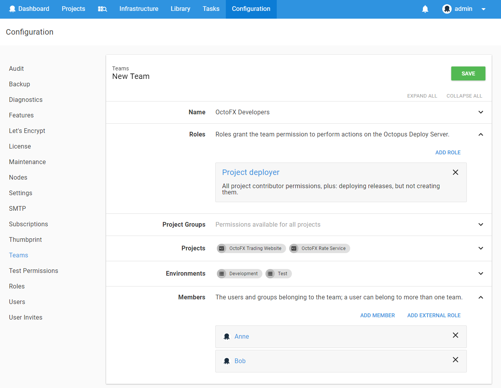

Octopus Deploy provides the most value when it is used by your whole team. Developers and testers might be allowed to deploy specific projects to pre-production environments, but not production environments. Stakeholders might be permitted to view certain projects, but not modify or deploy them. To support these scenarios, Octopus supports a permissions system based around the concept of **Teams**.

You can manage users from the **Users** tab under **Configuration** in the Octopus Deploy web portal.

You can manage teams from the **Teams** tab under **Configuration** in the Octopus Deploy web portal.

## User and Service accounts {#Managingusersandteams-UserandServiceaccounts}

**User accounts** are allowed to use both the Octopus web portal and the Octopus API, and can authenticate with a username and password, or [Active Directory credentials](/docs/administration/authentication-providers/active-directory-authentication.md), or an [Octopus API key](/docs/how-to/how-to-create-an-api-key.md).

[Service accounts](/docs/administration/managing-users-and-teams/service-accounts.md) are **API-only accounts** that should be used for automated services that integrate with Octopus Deploy, and can only authenticate with an [Octopus API key](/docs/how-to/how-to-create-an-api-key.md). For more information refer to our page dedicated to [Service accounts](/docs/administration/managing-users-and-teams/service-accounts.md).

:::success
You should create a different User account for each person that will use Octopus Deploy. You should create a different [Service account](/docs/administration/managing-users-and-teams/service-accounts.md) for each service that will integrate with Octopus Deploy.
:::

## Inviting users {#Managingusersandteams-Invitingusers}

To streamline the process of adding multiple users you can use the **User invites** feature to generate one or more unique registration codes bound to one or more existing teams. These links can then be issued to users so that they can register their own details and be giving automatic permissions for the team(s) the codes are bound to:

:::hint
Prior to version 4.0 this feature was accessed via the **Invite users** button on the **Users** page
:::

In the example above, we are generating codes for the **Octopus Administrators** team, so anyone who uses one of the codes will automatically join that team when they have completed registration.

:::warning
Invite codes are only valid for 48-hours aftering being generated, so make sure you issue them quickly before the expire.
:::

## Creating teams {#Managingusersandteams-Creatingteams}

You can add teams using the **Add Team** button. A team is a group of users, and being a member of a team gives those users certain roles, which can be scoped.

For example, we can create a team that gives Anne and Bob access to view projects and deploy them to pre-production environments:

In the example above, we've granted Anne and Bob the **Project deployer** role for the two OctoFX projects, but limited it to the pre-production environments - they won't have permission to deploy to Production.

## Roles {#Managingusersandteams-Roles}

Team members can be granted many different roles:

- **Project viewer**:
  Project viewers have read-only access to a project. They can see the project in their dashboard, view releases and deployments.
- **Project contributor**:
  Project viewer, plus: editing and viewing variables and deployment steps.
- **Project lead**: 
  Project contributor, plus: create releases (but not deploy them).
- **Project deployer**: 
  Project contributor, plus: deploying releases (but not creating releases).
- **Environment viewer**:
  View environments and their machines, but not edit them.
- **Environment manager**:
  View and edit environments and their machines.

Note that project leads can create releases but not deploy them, while project deployers can deploy releases but not create them - this allows you assign these permissions independently. If you need members to be able to both create and deploy releases, you can add both roles.

The roles assigned by a team can be scoped by project or environment.

:::hint
You can learn more about in our [User Roles documentation](/docs/administration/managing-users-and-teams/user-roles.md)
:::

## System teams {#Managingusersandteams-Systemteams}

Octopus Deploy comes with two built-in teams. The **Everyone** team always contains all users, but you can assign different roles to members of this Team (for example, you might allow everyone to view all projects and environments, but not edit anything). Out of the box, **Everyone** members can do nothing.

The second team is **Octopus Administrators.** Members of this team always have permission to do anything in Octopus. You can add or remove members from this team.
