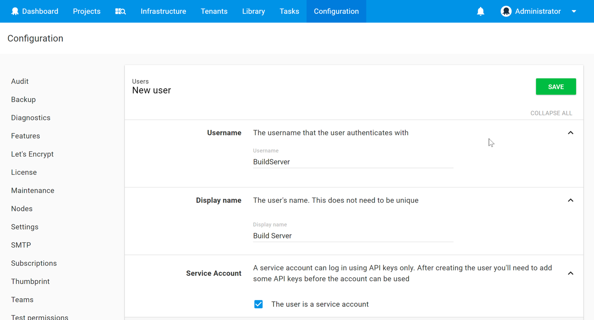

When using Octopus Deploy it is common to have other automated services control certain aspects of your deployments. Some examples:

- You might configure your [build server](/docs/octopus-rest-api/index.md) to push deployment packages to the built-in package feed, create releases, and deploy them to your test environment after each successful build.
- You might be deploying to an [elastic environment](https://octopus.com/blog/rfc-cloud-and-infrastructure-automation-support) and want to add/remove deployment targets dynamically via the [Octopus API](/docs/octopus-rest-api/index.md).
- You might have your own dashboard solution and want to get data directly from the [Octopus API](/docs/octopus-rest-api/index.md).

It is best to create **Service accounts** for this purpose to provide each service with the least privileges required for the tasks each service will perform.

:::hint
**Service accounts** are **API-only accounts** that can be assigned permissions in the same way you do for normal user accounts, but are prevented from using the Octopus Web Portal.
:::

:::success
Service accounts authenticate with the Octopus API using their [Octopus API Key](/docs/octopus-rest-api/how-to-create-an-api-key.md).
:::

## Creating a service account {#ServiceAccounts-Creatingaserviceaccount}

Creating a new Service account is very similar to creating a new User account:

1. Go to **{{Configuration,Users}}** and click **Create user**.
2. Check **The user is a service account** to indicate this will be a Service account.
3. Enter a unique **Username** and **Display name** so you can distinguish this Service account.
4. Save the user to create the Service account.

:::hint
This Service account is not very useful until it [belongs to one or more teams](/docs/administration/managing-users-and-teams/index.md), and has one or more [Octopus API keys](/docs/octopus-rest-api/how-to-create-an-api-key.md) associated with it
:::

Once you have created an [Octopus API key](/docs/octopus-rest-api/how-to-create-an-api-key.md) and [added this Service account to a team](/docs/administration/managing-users-and-teams/index.md), you can start using this Service account to automate Octopus with another service.

## Logins

As of **Octopus 3.17**, if you are using Active Directory there is also the option of using an Active Directory account's group membership to determine the service account's Team membership. To use this option all you need to do is add the Active Directory account as an external login entry for the service account.

