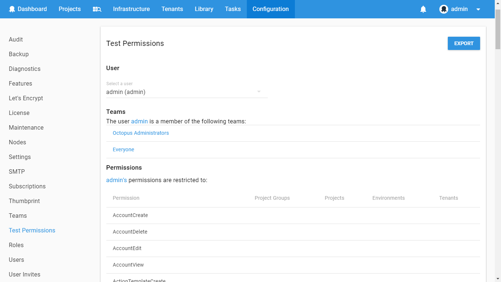

User Roles and group permissions play a major part in the Octopus security model. These roles are assigned to Teams and they dictate what the members of those teams can do in Octopus.

!toc

## Built-in User Roles {#UserRoles-Built-inUserRoles}

Octopus comes with a set of built-in User Roles that are designed to work for most common scenarios:

| User Role            | Description                              |
| -------------------- | ---------------------------------------- |
| Certificate Manager  | Certificate managers can edit certificates and export private-keys |
| Environment Manager  | Environment managers can view and edit environments and their machines. |
| Environment Viewer   | Environment viewers can view environments and their machines, but not edit them. |
| Package Publisher    | Permits packages to be pushed to the Octopus Server's built-in NuGet feed. |
| Project Viewer       | Project viewers have read-only access to a project. They can see a project in their dashboard, view releases and deployments. Restrict this role by project to limit it to a subset of projects, and restrict it by environment to limit which environments they can view deployments to. |
| Project Contributor  | All project viewer permissions, plus: editing and viewing variables, editing the deployment steps. Project contributors can't create or deploy releases. |
| Project Initiator    | All project viewer permissions, plus: create new projects. |
| Project Deployer     | All project contributor permissions, plus: deploying releases, but not creating them. |
| Project Lead         | All project contributor permissions, plus: creating releases, but not deploying them. |
| Space Manager        | Space managers can do everything within the context of the space they own. |
| System Administrator | System administrators can do everything at the system level.  |
| System manager       | System managers can do everything at the system level except certain system-level functions reserved for system administrators. |
| Tenant manager       | Tenant managers can edit tenants and their tags |

> For more information regarding the 'system or space level', please see [system and space permissions](./system-and-space-permissions)  

The built-in User Roles can be modified to contain more or less roles to suit specific needs. But instead of modifying the built-in ones, we recommend that you leave them as an example and instead create your own User Roles.

## Creating User Roles {#UserRoles-CreatingUserRoles}

A custom User Role can be created with any combination of permissions. To create a custom user role:

1. Under the **Configuration** page, click **Roles**.

   

2. Click **Add custom role**.

3. Select the set of permissions you'd like this new User Role to contain, and give the role a name and description. These can be system or space level permissions.

   

Once the custom role is saved, the new role will be available to be assigned to teams in Octopus. [Some rules apply](./system-and-space-permissions#SystemAndSpacePermissions-RulesOfTheRoad), depending on the mix of system or space level permissions you chose.

When applying roles to a team, you are able to optionally specify a scope for each role applied. This enables some complex scenarios, like granting a team [different levels of access](./creating-teams-for-a-user-with-mixed-environment-privileges) based on the environment they are authorized for.   

## Troubleshooting Permissions {#UserRoles-TroubleshootingPermissions}

If for some reason a user has more/fewer permissions than they should, you can use the **Test Permissions** feature to get an easy to read list of all the permissions that a specific user has on the Octopus instance.

To test the permissions go to {{Configuration,Test Permissions}} and select a user from the dropdown.

The results will show:

- The teams of which the user is a member of.
- A chart detailing each role and on which Environment/Project this permission can be executed. The chart can be exported to a CSV file by clicking the Export button. Once the file is downloaded it can viewed in browser using [Online CSV Editor and Viewer](http://www.convertcsv.com/csv-viewer-editor.htm).

If a user tries to perform an action without having enough permissions to do it, an error message will pop up showing which permissions the user is lacking, and which teams actually have these permissions.

:::warning
As further versions of Octopus are released, we might create new roles to improve our security model. These new roles will not be automatically included in any of the built-in User Roles, to avoid giving users permissions they are not supposed to have. These new roles will have to be added manually to a User Role by an administrator.
:::
