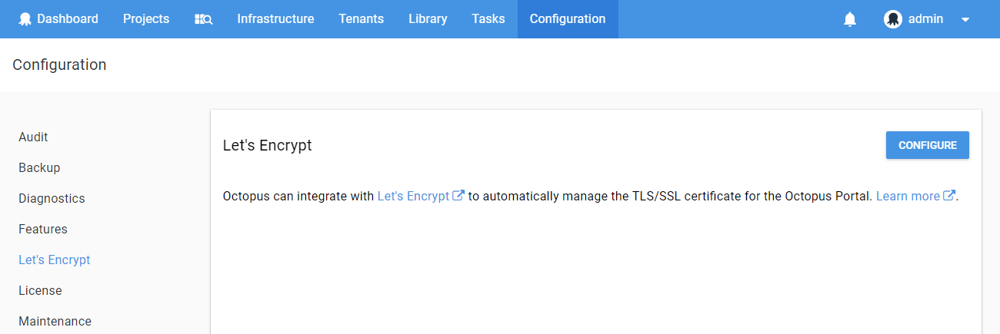

Let's Encrypt integration can be found under {{Configuration,Let's Encrypt}}.

To enable, click the `Configure` button.

Enter the DNS name that you want to have on the new SSL certificate. Do not enter a prefix such as `http://` or `https://`.

:::warning
The DNS name you enter must be publicly accessible from the internet (specifically the Let's Encrypt servers) over HTTP on port 80, so that Let's Encrypt can validate that you have control of this domain name. If your firewall has the ability, we recommend only allowing paths starting with `http://youroctopusserver.example.com/.well-known/acme-challenge/`.
:::

Once you have accepted the [Let's Encrypt Terms of Service](https://g.octopushq.com/LetsEncryptTermsOfService), and entered a registration email address, click the `Register` button.

:::hint
You do not have to create an account with Let's Encrypt to enable this integration. In fact, Let's Encrypt has no notion of user accounts.
:::

By default, Octopus will bind the new SSL certificate to `0.0.0.0`, which means all IP addresses on the machine. If you are running other sites on this machine, this will remove any other bindings. If this is the case, please enter the specific IP address to which you want the certificate bound.

If the Octopus Server is not currently listening on the binding/port, it will require a server restart to add the binding. This will generally only be required the first time round - when Octopus doesn't know about the HTTPS binding.b

Octopus will then register with Let's Encrypt, handle the domain validation, request a new certificate and apply it to the Portal. If need be, the server will be restarted. Once available, you will be able to access your server on the new HTTPS URL.

The {{Configuration,Let's Encrypt}} page will now show when the SSL certificate was last renewed, and when it is due to expire. Every 24 hours, Octopus will check the certificate, and will automatically renew if its due to expire in the next 21 days.
