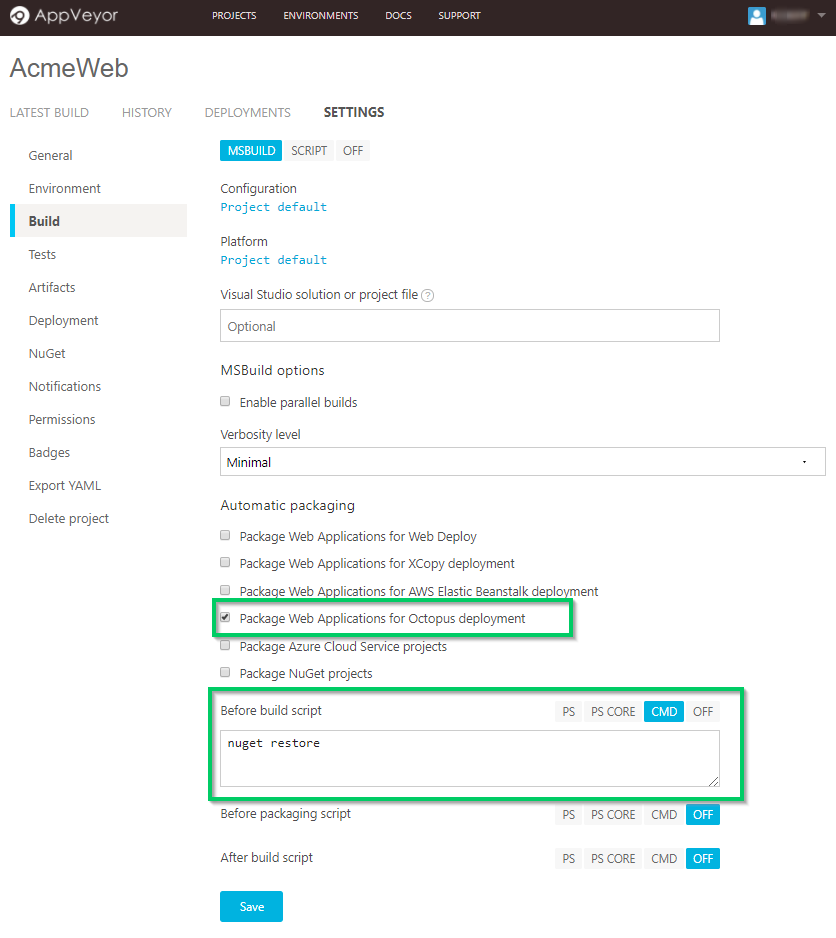
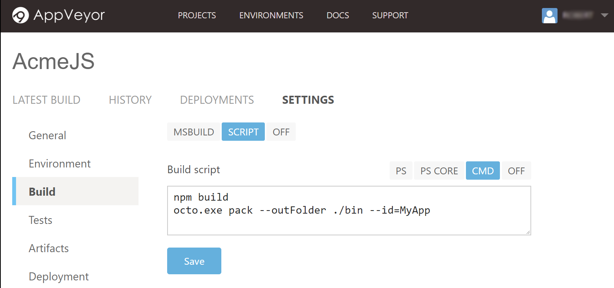
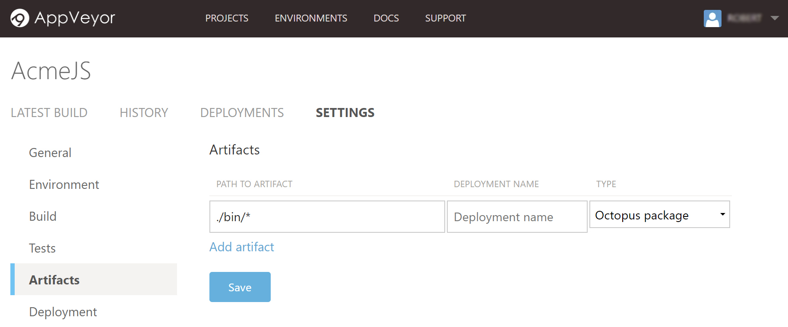

[AppVeyor](https://ci.appveyor.com) is a cloud-based continuous integration system that integrates natively with your source control and allows CI configuration files to live alongside your projects. This page will guide you through leveraging AppVeyor's build chain with Octopus Deploy's deployment capabilities.

## Configuring an AppVeyor Project for Octopus
Create a new AppVeyor project and use the Git repository `https://github.com/OctopusSamples/RandomQuotes-aspmvc4` as the source.

### Build Phase
Go to the Build page and add `nuget restore` to the `Before build script` command line input since AppVeyor will not perform this operation by default.

Under `Automatic Packaging` select `Package Web Applications for Octopus Deployment`. By ticking this box AppVeyor will run `octo.exe pack` after MSBuild has finished its `publish` command. _Keep in mind that since AppVeyor is doing a publish, some of the files that would usually be included by the [`OctoPack`](/docs/packaging-applications/creating-packages/nuget-packages/using-octopack/index.md) MSBuild target might not be included by default (this includes the various `web.*.config` files). To ensure these files are included in the package make sure they are configured to `Copy to Output Directory` is Visual Studio.



#### AppVeyor Environment Variables
| Variable Name       | Description|
| ------------- | ------- |
| OCTOPUS_PACKAGE_VERSION | Overrides the version in the package name. (default AppVeyor build version)|
| OCTOPUS_PACKAGE_NUGET | Overrides the package type. (default nupkg) |
| OCTOPUS_PACKAGE_ADVANCED | [Additional arguments](/docs/packaging-applications/creating-packages/nuget-packages/using-octo.exe.md) to pass to `octo.exe pack` |

#### Non-MSbuild Projects
AppVeyor have included `octo.exe` into the base Windows build VM and is available via the command line. If running a project _not_ using msbuild you can manually invoke the octo.exe pack command directly during the build phase.



If using this mechanism, you also need to flag the generated archive with AppVeyor that this file should be treated as an artifact of the build to be made available for subsequent steps. This can be done via the [Artifacts](https://www.appveyor.com/docs/packaging-artifacts/) page. You can simply provide a wildcard to pick up the dynamically generated package.



### Push To Octopus
With the build page configured, go to `Deployment` and select the new `Octopus Deploy` `Deployment Provider`. This provider will perform all the appropriate calls to push the package to the Octopus Server. Ensure that the provided Octopus `Server URL` addresses can be reached by the AppVeyor servers. If not using the on-premise offering of AppVeyor, this means the _Octopus Server must be accessible over the Internet_.


When you define an "Octopus package" in AppVeyor through the `Package Web Applications for Octopus Deployment` flag or `Artifacts` page, then AppVeyor will automatically select that package to push to your Octopus Server. Set the `Artifact(s)` field on the `Deployment` page if you have manually created an archive.

 If your Octopus Deploy project doesn't make use of [automatic release creation](/docs/deployment-process/releases/automatic-release-creation.md) or automatic lifecycle progression you can optionally trigger these actions from within the AppVeyor configuration providing the appropriate values in the inputs provided.
Unless overridden, the AppVeyor project name will be used in place of the Octopus project name when creating a release.

## Build Configuration in Code
AppVeyor provides another mechanism for providing the above configuration information and this is via an [appveyor.yml](https://www.appveyor.com/docs/appveyor-yml/) file contained in the repository source code. For the above configuration the yaml file is as simple as

```yml
version: 1.0.{build}
before_build:
- cmd: nuget restore
build:
  publish_wap_octopus: true
  verbosity: minimal
deploy:
- provider: Octopus
  push_packages: true
  create_release: true
  deploy_release: false
  server: https://myoctopus.acme.corp
  api_key:
    secure: 8PgmblIvjjj7jr4ZxOdZ9ADT+PeBCF6+PqRcf6PZ4A=
  project: AcmeWeb
  deploy_wait: false
```

Storing the configuration with the source code is a great way to version the build process however it is work noting that when AppVeyor detects a `appveyor.yml` file in the source code, any configuration in the portal will be ignored. Although you can continue to update the configuration via the portal, this will have no effect unless you remove the yaml file or configure the project to explicitly ignore it.

## Further Information
For more in-depth information about using AppVeyor, we would recommend checking out their [docs](https://www.appveyor.com/docs/).
