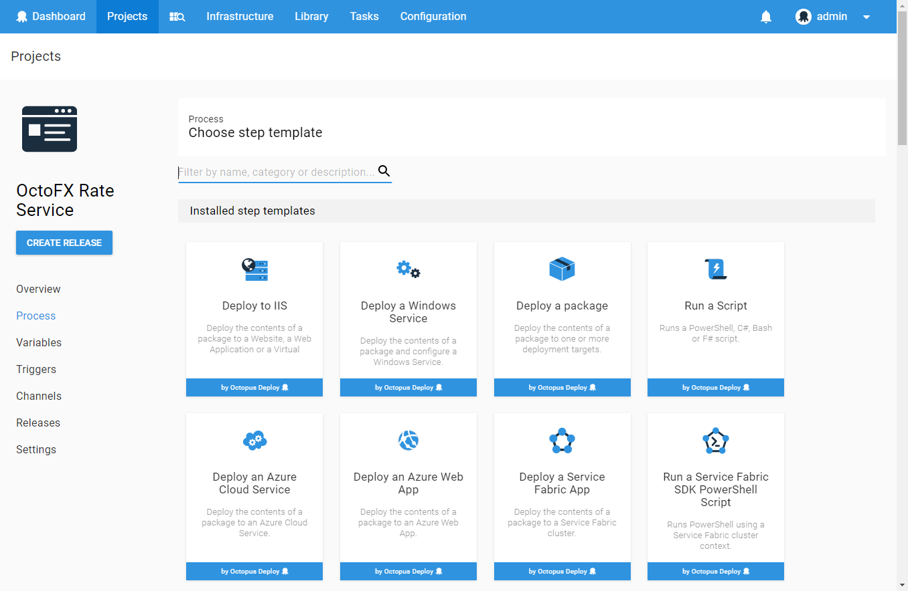
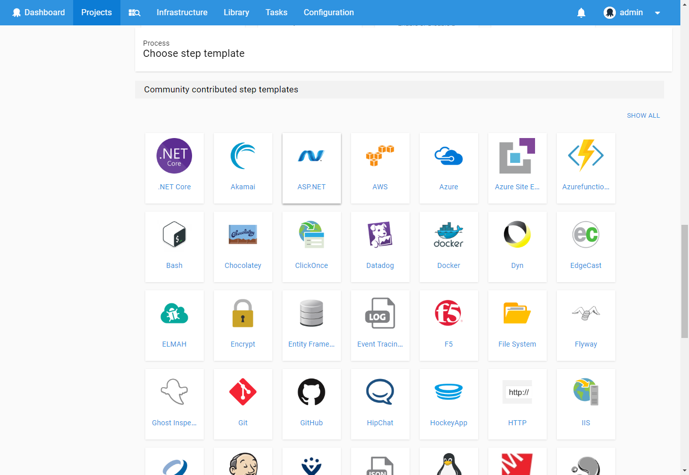
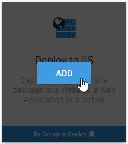
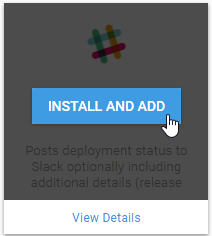
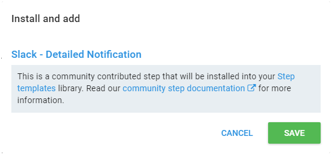
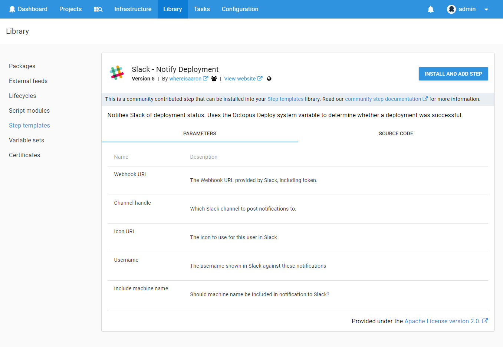
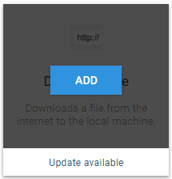

Octopus strives to make it quick and easy to define your project's deployment process.  Selecting the add step button displays a list of built-in steps, custom step templates as well as any community contributed step templates available to install.  Built-in steps are powerful and flexible to handle the most common deployment scenarios.  Octopus community library integration makes it easy to find steps templates that work with the frameworks and technologies you use without the need for custom scripting.  And finally, custom step templates enable you to encapsulate common steps/scenarios within your team or company.  This process also applies to child steps that are a part of a [rolling deployment](/docs/patterns/rolling-deployments.md).

:::hint
Octopus community step templates integration is enabled by default but this can be changed in the **Features** tab in the **Configuration** area. For more information, see [Octopus community step templates integration](/docs/administration/octopus-community-step-templates-integration.md).
:::

:::success
The [Community Library](http://library.octopusdeploy.com/) is an open source [repository](https://github.com/octopusdeploy/library/) of community contributed step templates automating a diverse set of actions.  If you still don't find what your looking for, don't forget: Octopus can do anything, as long as you can script the instructions. Maybe you could [contribute](https://github.com/OctopusDeploy/Library/blob/master/CONTRIBUTING.md) your scripts back to the community?
:::

:::hint
Prior to Octopus 3.7, selecting the add step button showed a popup list of built-in steps and any installed step templates (community contributed or custom).  Installing a community step required visiting the [Community Library](http://library.octopusdeploy.com/) and importing the step manually.  For more information, see [step templates](/docs/deploying-applications/step-templates/index.md).

:::

## Adding an installed step {#Addingsteps-Addinganinstalledstep}

The add step page displays the built-in steps first which includes common steps to deploy IIS web sites, windows services, run scripts and more.  The built-in steps have been develop by the Octopus team to handle the most common deployment scenarios and it also.  This section also includes any custom [step templates](/docs/deploying-applications/step-templates/index.md) added in the library.  Hover over a step and click add step to go configure the step.

## Adding a community contributed step templates {#Addingsteps-Addingacommunitycontributedsteptemplates}

The add step page also displays community contributed step templates available to install and add.  You can search for a specific template or you can browse through the categories.  Installing a community step template is easy.  Hover over a step and select Install and add step.  This will display a pop-up dialog where you can confirm to install and add the step.  This will take you to the configuration page for the step template.

If you select view details, this will take you to the community step details page which shows you the complete details of the step include the source code.  You can install the step or go back to the list of steps.

## Adding an updated version of a community step template {#Addingsteps-Addinganupdatedversionofacommunitysteptemplate}

Sometimes updates are available for step templates.  In this case, you will notice the step template has an option to update the step.  If you select update, this will take you to the community step details with the option to update the latest version of the step template.  Community step templates can also be updated in the library as needed.

