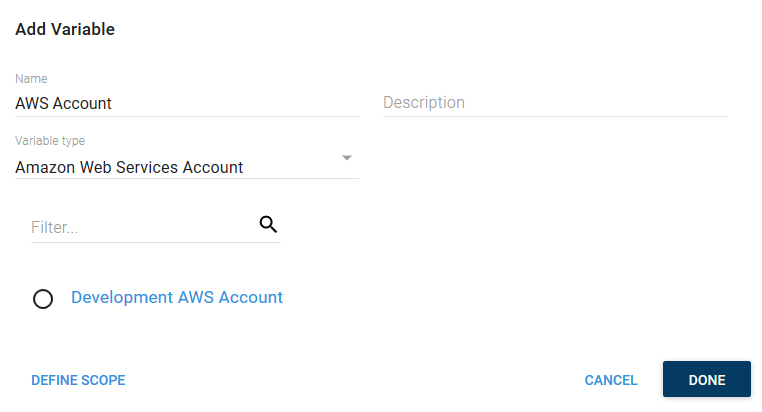
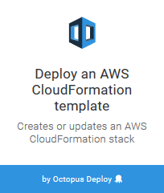
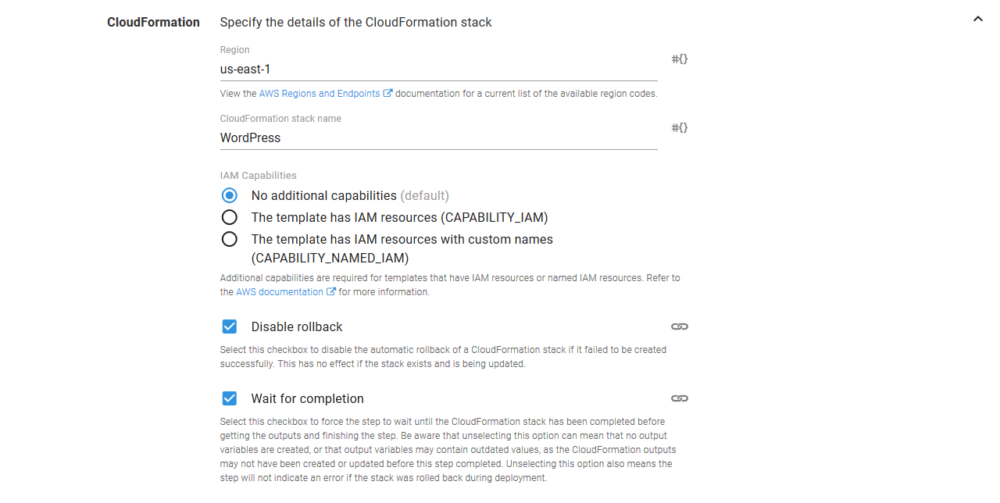
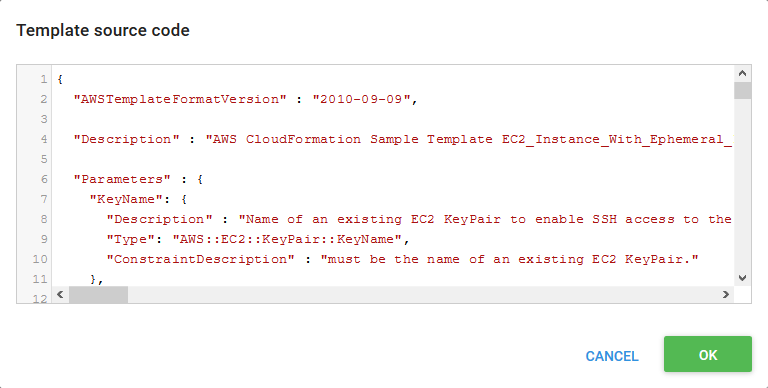
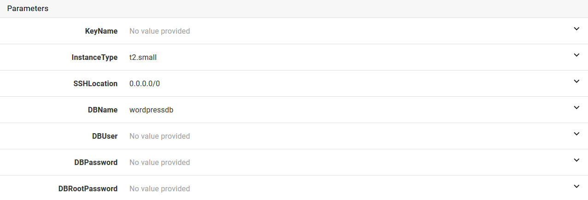
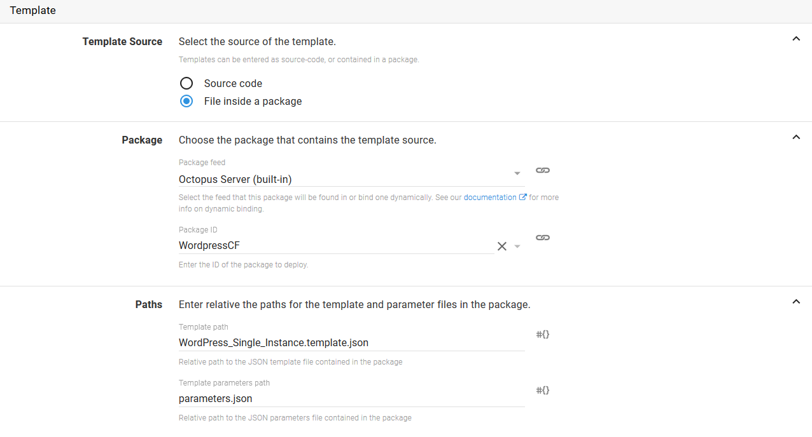

Octopus supports the deployment of AWS CloudFormation templates through the `Deploy a CloudFormation Template` step. This step executes a CloudFormation template using AWS credentials managed by Octopus, and captures the CloudFormation outputs as Octopus output variables.

The proceeding instructions can be followed to configure the `Deploy a CloudFormation Template` step.

## Create an AWS Account

AWS steps can use an Octopus managed AWS account for authentication. This account must first be created under {{Infrastructure>Accounts}} by clicking the `ADD ACCOUNT` button in the `Amazon Web Services Account` section.

::hint
AWS steps can also defer to the IAM role assigned to the instance that hosts the Octopus server for authentication. In this scenario there is no need to create the AWS account.
:::

And AWS account requires a `Name`, the `Access Key` and the `Secret Key`.

Clicking the `SAVE AND TEST` button will verify that the credentials are valid.

## Create a AWS Account Project Variable

AWS accounts are included in a project through a project variable of the type `Amazon Web Services Account`.

TODO: This check this wording

The `Add Variable` window is then displayed and lists all the AWS accounts, as well as an account called `Role Assigned to the AWS Instance Executing the Deployment`.

The `Role Assigned to the AWS Instance Executing the Deployment` account can be selected to defer to the IAM role that is assigned to the AWS EC2 instance where the deployment is executed from. This means no AWS credentials need to be stored by Octopus.

Because CloudFormation deployments are performed on the Octopus server today, the Octopus server must be installed on an EC2 instance that has an IAM role assigned to it in order to take advantage of the `Role Assigned to the AWS Instance Executing the Deployment` account.

:::hint
In future it is expected that AWS steps will be deployed from worker instances that can be hosted on separate EC2 instances with IAM roles assigned to them. This will make the `Role Assigned to the AWS Instance Executing the Deployment` account more flexible and powerful.
:::

Select the account that was created in the previous step to assign it to the variable.

## Add the CloudFormation Step

Add the `Deploy a CloudFormation template` step to the project, and provide it a name.

### AWS Section

Select the variable that references the account variable under the `AWS Account` section.

The supplied account can optionally be used to assume a second role. This can be used to run the AWS commands with a role that limits the services that can be affected.

### Template Section

Under the `CloudFormation` section, the AWS region and stack name need to be defined.

You can also optionally wait for the stack to complete before finishing the step by selecting the `Wait for completion` checkbox.

:::hint
Unselecting the `Wait for completion` checkbox will allow the step to complete once that CloudFormation process has been started. However Unselecting the option does mean that the output variables may be missing or outdated, because they will be read before the stack is finished deploying. It also means that the step will not fail if the CloudFormation deployment fails.
:::

### Template Section

The CloudFormation template can come from two sources: directly entered source code or from files in a package.

#### Source Code

The first option is to paste the template directly into the step. This is done by selecting the `Source code` option, and clicking the `ADD SOURCE CODE` button.

This will present a dialog in which the CloudFormation template can be pasted, in either JSON or YAML.

Once the `SAVE` button is clicked, the parameters defined in the template will be shown under the `Parameters` section.

#### Package

The second option is to reference a CloudFormation template and properties file from a package. This is done by selecting the `File inside a package` option, specifying the package, and the supplying the name of the template file (which can be a JSON or YAML file), and optionally the path to the parameters file (which [only supports JSON](https://github.com/aws/aws-cli/issues/2275)).

## Error Messages

The AWS deployment steps include a number of unique error codes that may be displayed in the output if there was an error. Below is a list of the errors, along with any additional troubleshooting steps that can be taken to rectify them.

### AWS-CLOUDFORMATION-ERROR-0001
CloudFormation stack finished in a rollback state. Commonly this occurs because the AWS account configured to run the CloudFormation deployment did not have the correct permissions, or because some required variables were missing or invalid.

The last `Status Reason` from the stack events is displayed in the Octopus logs, but you can find more information about the error in the AWS CloudFormation console under the Events section for the stack.

In the screenshot below you can see that the specified instance type could only be used in a VPC, triggering the rollback.

