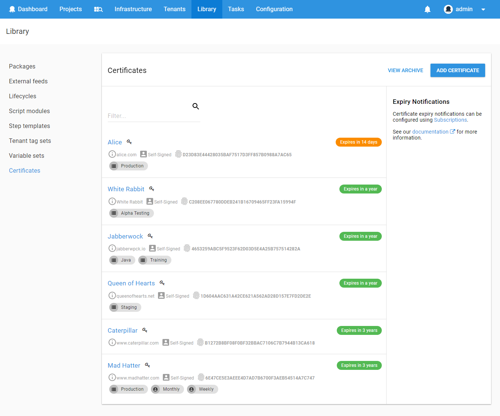
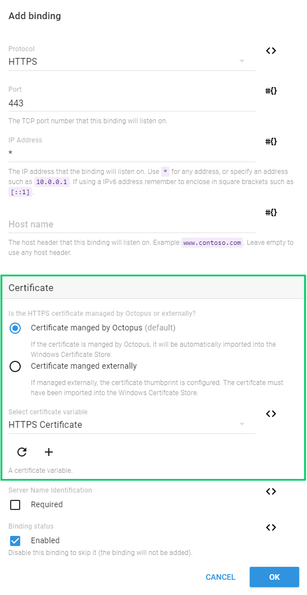

X.509 certificates are a key component of many deployment processes. Octopus Deploy provides the ability to securely store and manage your certificates, and easily use them in your Octopus Projects.  

## Securely Store Certificates and Private-Keys 

- [Add certificate](add-certificate.md)
- [Replacing certificates](replace-certificate.md)
- [Archiving and deleting certificates](archiving-and-deleting-certificates.md)
- [Exporting certificates](export-certificate.md)

## Configure Subscriptions for Expiry Notifications 

[Octopus Subscriptions](/docs/administration/subscriptions.md) can be used to configure notifications when certificates are close to expiry or have expired. 

There is a "Certificate expiry events" event-group, and three events:  

- Certificate expiry 20-day warning  
- Certificate expiry 10-day warning  
- Certificate expired

## Import Certificates into the Windows Certificate Store  

Certificates can be imported to Windows Certificate Stores as part of a deployment process using the [Import Certificate Deployment Step](/docs/deploying-applications/certificates/import-certificate-step.md)

## Use certificates for HTTPS bindings when deploying IIS Websites   

When configuring HTTPS bindings for [IIS Websites](/docs/deploying-applications/iis-websites-and-application-pools.md), a certificate can be configured either by:
- entering the thumbprint directly (this assumes the certificate has already been installed on the machine) 
- selecting a certificate-typed variable (this will automatically install the certificate)

## Create Certificate-Typed Variables 

Certificates managed by Octopus can be configured as the [value of variables](/docs/deploying-applications/variables/certificate-variables.md), and used from custom deployment scripts.

