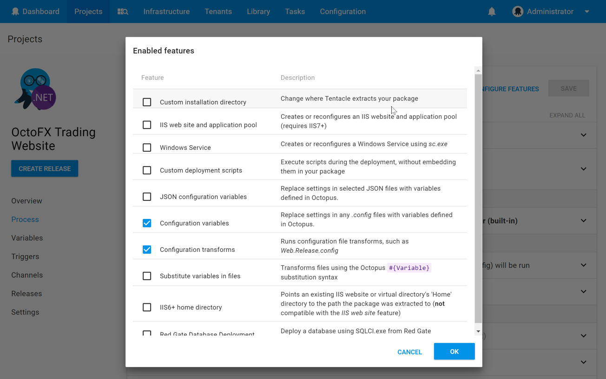

When defining your [deployment process](/docs/deploying-applications/index.md), the most common step type will be a package step. This step type allows you to deploy an [application that you have packaged](/docs/packaging-applications/index.md) onto one or more [Tentacles](/docs/infrastructure/windows-targets/index.md).

The process of deploying a package looks approximately like this:

1. Acquire the package as optimally as possible (local package cache and [delta compression](/docs/deploying-applications/delta-compression-for-package-transfers.md))
1. Create a new folder for the deployment (which avoids many common problems like file locks and leaving stale files behind)
    - Example: `C:\Octopus\Applications\[Tenant name]\[Environment name]\[Package name]\[Package version]\` where `C:\Octopus\Applications` is the Tentacle application directory you configured when installing Tentacle)
1. Extract the package into the newly created folder
1. Execute each of your [custom scripts](/docs/deploying-applications/custom-scripts/index.md) and the [deployment features](/docs/deploying-applications/index.md) you've configured will be executed to perform the deployment [following this order by convention](/docs/reference/package-deployment-feature-ordering.md).
1. [Output variables](/docs/deploying-applications/variables/output-variables.md) and deployment [artifacts](/docs/deploying-applications/artifacts.md) from this step are sent back to the Octopus Server

:::hint
**Package deployment feature ordering**
Each part of a package step is [executed in a specific order](/docs/reference/package-deployment-feature-ordering.md) by the open-source [Calamari project](https://github.com/OctopusDeploy/Calamari) to enable more complex deployment scenarios.
:::

## Adding a package step {#Deployingpackages-Addingapackagestep}

When adding a step to your deployment process, choose the **Deploy a Package** option. For more information, see the [add step](/docs/deploying-applications/adding-steps.md) section.

When deploying a package you will need to select the machine role that the package will be deployed to. You will also be asked to select the [feed](/docs/packaging-applications/package-repositories/index.md) that is the source of the package, and the ID of the package to deploy.

:::hint
**Variable Package Feed and/or Package ID**
You can dynamically select a Package Feed and/or the Package ID at deployment time using an Octopus variable expression. Learn more about [using dynamically selecting packages at deployment time](/docs/deploying-applications/deploying-packages/dynamically-selecting-packages.md).
:::

:::hint
When multiple machines are in the role you select, Octopus deploys to all of the machines in parallel. If you need to change this behavior, you can [configure a rolling deployment](/docs/patterns/rolling-deployments.md).
:::

## Configuring features {#Deployingpackages-Configuringfeatures}

Octopus is built to make it easy to deploy .NET applications, and contains a number of useful built in *features* that can be enabled on NuGet package steps.

You can enable or disable features by clicking **Configure features**.

For more details on some of the features, see the topics below.

- [Configuration files](/docs/deploying-applications/configuration-files/index.md)
- [Windows Services](/docs/deploying-applications/windows-services.md)
- [IIS Websites and Application Pools](/docs/deploying-applications/iis-websites-and-application-pools.md)
