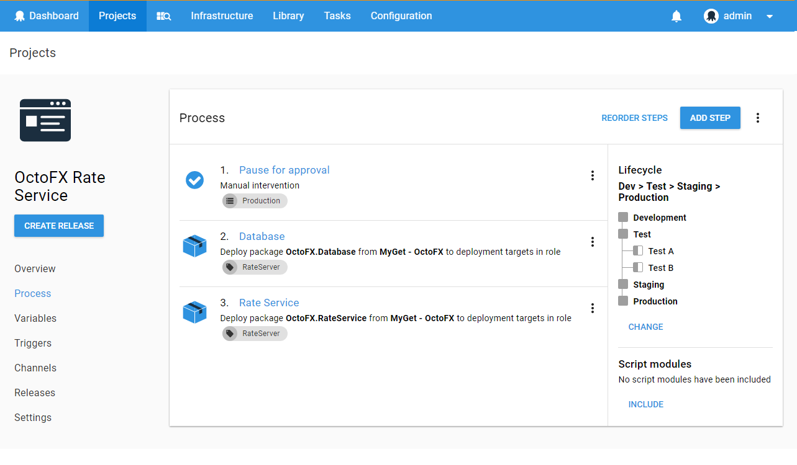
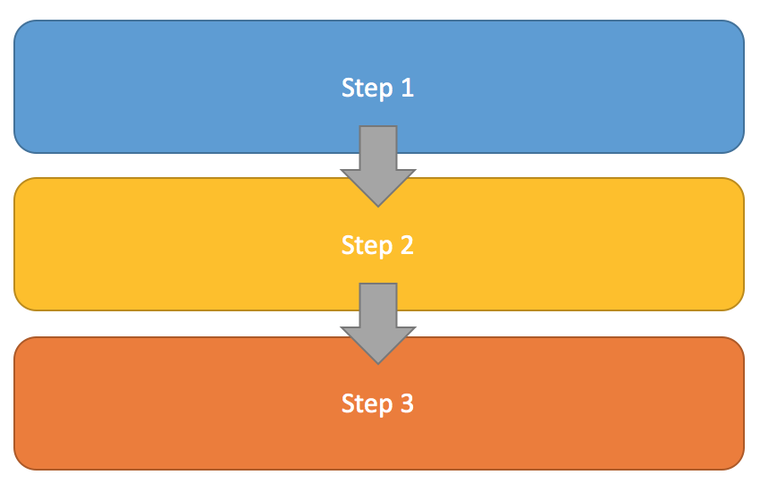
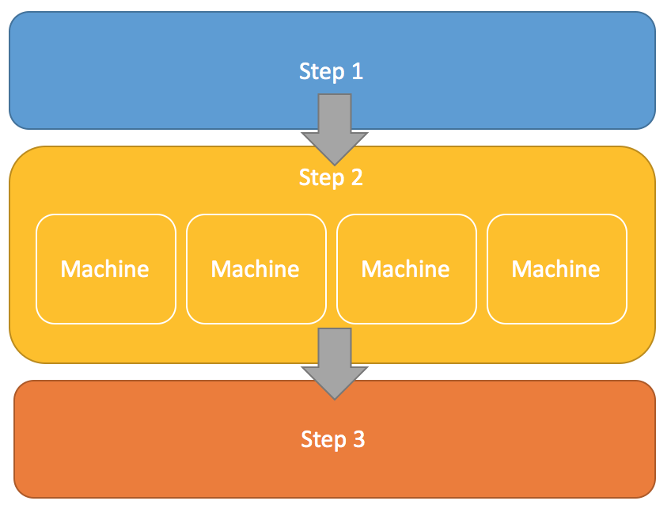

## Deployment Process {#Deployingapplications-Deploymentprocess}

Each project has a **deployment process**, which can be found on the **Process** tab of the project in the Octopus web portal. The deployment process is like a recipe. It defines the set of instructions that will be run repeatably each time the project is deployed. The deployment process can have one or more steps, and the steps can be ordered using the **Reorder steps** link.

  

:::hint
By default, the list of steps in a deployment process are run sequentially, one after another.

  
Also by default, a step that is configured to execute across multiple deployment targets will execute across all of those deployment targets in parallel.

For more information, see the section on [simple and advanced deployment processes](/docs/key-concepts/projects/deployment-processes.md) and [rolling deployments](/docs/patterns/rolling-deployments.md).
:::

### Adding Steps {#Deployingapplications-Addingsteps}

Steps can be added to the deployment process using the **Add step** button. There are many different types of steps supported by Octopus and we are adding more specific steps all the time. For more information, see the [add step](/docs/deploying-applications/adding-steps.md) section.

:::success
If a step you want isn't built-in you should check out the community contributed [step templates](/docs/deploying-applications/step-templates/index.md). If you still don't find it, don't forget: *Octopus can do anything, as long as you can script the instructions*. Maybe you could contribute your scripts back to the community?
:::

## Common Step Properties {#Deployingapplications-Commonstepproperties}

All steps have a name, which is used to identify the step.

:::success
**What&#39;s in a Name?**
Be careful when changing names! Octopus commonly uses names as a convenient identity or handle to things, and the steps and actions in a deployment process are special in that way. For example you can use [output variables](/docs/deploying-applications/variables/output-variables.md) to chain steps together, and you use the name as the indexer for the output variable. For example: `#{Octopus.Action[StepA].Output.TestResult}`
:::

### Conditions {#Deployingapplications-Conditions}

Steps can also have conditions. You can restrict a step so that it only runs when deploying to specific [environments](/docs/key-concepts/environments/index.md) (e.g., an Email step that only runs on production deployments).

If you have created some [channels](/docs/key-concepts/projects/channels.md), you can also specify whether a step runs only when deploying a release through specific channels (e.g., a Script step that only runs for deployments through certain channels to configure extra telemetry). *This will only appear if you have created one or more non-default channels.*

You can also specify whether a step runs only when previous steps are successful (default), when a previous step fails, or always.

:::success
You can achieve very complex deployment processes in Octopus by leveraging advanced concepts like parallel execution of steps and rolling deployments. Learn more about [simple and complex deployment processes](/docs/key-concepts/projects/deployment-processes.md).
:::

