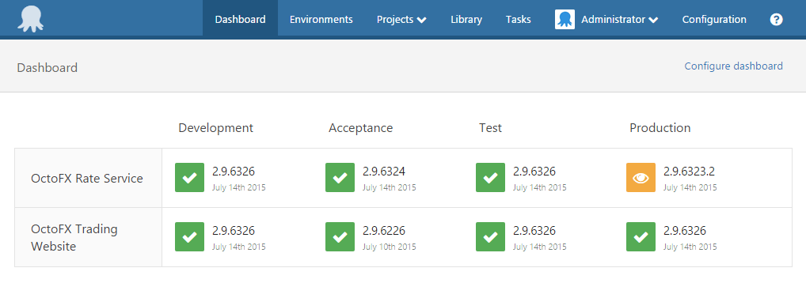

A project is a collection of deployment steps and configuration variables that define how your software is deployed.

## Creating Projects

The first time you navigate to the **Projects** area of the **Octopus Web Portal** you have the option to either **ADD GROUP** or **ADD PROJECT**.

### Projects

To add your first project, select **ADD PROJECT**. 

We recommend using a meaningful name and description.

Under the **Advanced Settings** you can specify a **Project Group** and the [Lifecycle](docs/deploying-applications/deployment-process/projects/lifecycles/index.md).

If you have existing projects you can *Disable*, *Clone*, or *Delete* the project from the project's settings.

Cloning a project will copy the deployment process and variables but not the release history of the project being cloned.

### Project Groups

Project groups are a way of organizing your projects.

When you create a project group, we recommend using a meaningful name and adding a description.

After you have created a project group there are a number of ways you can add projects to the group:

1. Click **ADD PROJECT** from the group's section of the **Projects** page. 
1. Edit an existing project by navigating to the project, selecting **Settings** and editing the **Project Group**.
1. Specify the **Project Group** under **Advanced Settings** when you create a new project.

Any projects and project groups you create will be accessible from the projects page. If a project group does not have any projects associated with it, click *SHOW EMPTY GROUPS* to reveal the group.

## Project Permissions {#Projects-Projectpermissions}

You can control who has access to view or edit environments, as well as who has access to deploy to environments, by assigning users to Teams and assigning roles to those teams. For more information, see the section on [managing users and teams](/docs/administration/managing-users-and-teams/index.md).

## Do I Need One or Many Projects?  {#Projects-DoIneedoneormanyprojects?}

It can be hard to decide whether to create lots of single-step projects in Octopus, or one big project. Here are two rules of thumb that may help:

- If the packages are delivered by different teams, or have different release schedules and deadlines, use separate projects
- If the packages are always deployed at the same time, and there is good communication between the teams developing them (or they are the same team), use a single project

**Example: OctoFX**

For example, the OctoFX example organization might be split into two delivery teams. One team builds a currency rate service, and another team builds the online trading website. Each team works to different deadlines and release schedules. For them, it makes sense to use two separate projects:

Alternatively, there may only be one team, who work on both the rate service and the trading website together. When a new version of the product is released, they will always deploy both at the same time. In this example, it makes sense to use a single project, with multiple steps:

