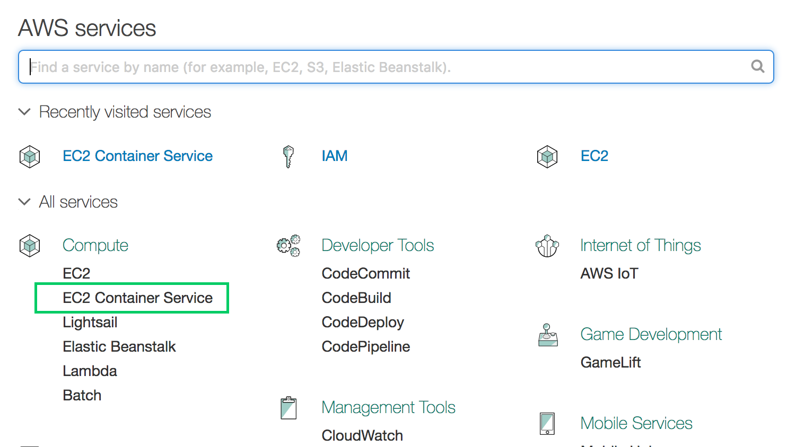

#Amazon - EC2 Container Service#

AWS provides a v2 image registry and is available through their [EC2 Container Serivice](https://aws.amazon.com/ecs/) offering. 

From their Services dashboard go to `EC2 Container Service`.

 

Under the `Repositories` area you need to create a repository to match the what in Octopus-speak would be the PackageId. This should map to your distinct application image. If you attempt to push an image during your build process to this registry without first createing the corresponding repository you will be an receive an error.


Take note of the Repository URI, this will provide you with the path that you need to add into the Octopus Deploy Docker Feed. In the example above we can see that the URI for the `mypackage` repository is `96802670493.dkr.ecr.ap-southeast-1.amazonaws.com/mypackage`. In this case we can drop the repository name and just provide Octopus with the `HTTPS` address `https://96802670493.dkr.ecr.ap-southeast-1.amazonaws.com`. 

To get the credentials for an AWS container instance you will need to invoke a command via the aws cli. Details for setting this up can be found in the [aws installation guides](http://docs.aws.amazon.com/cli/latest/userguide/installing.html). With the cli installed, run (with the appropriate region)
```
aws ecr get-login --region ap-southeast-1
```
and it will return the credentials you will need to authenticate your Docker Engine client with the AWS registry. e.g.
```
docker login -u AWS -p AQECAHid...j/nByScM -e none https://96802670493.dkr.ecr.ap-southeast-1.amazonaws.com
```
These are also the credentials that are needed by Octopus Deploy to access the exposed API (which are passed to your Docker Engine at deploy time). Take the username and password provided in this command and provide them to Octopus Deploy in your feed configuration.


Save and test your registry to ensure that the connection is authorised successfully.

:::warning
**AWS EC2 Container Service logins only last 12 hours**
As noted in the AWS [registry documentation](http://docs.aws.amazon.com/AmazonECR/latest/userguide/Registries.html) the token that is returned in the above `get-login` command is only valid for 12 hours. This means that you will more than likely need to reset these credentials often. At the moment there is no first class support to automatically  retrieve and update these credentials in Octopus Deploy.
:::

Further links for getting your AWS registry set up are available in their [online docs](http://docs.aws.amazon.com/AmazonECR/latest/userguide/what-is-ecr.html)