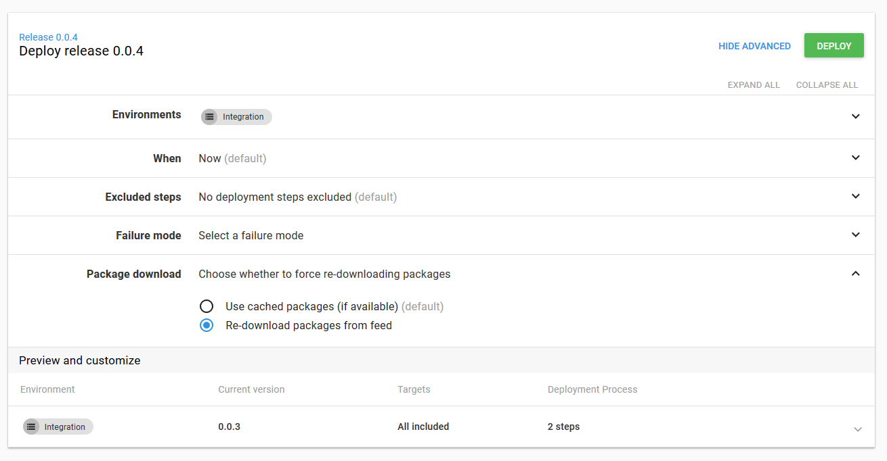

Maven repositories can be configured as an external feed, allowing the artifacts contained in the repository to be consumed by the Octopus steps that deploy Java packages, as well as the generic `Transfer a package` step.

## Adding an External Maven Feed

The following steps can be followed to add an external Maven feed.

1. Select {{Library>External feeds}} and click the `ADD FEED` button.
2. Select `Maven Feed` from the `Feed Type` field.
3. Enter the name of the feed in the `Feed name` field.
4. In the `Feed url` field, enter the URL of the Maven feed. The URL must point to the directory under which the initial directory that makes up the Maven artifact group ids are found. For example, for the Maven central repo the URL is https://repo.maven.apache.org/maven2/. The SonaType Snapshot repo URL is https://oss.sonatype.org/content/repositories/snapshots/.
5. If the Maven repository is password protected, the credentials can be entered into the `Feed login` and `Feed password` field.
6. The `Download attempts (attempts)` field defines the number of times that Octopus will attempt to download an artifact from a Maven repository. Failed attempts will wait for the number of seconds defined in the `Download retry backoff (seconds)` field before attempting to download the artifact again.

## Downloading SNAPSHOT Releases

When downloading SNAPSHOT releases of Maven artifacts, the latest SNAPSHOT version will be downloaded. This version is then saved in the Octopus cache, and will be reused in subsequent deployments of the same SNAPSHOT version.

What this means is that if a new SNAPSHOT artifact is published to the Maven repository after Octopus has saved the previous SNAPSHOT artifact to its local cache, Octopus will continue to use the older locally cached version.

To force Octopus to download the newer SNAPSHOT release, select the `Re-download packages from feed` option when deploying.

## Versioning with Maven Feeds

When using artifacts from a Maven feed, the [Maven versioning scheme](https://octopus.com/blog/maven-versioning-explained) is used.

The following qualifiers in the version are used to indicate that it is a pre-release version:

* `alpha` (or the `a` shorthand) e.g. `1.0.0-alpha1` or `1.0.0-a1`
* `beta` (or the `b` shorthand) e.g. `1.0.0-beta1` or `1.0.0-b1`
* `milestone` (or the `m` shorthand) e.g. `1.0.0-milestone1` or `1.0.0-m1`
* `rc` or `cr` e.g. `1.0.0-rc1` or `1.0.0-cr1`
* `SHAPSHOT` e.g. `1.0.0-SNAPSHOT`

## Version Ranges with Maven Feeds

When defining versions ranges against artifacts sourced from a Maven feed (when defining a channel rule for example), the [Maven range specification](https://g.octopushq.com/MavenVersioning) is used. The table below shows some common examples of Maven version ranges.

| Range |	Meaning |
|-|-|
| 1.0 |	x >= 1.0 * The default Maven meaning for 1.0 is everything (,) but with 1.0 recommended. Obviously this doesn't work for enforcing versions here, so it has been redefined as a minimum version. |
| (,1.0] |	x <= 1.0 |
| (,1.0) | 	x < 1.0 |
| [1.0] |	x == 1.0 |
| [1.0,) |	x >= 1.0 |
| (1.0,) |	x > 1.0 |
| (1.0,2.0) |	1.0 < x < 2.0 |
| [1.0,2.0] |	1.0 <= x <= 2.0 |
| (,1.0],[1.2,) |	x <= 1.0 or x >= 1.2. Multiple sets are comma-separated |
| (,1.1),(1.1,) |	x != 1.1 |
