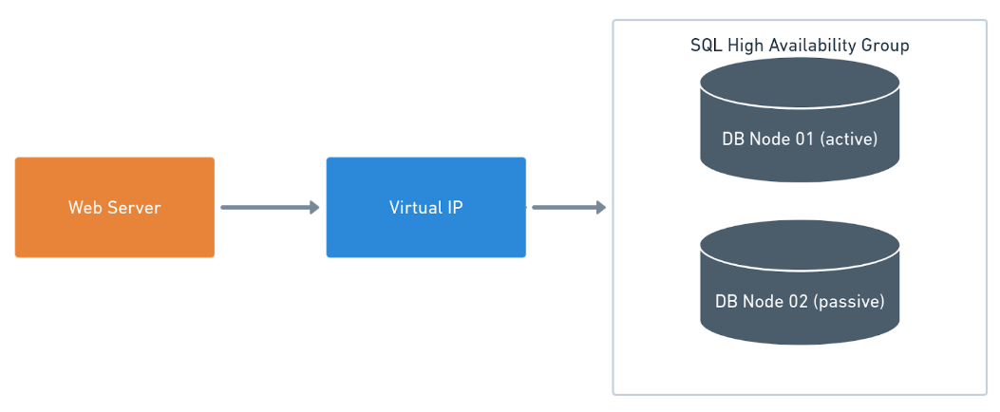
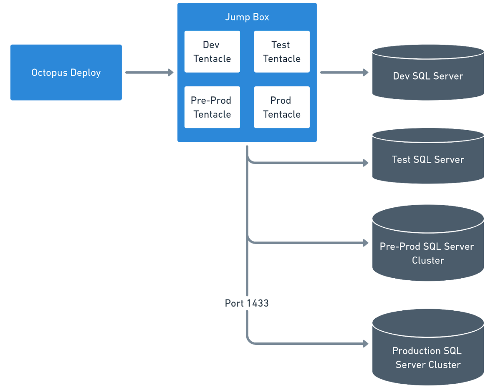

There are a variety of ways for Octopus Deploy to deploy to SQL Server.  There are many third-party tools, both free and commercial, Octopus Deploy integrates with.  This section will provide a broad outline of approaches, tooling, and recommended configuration.

## Approaches to database change management {#SQLServerdatabases-Approachestodatabasechangemanagement}

There are two main approaches to deploying databases.
  
1. A model-driven approach, where you define the desired state of your database.  During deployment, a tool will compare the desired state with the target database.  Using that comparison it will generate a delta script.

[Redgate's DLM Automation Suite](https://www.red-gate.com/products/dlm/dlm-automation/index), [Microsoft's DacPac](https://docs.microsoft.com/en-us/sql/relational-databases/data-tier-applications/data-tier-applications?view=sql-server-2017), and [Microsoft's Entity Framework Migrations](https://msdn.microsoft.com/en-us/library/jj591621(v=vs.113).aspx) use the model-driven approach.

2. A change-driven approach, where schema changes are manually written and only run once.  The target database keeps track of which scripts already ran.

[Redgate's ReadyRoll](https://www.red-gate.com/products/sql-development/readyroll/index), [DbUp](https://dbup.readthedocs.io/en/latest/), and [RoundhousE](http://projectroundhouse.org/) use the change-driven approach.

There are pros and cons to either approach as well as the tools themselves.  It is important for your team to research the tools and determine the best one for you.

## Tentacle Installation Recommendations {#SQLServerdatabases-Tentacles}

Deploying an IIS Web Application or a Windows Service is very straight-forward.  Install the tentacle on the server to be deployed to.  SQL Server is different.  Production SQL Servers are typically clusters or high-availability groups.  They comprise more than one node hidden behind a VIP or virtual IP Address. 

For high-availability groups, there is an active node and a passive node.  In this case, installing a tentacle on each node will not work.  Octopus Deploy will see multiple tentacles and attempt to deploy to both nodes.

SQL PaaS, such as AWS RDS or Azure's SQL as a Service, will not allow the installation of tentacles on SQL Server.  

All the tools mentioned above connect to SQL Server using port 1433 and run one or more scripts.  They do not need to be installed directly on SQL Server.  Nor do they need to be run directly on SQL Server.  They will work as long as they run on any machine with a direct connection and port 1433 open.

Also, windows authentication is the often the preferred way to authenticate.  A recommended security practice is the principle of least privilege.  The account used by the website to connect to SQL Server should have little permissions.  Whereas, the account used to make schema changes needs elevated permissions.

Most of the tooling from above requires it to be installed somewhere.  It is important the same version is used across all environments.  This prevents any uncertainty during deployments.  

Finally, it is good security practice to have a different account with schema change permissions per environment.  An account used to change a test environment should not be able to change production.  

With all that in mind, a "jump box" is where tentacles should be installed.  The jump box sits between Octopus Deploy and the SQL Server VIP.  The tentacle is running as a [service account](/docs/infrastructure/windows-targets/running-tentacle-under-a-specific-user-account) with the necessary permissions to make schema changes.  The tooling chosen for database deployments is installed on the jump box.

 

In the event of multiple domains, a jumpbox would be needed per domain.  This might be seen where there is a domain in a local infrastructure and another domain in a cloud provider such as Azure.  As long as port 10933 is open (for a listening tentacle) or port 443 (for a polling tentacle) Octopus will be able to communicate to the jumpbox.

It is possible to install many tentacles on a single server.  Please [read here](/docs/administration/managing-multiple-instances) for more information.  

## Database Deployment Permissions {#SQLServerdatabases-Permissions}

The level of permissions required to automate database deployments is tricky.  There is a fine line between functionality and security.  There is no single magic bullet.  It will be up to you and your security team to discuss.  With that said, below are some considerations around permissions and a couple of recommendations.

### Deployment Permission Considerations {#SQLServerdatabases-DeploymentPermissions}

The account used to make schema changes requires elevated permissions.  Because of that, create a special account to handle database deployments.  Do not use the same account used by an IIS Web Application.

The level of elevated permissions is up to you.   The more restrictions placed on the deployment account means more manual steps.  Deployments will fail due to missing or restricted permissions.  Octopus will provide the error message to fix the issue.  It will need a manual intervention.  It is up to you to decide which is best. 

First, decide what the deployment account should have the ability to do at the server level.  From there, research which server roles can are applicable.  For example, the account can create databases and users.  Use the securityadmin and dbcreator server roles.  Should the account only be able to create databases? Use dbcreator role. 

Next, decide what permissions the deployment account can have at the database level.  The easiest is db_owner.  It is possible to get very granular with permissions at the database level.  Research, decide and test.

### Application Account Permissions {#SQLServerdatabases-ApplicationAccountPermissions}

Applications should run under their own accounts with the least amount of rights.  Each environment for each application should have their own account.  

Having separate accounts for each environment can make automated database deployments very tricky.  Which account should be stored in source control  All of them or none of them?  None of them.  Assign permissions to roles.  Attach the correct user for the environment to that role.

### Fully Automated Database Deployments Permission Recommendation {#SQLServerdatabases-FullAutomationPermissions}

Following DevOps principles, everything that can be automated should be automated.  This includes databases, from creation to user management, to schema changes.  Octopus Deploy plus the third-party tool of your choice can handle that. The deployment account should have these roles assigned:

- Server Roles: dbcreator and securityadmin
- Database Role: db_datareader, db_datawriter, db_accessadmin, db_securityadmin, db_ddladmin, db_backupoperator

Be sure to assign the deployment account those database roles in the model database.  That is the system database used by SQL Server as a base when a new database is created.  This means the deployment account will be assigned to those roles going forward.
  
### Manual User Creation With Everything Else Automated {#SQLServerdatabases-ManualUserPermissions}

If granting that level of access is not workable or allowed we would recommend the following.  It can do anything but create users and grant them permissions.

- Server Roles: dbcreator 
- Database Role: db_datareader, db_datawriter, db_ddladmin, db_backupoperator
The downside to this setup is you will be unable to create new schemas.  That is granted by db_accessadmin and db_securityadmin.

## Third party tools {#SQLServerdatabases-Thirdpartytools}

### Redgate SQL Release {#SQLServerdatabases-RedgateSQLRelease}

:::warning
**SQL Release has been replaced by DLM Automation**
SQL Release has been replaced by DLM Automation, which is available in the [SQL Toolbelt](http://www.red-gate.com/products/sql-development/sql-toolbelt/). For more details, see the documentation for [DLM Automation](https://documentation.red-gate.com/display/DLMA1/DLM+Automation+documentation)
:::

### Redgate DLM Automation {#SQLServerdatabases-RedgateDLMAutomation}

The Redgate Database Lifecycle Management (DLM) Automation tool works with build servers and release management tools to provide continuous integration and automated deployment for your SQL databases. You can control DLM Automation by using the [DLM Automation PowerShell cmdlets](https://documentation.red-gate.com/display/DLMA2/Cmdlet+reference) or by using one of the [DLM Automation add-ons](http://www.red-gate.com/dlmas/add-ons-page). DLM Automation is available in the [SQL Toolbelt](http://www.red-gate.com/products/sql-development/sql-toolbelt/).

:::hint
Learn about [using DLM Automation with Octopus Deploy](https://documentation.red-gate.com/display/DLMA2/Walkthrough%3A+Set+up+Continuous+Integration+And+Release+Management).
:::

### Redgate ReadyRoll {#SQLServerdatabases-RedgateReadyRoll}

Redgate ReadyRoll follows the change script approach, and also provides an excellent Visual Studio experience. It has the ability to [generate Octopus Deploy-ready NuGet packages](http://doc.ready-roll.com/display/RRSQLDOC/Octopus+Deploy) and can work in continuous integration/automated build tools.

:::hint
**Learn more about ReadyRoll**
You can learn more about [Redgate ReadyRoll's Octopus Deploy support](http://doc.ready-roll.com/display/RRSQLDOC/Octopus+Deploy) in their documentation.
:::

### DbUp {#SQLServerdatabases-DbUp}

The open source tool [DbUp](http://dbup.github.io/), built by members of the Octopus Deploy team and other contributors, is another alternative. This 8 minute video (with captions) demonstrates how DbUp and Octopus Deploy can be used together to perform database deployments:

<iframe width="640" height="360" src="https://www.youtube.com/embed/mFnN8eLs3c8" frameborder="0" allowfullscreen></iframe>

### Visual Studio Database Projects {#SQLServerdatabases-VisualStudioDatabaseProjects}

Raffaele Garofalo has a blog post detailing [how to deploy Visual Studio Database Projects with Octopus](http://blog.raffaeu.com/archive/2013/10/17/deploy-database-project-using-octopus.aspx).

### Entity Framework Migrations {#SQLServerdatabases-EntityFrameworkMigrations}

Kevin Kuszyk has a blog post about [deploying SQL databases using Entity Framework migrations and Octopus Deploy](http://www.kevinkuszyk.com/2016/10/26/deploying-sql-databases-using-entity-framework-migrations-and-octopus-deploy/).

### RoundhousE {#SQLServerdatabases-RoundhousE}

Ben Tillman has a walkthrough on [how to deploy database migrations with RoundhousE](http://blog.bentillman.net/deploying-db-migrations-with-octopus-deploy-and-roundhouse/).
