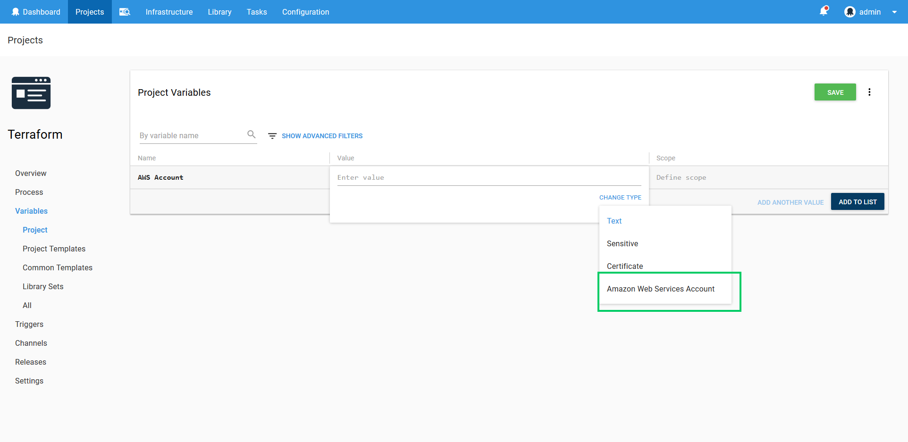
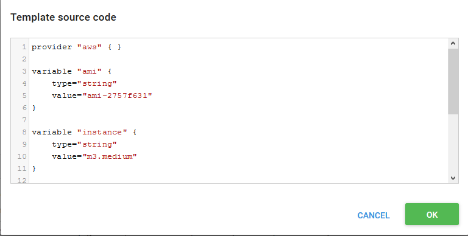

Octopus supports the deployment of Terraform templates through the `Apply a Terraform template` step. This step executes a Terraform template, optionally using AWS credentials managed by Octopus, and captures the Terraform output variables as Octopus output variables.

The proceeding instructions can be followed to configure the `Apply a Terraform template` step.

## AWS Account Support

If you wish to use the AWS credentials managed by Octopus when deploying Terraform templates, the AWS account will need to be added to Octopus and a variable referencing the account configured in the project.

:::hint
Using AWS credentials managed by Octopus is optional. These credentials can be saved directly into the Terraform template if that approach is preferable.
:::

## Create an AWS Account

The instructions at [Creating an AWS Account](/docs/infrastructure/aws/creating-an-aws-account/index.md) detail the procedure for creating an account in Octopus.

### Create a AWS Account Project Variable

AWS accounts are included in a project through a project variable of the type `Amazon Web Services Account`.



The `Add Variable` window is then displayed and lists all the AWS accounts.

Select the account that was created in the previous step to assign it to the variable.


### Selecting the Account

Under the `Managed Account` section, select `AWS Account`. This will display two additional sections where the AWS account can be selected, and the default AWS region optionally defined.

### AWS Section

Select the variable that references the `Amazon Web Services Account` under the `AWS Account` section or select whether you wish to execute using the service role of an EC2 instance.


The supplied account can optionally be used to assume a different AWS service role. This can be used to run the AWS commands with a role that limits the services that can be affected.


:::hint
If you select `Yes` to `Execute using the AWS service role for an EC2 instance`, you do not need an AWS account or account variable. Instead the AWS service role for the EC2 instance executing the deployment will be used. See the [AWS documentation](https://g.octopushq.com/AwsDocsRolesTermsAndConcepts) for more information on service roles.
:::

:::hint
Credentials defined in the Terraform template take precedence over any credentials defined in the step.
:::

### Region Section

You can optionally define the default region to use when interacting with AWS in the `Region` section.

:::hint
Regions defined in the Terraform template take precedence over the default value defined in the step.
:::

### Template Section

The Terraform template can come from two sources: directly entered source code or from files in a package.

#### Source Code

The first option is to paste the template directly into the step. This is done by selecting the `Source code` option, and clicking the `ADD SOURCE CODE` button.


This will present a dialog in which the Terraform template can be pasted, in either JSON or HCL.



Once the `OK` button is clicked, the parameters defined in the template will be shown under the `Parameters` section.


#### Package

The second option is to use the files contained in a package. This is done by selecting the `File inside a package` option, and specifying the package.

The contents of the package will be extracted, and Terraform will automatically detect the files to use. See the [Terraform documentation](https://www.terraform.io/docs/configuration/load.html) for more details.


#### Variable Replacements

Variable replacement is performed before the template is applied or destroyed when accessed from either an inline script or a package.

When deploying a template from a package, all `*.tf`, `*.tfvar`, `*.tf.json` and `*.tfvar.json` files will have variable substitution applied to them.

For example, if you were deploying from a package and your template file looked like this:

```json
provider "aws" { }

resource "aws_instance" "example" {
  ami           = "#{AMI}"
  instance_type = "m3.medium"
  tags {
    Name = "My EC2 Instance"
  }
}

```

Then the values from the project variable `AMI` would be substituted for the markers `#{AMI}`.

See the [variable substitution](https://octopus.com/docs/deployment-process/variables/variable-substitution-syntax) documentation for more information.
