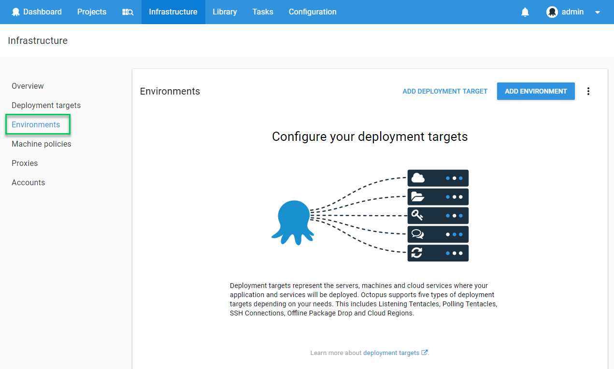
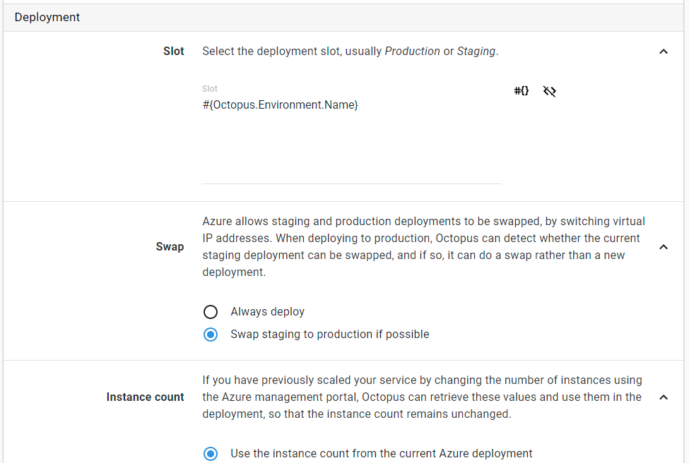
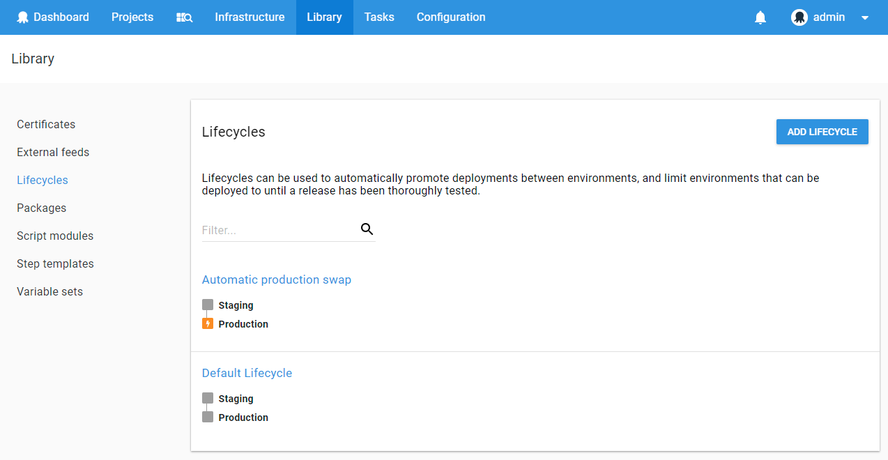
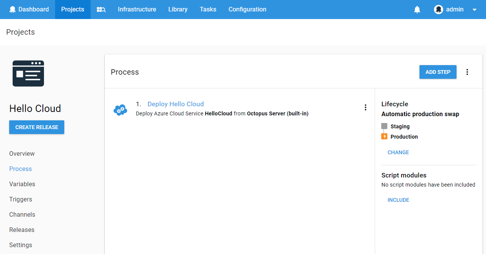

The guide demonstrates how to perform a VIP swap when deploying to Azure Cloud Services.

## Using VIP swaps for blue/green deployments

VIP swap is a great way for you to implement [Blue-green deployments](/docs/deployments/patterns/blue-green-deployments/index.md) using Azure Cloud Services and Octopus Deploy. The typical process is to:

1. Deploy a fully configured application into the "staging" slot in Azure.
2. Run manual/automated tests on your "staging" slot.
3. Perform a VIP swap, which simply swaps the "staging" and "production" slots over, resulting in your newly deployed application moving into the "production" slot and beginning to accept requests, and your previous production instance being moved down into the "staging" slot, at which point you can:
    * Delete the "staging" slot to free up resources/costs.
    * Keep the previous version in "staging" in case you want to roll back - which is as easy as performing another VIP swap.

In order to complete this guide you should have a Cloud Service project set up in Octopus Deploy that is deploying to the staging or production slot.  Please see [Getting started with Azure Cloud Services](/docs/deployment-examples/azure-deployments/cloud-services/getting-started-with-azure-cloud-services.md) for more information.

## Environment configuration {#VIPSwap-Environmentconfiguration}

The easiest way to configure Octopus for VIP swapping is to map Cloud Service slots to Octopus environments. By default a Cloud Service has a staging and production slot.  In order to map this in Octopus, create Staging and Production environments:

## Enabling VIP swap {#VIPSwap-EnablingVIPswap}

In order to enable VIP swapping, edit the process of your Cloud Service project and toggle the Swap setting to "Swap staging to production if possible":

With this setting enabled Octopus will attempt to swap the staging and production slots but, in the example above, it is always deploying to the staging slot.  In order to perform a VIP swap we want to first deploy to Staging and then Production.  In order to do this in Octopus, edit the Cloud Service process and replace the Slot setting with a variable that resolves the environment name.  Press the square to the right of the Slot field to enable variable binding and enter #{Octopus.Environment.Name}:

## Performing a VIP swap {#VIPSwap-PerformingaVIPswap}

In order to perform a VIP swap you must have a deployment in your Cloud Service production slot. The first time you create a release and deploy it to Staging and then Production it will not VIP swap. On subsequent deployments to Staging and then Production a VIP swap will occur:

## Automatic VIP swap {#VIPSwap-AutomaticVIPswap}

A production VIP swap can be automatically performed after a successful staging deployment through the use of lifecycles. A lifecycle should be configured with two phases: Staging and Production.  The Staging phase contains the Staging environment and the Production phase contains the Production environment. The Production environment should be configured with "Deploy automatically to this environment as soon as the release enters this phase.":

Configure the Cloud Service project to use the newly created lifecycle from the project process tab:

Now each time a release is deployed to staging it will automatically perform a VIP swap with production.
