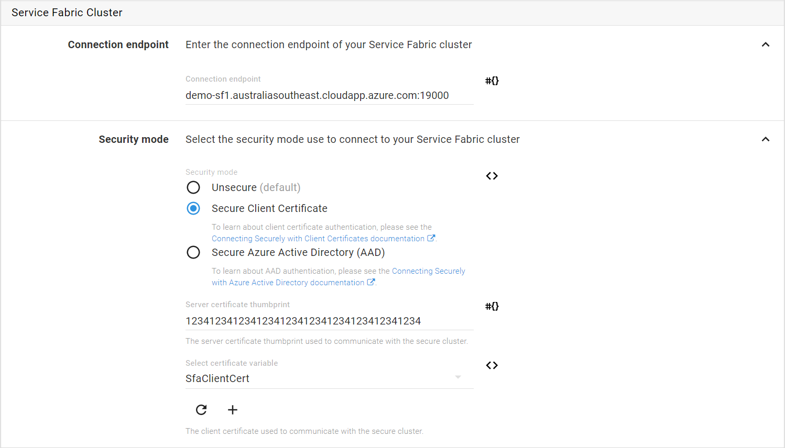

As part of Service Fabric step templates, Octopus allows you to securely connect to a secure cluster by using client certificates.

This page assumes you have configured your Service Fabric cluster in secure mode and have already configured your primary/server certificate when setting up the cluster (and have used an Azure Key Vault to store the server certificate thumbprint).

:::warning
This example will use a self-signed certificate for testing purposes, and assumes you are using Azure to host your Service Fabric cluster.
:::

During a Service Fabric deployment that uses Client Certificates for authentication, Calamari will set the following connection parameters before attempting to connect with the Service Fabric cluster:

```powershell
$ClusterConnectionParameters["ServerCertThumbprint"] = $OctopusFabricServerCertThumbprint
$ClusterConnectionParameters["X509Credential"] = $true
$ClusterConnectionParameters["StoreLocation"] = $OctopusFabricCertificateStoreLocation
$ClusterConnectionParameters["StoreName"] = $OctopusFabricCertificateStoreName
$ClusterConnectionParameters["FindType"] = $OctopusFabricCertificateFindType
$ClusterConnectionParameters["FindValue"] = $OctopusFabricClientCertThumbprint
```

These PowerShell variables correspond to the following Octopus variables:

| PowerShell Variable                    | Octopus Variable                                       |
| -------------------------------------- | ------------------------------------------------------ |
| $OctopusFabricCertificateFindType      | Octopus.Action.ServiceFabric.CertificateFindType       |
| $OctopusFabricCertificateStoreLocation | Octopus.Action.ServiceFabric.CertificateStoreLocation  |
| $OctopusFabricCertificateStoreName     | Octopus.Action.ServiceFabric.CertificateStoreName      |
| $OctopusFabricClientCertThumbprint     | Octopus.Action.ServiceFabric.ClientCertThumbprint      |
| $OctopusFabricServerCertThumbprint     | Octopus.Action.ServiceFabric.ServerCertThumbprint      |

It is these values and variables that we will be discussing below.

## Step 1: Get the DNS Name of Your Service Fabric Cluster

The following steps will need the DNS name of your Service Fabric cluster.

The DNS name for Azure Service Fabric clusters can be found as the "Client connection endpoint" field on the "Overview" tab of your Azure Service Fabric cluster in the Azure portal.

An example of a Service Fabric cluster's DNS name is: `democtopus-sf1-secure.australiasoutheast.cloudapp.azure.com`

## Step 2: Generate the Client Certificate

:::warning
Azure have recently updated their **Key vaults > Certificates** UI to allow generating self-signed certificates. If you're deploying to Azure and wish to generate a self-signed certificate for testing, please use their portal functions or cmdlets.
:::

Using PowerShell, you can easily generate a self-signed certificate for testing purposes.

In this case, Octopus Server (the client) will be connecting to Service Fabric (the server) during a deployment. Therefore this client certificate will need to reside on your Octopus Server machine. If you do not install this certificate manually, Octopus will attempt to install it automatically as part of your [Server Fabric target's](/docs/infrastructure/deployment-targets/azure/service-fabric-cluster-targets/index.md) health check.

:::hint
In this PowerShell, we print the value of the certificate's thumbprint. Be sure to remember this thumbprint value, as you will need to store it in your Azure Key Vault used by Service Fabric:
:::

```powershell
$dnsName = "democtopus-sf1-secure.australiasoutheast.cloudapp.azure.com"
$cert = New-SelfSignedCertificate -DnsName $dnsName -CertStoreLocation "cert:\LocalMachine\My"
Write-Host $cert.Thumbprint
$password = ConvertTo-SecureString -String "MySuperSecurePasswordGoesHere" -Force -AsPlainText
Export-PfxCertificate -Cert $cert -FilePath "C:\_export\democtopus-sf1-secure-server-cert.pfx" -Password $password
```

We can then take the exported certificate and thumbprint, and complete the following steps.

:::hint
**Location matters!**
By default, the Service Fabric steps assume the certificate store location is `LocalMachine` and that the certificate store name is `MY`. If you have this client certificate installed somewhere else, you will need to override these defaults using the variables mentioned below.
:::

To override certificate settings used when connecting to Service Fabric, the following variables are available:

| Variable                                                  | Default          | Description                              |
| --------------------------------------------------------- | ---------------- | ---------------------------------------- |
| Octopus.Action.ServiceFabric.CertificateStoreLocation     | LocalMachine     | The store location that Octopus will pass as the 'StoreLocation' argument of the Service Fabric connection properties during a deployment (see the `StoreLocation` section of the [Connect-ServiceFabricCluster documentation](https://docs.microsoft.com/en-us/powershell/servicefabric/vlatest/connect-servicefabriccluster))|
| Octopus.Action.ServiceFabric.CertificateStoreName         | MY               | The store name that Octopus will pass as the 'StoreName' argument of the Service Fabric connection properties during a deployment (see the `StoreName` section of the [Connect-ServiceFabricCluster documentation](https://docs.microsoft.com/en-us/powershell/servicefabric/vlatest/connect-servicefabriccluster)) |
| Octopus.Action.ServiceFabric.CertificateFindType          | FindByThumbprint | The type of FindValue for searching certificates in the Azure certificate store (see the `FindType` section of the [Connect-ServiceFabricCluster documentation](https://docs.microsoft.com/en-us/powershell/servicefabric/vlatest/connect-servicefabriccluster)) |
| Octopus.Action.ServiceFabric.CertificateFindValueOverride |                  | The FindValue for searching certificates in the Azure certificate store (see the `FindValue` section of the [Connect-ServiceFabricCluster documentation](https://docs.microsoft.com/en-us/powershell/servicefabric/vlatest/connect-servicefabriccluster)) |

You do not need to override these variables by default. However, they _are_ available if you require more flexibility over the default client certificate connection parameters.

## Step 3: Install the Client Certificate

Now that you have a client certificate and thumbprint, the following steps can be completed:

1. Install the certificate on your Octopus Server (the server that will be deploying to your Service Fabric cluster).
2. Upload the certificate to your Azure Key Vault (the vault that Service Fabric is configured to communicate with).
3. Add the thumbprint as a "Client certificate" to your Service Fabric security settings (Authentication type = **Admin client**, Authorization method = **Certificate thumbprint**).

The client certificate should now be setup for your Octopus Server machine to communicate with your Service Fabric cluster.

## Step 4: Configure and Run a Deployment Step

In Octopus, Service Fabric deployment steps that use "Client Certificate" as the security mode will need you to enter the Server Certificate thumbprint and select the Client Certificate variable.



## Connection Troubleshooting

Calamari uses the [Connect-ServiceFabricCluster cmdlet](https://docs.microsoft.com/en-us/powershell/servicefabric/vlatest/connect-servicefabriccluster) to connect to your Service Fabric cluster. The connection parameters are logged (Verbose) at the time of a deployment to help if you need to debug connection problems to your Service Fabric cluster.

If you wish to learn more about how Octopus connects securely to Service Fabric clusters, the PowerShell scripts used by Calamari can be [viewed here](https://github.com/OctopusDeploy/Calamari/blob/master/source/Calamari.Azure/Scripts/AzureServiceFabricContext.ps1).
