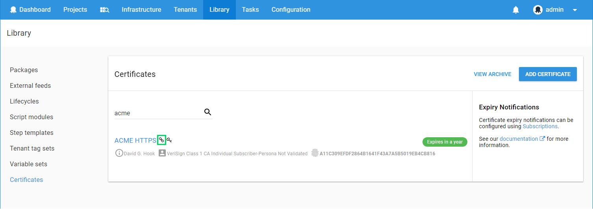
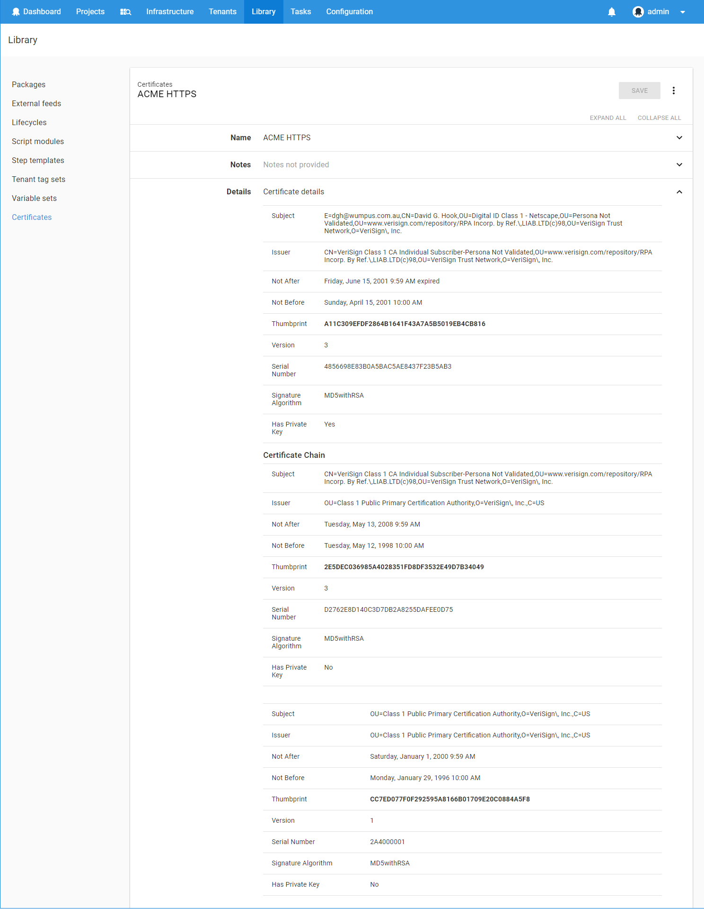

Uploaded PFX or PEM files may contain a certificate-chain. i.e. A certificate with a private-key, plus one or more authority certificates.

Certificates which contain a chain are indicated by a chain icon on the certificate card, as shown below:

The details page will show the details of all certificates in the chain.

## Importing Certificate Chains

When a certificate-chain is imported to one of the Windows Certificate Stores (either via the [Import Certificate Step](import-certificate-step.md) or by using the Certificate in an IIS HTTPS Binding) the authority certificates will be automatically imported into the CA or Root stores (Root if the authority certificate is self-signed, CA otherwise as it is an intermediate authority).   

_Note:_  Authority certificates will be always be imported to the LocalMachine location, even if the subject certificate is imported to a user-specific location.  
This is because importing to the Root store for a specific user results in a security-prompt being displayed, which obviously doesn't work with automated deployments.   

## Downloading Certificate Chains

When downloading a certificate containing a chain, the behavior depends on the format being downloaded.

- `Original`: The downloaded file will be exactly what was originally uploaded.
- `PFX`: The entire chain will be included in the exported file.
- `DER`: Only the subject certificate will be included.  DER files never contain chains.
- `PEM`: Download-dialog provides options to include
   - Primary Certificate
   - Primary and Chain Certificates
   - Chain Certificates Only

