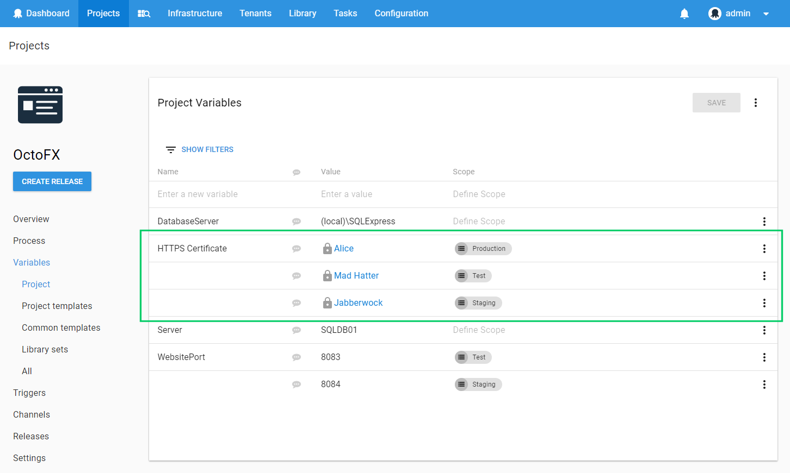

X.509 certificates are a key component of many deployment processes. Octopus Deploy provides the ability to securely store and manage your certificates, and easily use them in your Octopus Projects.  

## Securely store certificates and private-keys

- [Add certificate](add-certificate.md)
- [Replacing certificates](replace-certificate.md)
- [Archiving and deleting certificates](archiving-and-deleting-certificates.md)
- [Exporting certificates](export-certificate.md)

## Configure subscriptions for expiry notifications

[Octopus Subscriptions](/docs/administration/managing-infrastructure/subscriptions/index.md) can be used to configure notifications when certificates are close to expiry or have expired.

There is a "Certificate expiry events" event-group, and three events:  

- Certificate expiry 20-day warning.
- Certificate expiry 10-day warning.
- Certificate expired.

:::info
Certificate-expiry events are _not_ raised for [archived](archiving-and-deleting-certificates.md) certificates.
:::

:::info
The background task which raises the certificate-expiry events runs:
- 10 minutes after the Octopus Server service starts
- Every 4 hours
:::

## Import certificates into the Windows certificate store  

Certificates can be imported to Windows Certificate Stores as part of a deployment process using the [Import Certificate Deployment Step](/docs/deployment-examples/certificates/import-certificate-step.md).

## Use certificates for HTTPS bindings when deploying IIS websites   

When configuring HTTPS bindings for [IIS Websites](/docs/deployments/windows/iis-websites-and-application-pools.md), a certificate can be configured either by:
- entering the thumbprint directly (this assumes the certificate has already been installed on the machine).
- selecting a certificate-typed variable (this will automatically install the certificate).

## Create certificate-typed variables

Certificates managed by Octopus can be configured as the [value of variables](/docs/projects/variables/certificate-variables.md), and used from custom deployment scripts.

Note that certificates can not be selected directly when configuring a deployment step. Selecting a certificate in deployment steps presents a drop-down list of the certificate variables that have been defined in the project.
