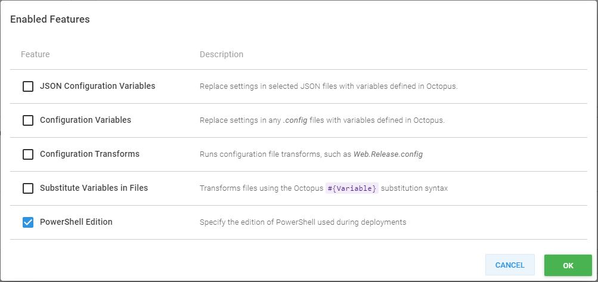

As a convention-oriented deployment tool, Octopus can perform a number of actions automatically, such as [managing configuration features](/docs/deployment-process/configuration-features/index.md), creating [IIS websites and application pools](/docs/deployment-examples/iis-websites-and-application-pools.md), and installing [Windows Services](/docs/deployment-examples/windows-services.md). Sometimes however you’ll need to do more than the built-in conventions support, and that’s where custom scripts come in.

## Supported Script Types

Octopus supports the following scripts:

 - PowerShell scripts (.ps1)
 - C# scripts (.csx) using [ScriptCS](https://github.com/scriptcs/scriptcs)
 - Bash scripts (.sh)
 - F# scripts (.fsx)
 - Python scripts (.py)

## How Your Scripts are Bootstrapped by Calamari

Each of your scripts will be bootstrapped by the [open-source Calamari project](https://github.com/OctopusDeploy/Calamari) to provide access to variables and helper functions. You can see how your scripts are bootstrapped in the [Calamari source code](https://github.com/OctopusDeploy/Calamari/blob/master/source/Calamari.Shared/Integration/Scripting).

## PowerShell Core

In Octopus Version 2019.9.0 we released support for PowerShell Core. When executing a PowerShell scrip in Octopus as a part of a step, you can now specify whether Octpus should use PowerShell or PowerShell Core. This feature will allow you to execute your PowerShell scripts on Linux targets with PowerShell Core installed. For information on how this affects proxy, [see here](/docs/infrastructure/deployment-targets/proxy-support.md#powershell-core-scripts).

You can enable the option to select PowerShell Core from the Configure Features button on a step in your deploymet.



Enabling this feature will give you the option to select PwerShell core to execute your PowerShell scripts. By default, Octopus will execute your PowerShell scripts with standard PowerShell.


###PowerShell Core on Linux Targets

You will first need to ensure that you add the PowerShell directory to your `$PATH` before Octopus can use it.

For Linux targets with PowerShell Core installed, you can use this feature to directly run your PowerShell scripts against those targets. However, there are some things to keep in mind here.

If your package contains both `.ps1` & `.sh` scripts and you are calling PowerShell Core on a non-Windows target, Octopus will attempt to execute both scripts. This can cause some unexpectted behaviour depending on the scrip, so ensure that your package only contains a single copy of your deploy scripts if you are using PowerShell Core.

## Working Directories {#Customscripts-Workingdirectories}

When Calamari executes your scripts, it does so within the context of the working directory by default:

```powershell
C:\Octopus\Work\
```

If you're executing a script contained within a package, the package contents will be uncompressed and copied to this directory, but the working directory is the directory containing the script within it.

## Collecting Artifacts {#Customscripts-Collectingartifacts}

If your deployment produce a log file, configuration files, binaries, or test results that you want to publish and keep as part of your deployment, your scripts can instruct the Octopus Server to collect files as deployment [artifacts](/docs/deployment-process/artifacts.md).

```powershell PowerShell
New-OctopusArtifact -Path "C:\Windows\System32\drivers\etc\hosts" -Name "$([System.Environment]::MachineName)-hosts.txt"
```

```cs C#
Octopus.CreateArtifact(@"C:\Windows\System32\drivers\etc\hosts", System.Environment.MachineName + "-hosts.txt");
```

```bash Bash
new_octopusartifact /etc/hosts $(hostname)-hosts.txt
```

```fsharp F#
createArtifact @"C:\Windows\System32\drivers\etc\hosts" (Some (System.Environment.MachineName + "-hosts.txt"))
```

```python Python3
import os
createartifact("C:\Windows\System32\drivers\etc\hosts", "{}-hosts.txt".format(os.environ["COMPUTERNAME"]))
```


### Service Message

The following service message can be written directly (substituting the properties with the relevant values) to standard output which will be parsed by the server and the artifact retrieved at the end of the step. Note that the properties must be supplied as a base64 encoded UTF-8 string.
```
##octopus[createArtifact path='<Base64Encoded-FullPath>' name='<Base64Encoded-FileName>' length='<Base64Encoded-FileLength>']
```

## Security and Permissions {#Customscripts-Securityandpermissions}

Keep in mind that scripts are executed in the context of the account that the Tentacle Windows Service (which invokes Calamari) or SSH session runs as.

:::hint
By default Tentacle runs as **Local System**, which has extensive local privileges, but usually cannot access file shares, remote SQL databases, or other external resources. If you need wider permissions, you’ll need to configure Tentacle to run under a custom service account.
:::

:::warning
**PowerShell ExecutionPolicy: Unrestricted**
When Calamari invokes PowerShell.exe, it uses the **unrestricted** execution policy for the session. You can see how PowerShell scripts are executed in more detail by [looking at the open-source Calamari project](https://github.com/OctopusDeploy/Calamari/tree/master/source/Calamari.Shared/Integration/Scripting/WindowsPowerShell).
:::

## Testing Scripts {#Customscripts-Testingscripts}

You may find that your script runs differently under Calamari than it does when run from PowerShell directly.

The easiest way to test your scripts under Calamari is to use the [Script Console](/docs/administration/managing-infrastructure/script-console.md). Alternatively you can invoke `Calamari.exe run-script` via the command line to test a script.

**Calamari run-script command**

```text
Usage: Calamari run-script [<options>]
Where [<options>] is any of:
      --variables=VALUE      Path to a JSON file containing variables.
      --package=VALUE        Path to the package to extract that contains the
                             package.
      --script=VALUE         Path to the script to execute. If --package is
                             used, it can be a script inside the package.
      --scriptParameters=VALUE
							 Parameters to pass to the script. Parameters
							 need to be provided in a language specific way.
							 E.g. -Parameter1 Value1 -Parameter2 Value2 for PowerShell or
							 Value1 Value2 for Bash.
      --sensitiveVariables=VALUE
                             Password protected JSON file containing
                             sensitive-variables.
      --sensitiveVariablesPassword=VALUE
                             Password used to decrypt sensitive-variables.
      --substituteVariables  Perform variable substitution on the script body
                             before executing it.
```

## Scripts that Block Deployments {#Customscripts-Scriptsthatblockdeployments}

Sometimes a script launches a service or application that runs continuously. In this case the script does not complete until the application is terminated.  When the script is run in an Octopus deployment, the deployment will continue executing until the script exits.  In most cases this is undesirable. In order to avoid this behavior the service or application should be launched in a separate process or session, allowing the deployment to continue executing immediately. For example:

```powershell PowerShell
Start-Process MyService
```

```bash Bash
screen -d -m -S "MyService" MyService
```
