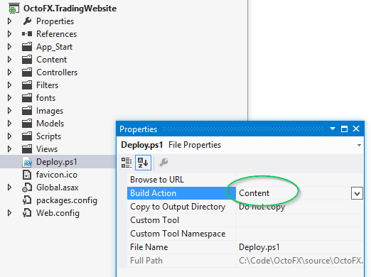
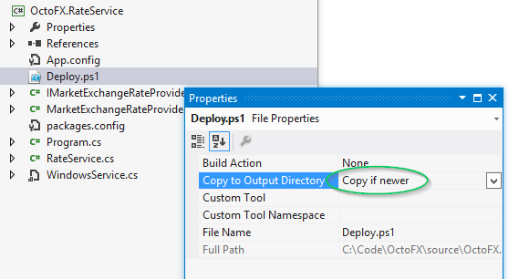

You can add any of the following script files in any of the scripting languages supported by Octopus (where `<ext>` is the appropriate extension for your scripting language of choice) to your packages:

- `PreDeploy.<ext>`
- `Deploy.<ext>`
- `PostDeploy.<ext>`
- `DeployFailed.<ext>`

Octopus will detect these scripts and invoke them at the appropriate time during the step. Which file you use depends on when you need your custom activity to run – see the section on [what order are conventions run in](/docs/deployment-examples/package-deployments/package-deployment-feature-ordering.md) for details. Your scripts can do anything your scripting language supports, as well as setting [output variables](/docs/projects/variables/output-variables.md) and [collecting artifacts](/docs/deployment-process/artifacts.md).

## Including the Scripts in the Package

1. Create the scripts you want Octopus to execute during the step.
2. Name each script to match the naming convention depending when you want the script to execute.
3. Include these scripts at the root of your package. Octopus will not search subdirectories.

:::hint
Avoid duplicate scripts into your package, like `PreDeploy.sh` and `PreDeploy.ps1`, hoping Octopus will choose the right script on your behalf. Octopus will try to execute both of these scripts during the pre-deploy phase of the step since both bash and PowerShell are cross-platform runtimes. This might lead to surprising behavior.
:::

## Running a Script When A Step Fails

You can create a file named `DeployFailed.<ext>`, which will be invoked if the step fails. Our blog post about this feature [describes how DeployFailed.<ext> works](https://octopus.com/blog/deployfailed).

## Disabling this Convention

You can prevent Octopus from automatically running scripts in packages by adding the `Octopus.Action.Package.RunScripts` variable to your project and setting it to `false`. You can scope the value of this variable to suit your needs.

## Scripts in Package Steps {#scripts-in-package-steps}

Rather than embed scripts in packages, you can also define scripts within the package step definition in Octopus. This is a feature that can be enabled on package steps by clicking **CONFIGURE FEATURES** and selecting **custom deploy scripts**.

When enabled, you will see **Configuration Scripts** under the features section of the process definition.

## Troubleshooting

Make sure the scripts are located in the root of your package.

Make sure the scripts are actually included in your package. Extract your package and inspect the contents to make sure the scripts are included as you expect. For example, if you are using OctoPack for an ASP.NET web application, you'll need to make sure the file is marked as **Build Action =** **Content**.

If you are using OctoPack to package a Windows Service or console application, set **Copy to Output Directory** = **Copy if newer**.

Read more about [using OctoPack](/docs/packaging-applications/create-packages/octopack/index.md).

If the scripts in your package are still not running, make sure someone has not set a project variable called `Octopus.Action.Package.RunScripts` to `false` for the step where the scripts should run.