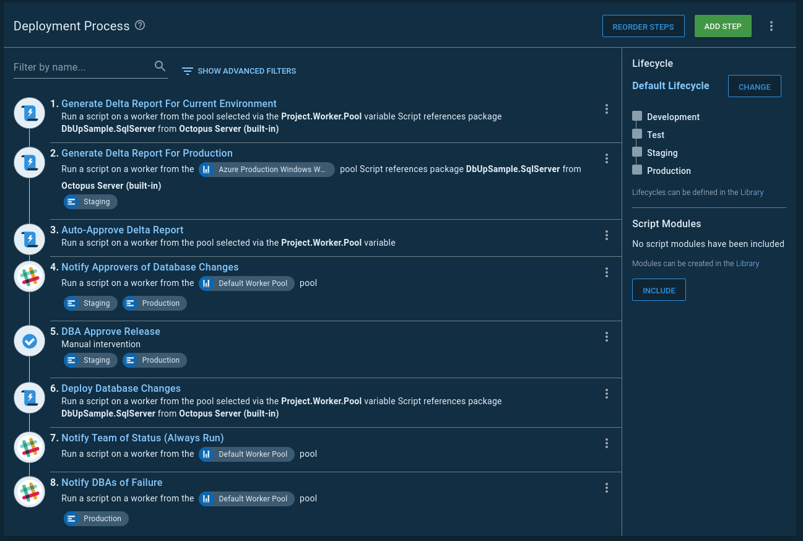
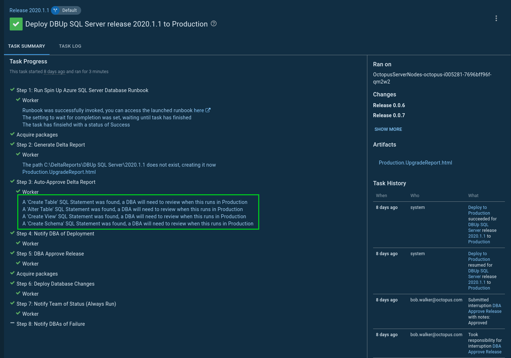

This document assumes you have read the [manual approvals documentation](/docs/deployment-examples/database-deployments/common-patterns/manual-approvals.md).  It is highly recommended you read that before proceeding.

We recommend including DBAs in the automated database deployment process.  If something goes wrong in `Production` at 1 AM, they are the ones who are paged.  The [manual approvals documentation](/docs/deployment-examples/database-deployments/common-patterns/manual-approvals.md) walks through how to include DBAs in the deployment process in Octopus Deploy.  The concern with manual approvals is scalability.  It is common for us to see a 15-to-1 or 20-to-1 ratio of developers to DBAs.  The number of approvals a DBA is involved in will exponentially grow as the number of teams and projects automate their database deployments increases.  

Schema change commands are the biggest concern.  Thankfully, the SQL language defines those commands.  Most database deployment tools, Flyway, DBUp, RoundhousE, Redgate, or DacPac, generate "what-if" or "dry-run" reports.  It is possible to write a script that looks for specific commands, and when one is found, then run a manual intervention.  The format of the "what-if" report depends on the tool.  

The general auto-approval process will look something like this:

1. Generate the "what-if" report using the database deployment tooling.  Save the report to a shared location for easier access.
2. Run a script to:
    1. Open up the "what-if" report.
    2. Loop through a list of schema change commands, such as `Drop Table`, `Create Table`, `Drop Column`, `Alter Table`, `Drop User`.
    3. If a schema change command is found set an [output variable](/docs/projects/variables/output-variables.md) to `True`.
    4. If no schema change command is found set the same [output variable](/docs/projects/variables/output-variables.md) to `False`. 
3. Notify the approvers when that [output variable](/docs/projects/variables/output-variables.md) is `True` using [run conditions](/docs/deployment-process/conditions/index.md#run-condition)
4. Pause for a [manual intervention](/docs/deployment-process/steps/manual-intervention-and-approvals.md) when that [output variable](/docs/projects/variables/output-variables.md) is `True` using [run conditions](/docs/deployment-process/conditions/index.md#run-condition).
5. Deploy database changes.
6. Send notifications on the status of deployments.

## Output Variables and Run Conditions

We recommend creating a variable in the project to reference the output variable from the auto-approval step.  A variable referencing the output variable makes it easier to change when if the auto-approval step name were to change.

In this particular screenshot, the variable value is:

`#{Octopus.Action[Auto-Approve Delta Report].Output.DBAApprovalRequired}`

Creating a variable also makes it much easier to use in a [run condition](/docs/deployment-process/conditions/index.md#run-condition).

:highlight
We recommend setting the output variable to `True` or `False` because that is what the [run conditions](/docs/deployment-process/conditions/index.md#run-condition) look for.  If you need an if/then statement, then in include it in the auto-approval script.
:

## Logging

We recommend the auto-approval step write logs using `Write-Host` for PowerShell or `echo` for Bash scripts.  That output is captured by Octopus Deploy and can be viewed in the `Task Log` tab on the deployment screen.  We've when debugging scripts, the more logging, the better.

For important logs, such as when a command is found, leverage the [write highlight](/docs/deployment-examples/custom-scripts/logging-messages-in-scripts.md) command.  That is a custom command Octopus Deploy injects into the deployment process.  Using that command will show the message on the task summary screen.

## Example

View a working example on our [samples instance](https://samples.octopus.app/app#/Spaces-106/projects/dbup-sql-server-worker-pool-variable-type/deployments/process).