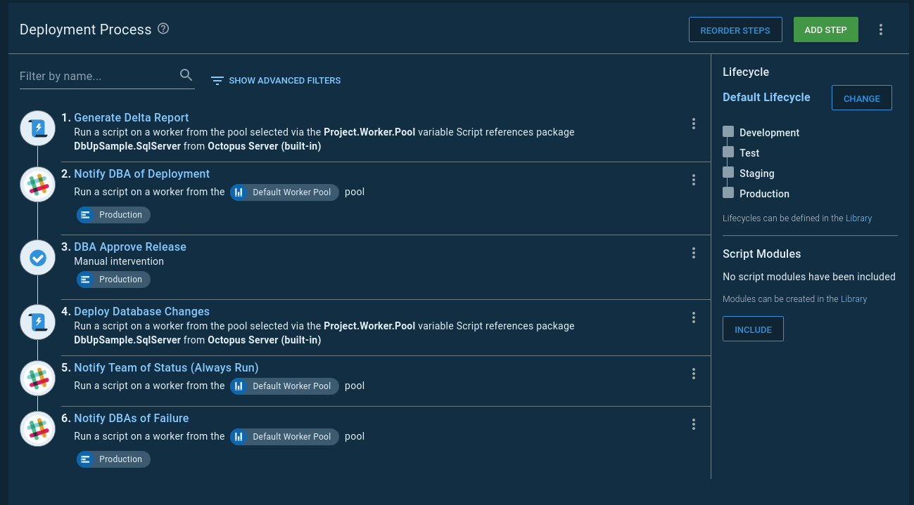
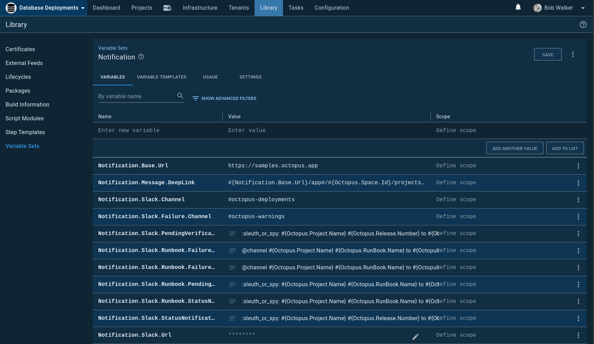

Building trust is critical when automating database deployments.  You are working on a process that changes your database, and unlike code, you cannot merely destroy and recreate a database.  Most database tooling Octopus Deploy integrates with provides the ability to generate a *what-if* report that is used for approvals.  It should show the SQL statements the tool is about to run as seeing the actual SQL statements contributes to that building of trust.  Additional information, such as release notes, also helps build trust.  This section walks through the various features as well as the deployment process.

The high-level overview of the process is:

1. Use database deployment tooling to generate the *what-if* report and create an [artifact](/docs/deployment-process/artifacts.md).
2. Send notifications to approvers.
3. Pause the deployment using a [manual intervention](/docs/deployment-process/steps/manual-intervention-and-approvals.md).  Approvers sign-in to Octopus Deploy, download the *what-if* report, review it, and give their approval.
4. Use database deployment tooling to deploy the database changes.
5. Once the deployment is complete, a notification of the deployment status is sent to the team.
6. In production, failures are sent to the DBAs.

Each step in this process requires several decisions.  Each company we work with has their own set of business rules and regulations they must follow.  Below are recommendations to help get you going.

## Generating the what-if report

How the report is generated depends on the database tooling you chose.  Below are links to some of the most popular tools documentation.

- [DbUp Generate HTML Report](https://github.com/DbUp/DbUp/blob/master/docs/more-info/html-report.md)
- [Flyway Dry Runs](https://flywaydb.org/documentation/dryruns)
- [RoundhousE Dry Run](https://github.com/chucknorris/roundhouse/wiki/ConfigurationOptions)
- [SSDT/DacPac Deploy Report](https://docs.microsoft.com/en-us/sql/tools/sqlpackage?view=sql-server-ver15#deployreport-parameters-and-properties)
- [Redgate SQL Change Automation Create Database Release](https://documentation.red-gate.com/sca4/deploying-database-changes/automated-deployments-with-sql-change-automation-projects/deploying-sql-change-automation-projects) - Please note: [Redgate's step template](https://library.octopus.com/step-templates/c20b70dc-69aa-42a1-85db-6d37341b63e3/actiontemplate-redgate-create-database-release) automatically creates artifacts for you.
- [Redgate Oracle Deployment Suite](https://octopus.com/blog/database-deployment-automation-for-oracle-using-octopus-and-redgate-tools)

The goal is to create a single file that can be uploaded as an [artifact](/docs/deployment-process/artifacts.md) for the approvers to review.  

## Manual Interventions

This document intentionally document uses the word `approvers` instead of `DBAs` because in our experience, especially as everyone is learning the tooling and process, there will be different approvers for each environment.  Having a script run `Drop Table` unintentionally even in `Development` can ruin a day.  To prevent a bad script being run, the deployment process is paused using a [manual intervention](/docs/deployment-process/steps/manual-intervention-and-approvals.md) for someone to look for scripts that might cause significant harm to the database.    

For lower environments, for instance, `Development`, `Test`, or `QA`, the approver might be a developer, lead developer, or database developer.  On production level environments, `Staging`, `Pre-Prod`, or `Production`, the approvers are typically DBAs.  

:::hint
We recommend you follow a crawl-walk-run approach for each team adopting database deployments.  
:::

The crawl phase is when a team starts adopting automated database deployments.  During that time, there should be, at a minimum, two manual interventions.  One for the lower environments that developers on the team approve, and another for production environments for DBAs to approve.  All of these approvals allow everyone to gain experience with the process and tooling.  That, in turn, builds trust.

The walk phase is when the team has some experience, and they feel confident they aren't going to check in anything which causes harm to the database.  It is common for the DBAs to have a separate team.  They talk to the development teams, but they are not involved with the day to day goings-on. However, they still want manual interventions for any environments they are responsible for to ensure scripts won't cause outages.

The run phase can be found in [this documentation](/docs/deployment-examples/database-deployments/common-patterns/automatic-approvals.md).  The run phase is when all the approvers trust the tooling and the process.  The approvers only want to be notified if specific commands, such as `drop table`, appear in a script.

## Involving DBAs earlier in the process

Often, DBAs review scripts too late in the process.  Having them review a script in `Production` is typically only a sanity check.  If a deadline has to be met or promises have to be made, it is difficult for a DBA to stop it.  Unless the DBA can prove, without a shadow of a doubt, the script contains a show-stopping bug, that release is going to `Production`.  For `Production` deployments, the DBA is there to ensure the database doesn't accidentally get deleted.

But having a DBA approve every change to `Development` isn't feasible.  They'd spend all day, every day, approving and reviewing changes.  

:::hint
We recommend a DBA review and approve scripts toward the end of the QA test effort.
:::

Typically, when QA feels good about a release, they will sign off on a promotion to a `Staging` or `Pre-Prod` environment.  It makes more sense for a DBA to approve a release to `Staging` or `Pre-Prod` rather than `Production`.  Approving during a non-production deployment gives the DBA more time and less stress to approve a deployment.  At the same time, it might make sense to review changes for both `Staging` and `Production`.   We often see a new version deployed to `Staging` several times before going to `Production`.  There is a significant difference between `Staging` and `Production`.  In that case, add another *what-if* report step, but have it run in `Staging` and generate that report for `Production`.

You might have only `Test` and `Production`.  In that case, you could add an `Approver` environment, that generates the *what-if* report for `Production` and has a manual intervention.  

## Notifications

Notifications come in many forms.  With Octopus Deploy you have many options:

- [Slack](https://library.octopus.com/step-templates/99e6f203-3061-4018-9e34-4a3a9c3c3179/actiontemplate-slack-send-simple-notification)
- [Microsoft Teams](https://library.octopus.com/step-templates/110a8b1e-4da4-498a-9209-ef8929c31168/actiontemplate-microsoft-teams-post-a-message)
- [Email](/docs/deployment-process/steps/email-notifications.md)
- [Custom Step Template](https://octopus.com/docs/deployment-process/steps/custom-step-templates)

Regardless of your notification preference, we recommend creating a variable set to store notification values.  The variable set gives you the ability to create a standard set of messages any project can use

For easier approvals, the notification messages should include a deep link back to the release.  That little change provides a nice quality of life improvement.  The deep-link to the deployment summary is:

`#{Notification.Base.Url}/app#/#{Octopus.Space.Id}/projects/#{Octopus.Project.Id}/releases/#{Octopus.Release.Number}/deployments/#{Octopus.Deployment.Id}?activeTab=taskSummary`

That sample uses `Notification.Base.Url` instead of the system variable `Octopus.Web.BaseUrl`.  That variable choice is intentional as our documentation for that value states:

> Note that this (`Octopus.Web.BaseUrl`) is based off the server's ListenPrefixes and works in simple configuration scenarios. If you have a load balancer or reverse proxy this value will likely not be suitable for use in referring to the server from a client perspective, e.g. in email templates etc.

A separate variable, such as `Notification.Base.Url` provides a lot more options.  For example, you can set that to a publicly exposed URL the approvers can use to approve changes from home.  

## Keeping the signal to noise ratio low

Imagine a message is sent to the team for every deployment to `Development` and `Test`.  At first, that is a good idea.  But as time goes on, the number of deployments per day will increase.  They are now deploying 20 times a day to each environment.  Those notifications went from being useful to being noise.  

As experience is gained and trust is built, the number of notifications should go down.  Our recommendation is to start sending notifications for every deployment, both successes, and failures.  As time goes on, adjust that down to failures only. 

## Example

View a working example on our [samples instance](https://samples.octopus.app/app#/Spaces-106/projects/dbup-sql-server-worker-pool-variable-type/deployments/process).