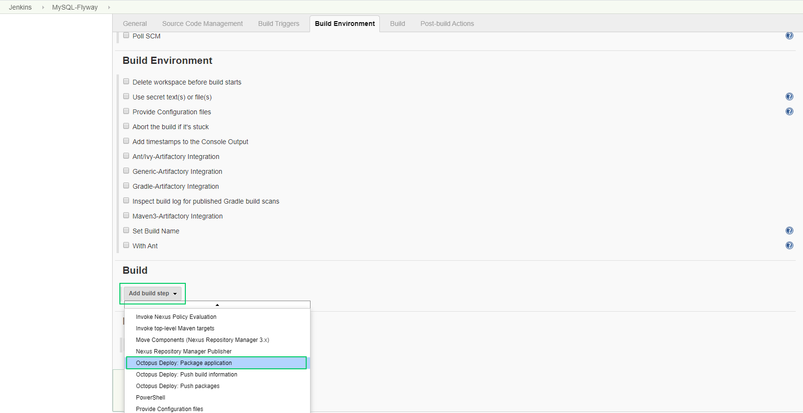
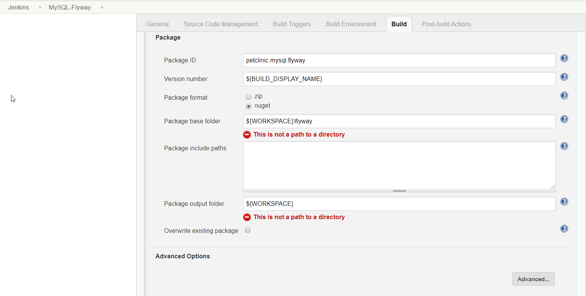
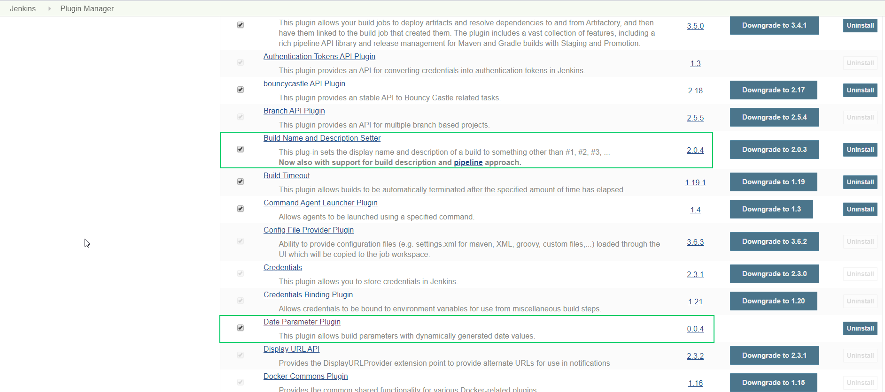
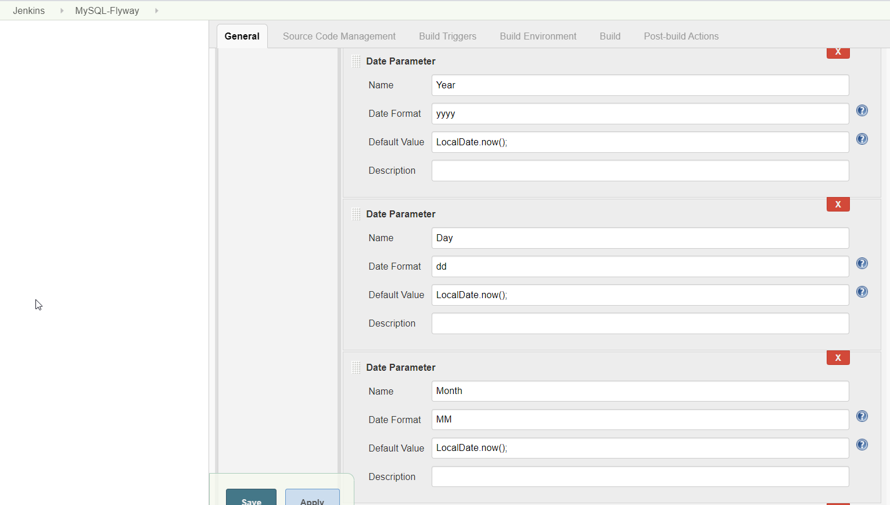
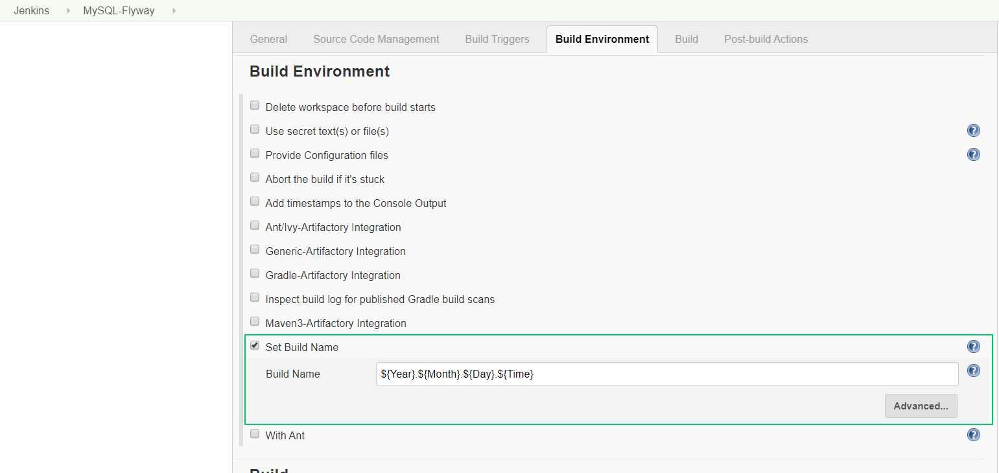
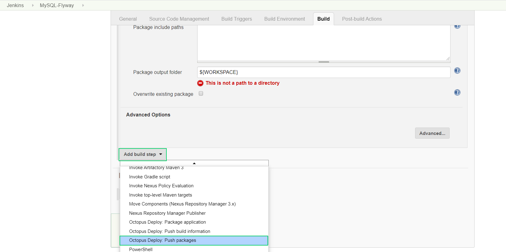
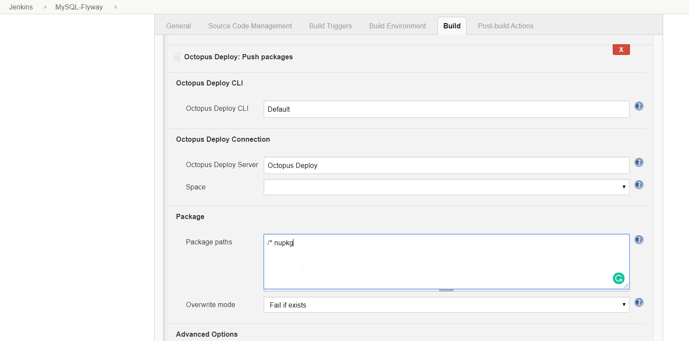
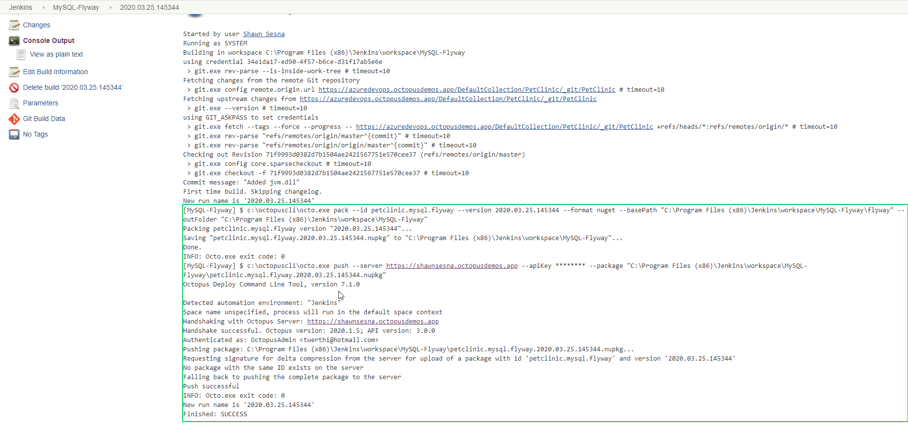

[Flyway](https://flywaydb.org/) is a open source [migrations-based](https://octopus.com/blog/sql-server-deployment-options-for-octopus-deploy) database deployment tool supported by Redgate.  It's a command-line utility that uses Java to execute script files against a number of database technologies such as Microsoft SQL Server, MySQL, MariaDB, and PostgreSQL.  Along with a free Community edition, there is also a paid Pro and Enterprise versions available.  Flyway is a popular tool with the open source community.

## Including Flyway with your project
Adding Flyway to your project is pretty simple, just [download the archive](https://flywaydb.org/download/) file and extract it to disk.  Once the files are extracted, move them into your project folder structure.  The Flyway download comes with everything it needs to execute, including a version of the Java Runtime Environment (JRE).  

:::hint
If Flyway doesn't find Java installed on the machine (detected by the presence of the JAVA_HOME envronment variable), it will fall back to the included JRE.  The included version of the JRE has the .exe and .dll files located within a `bin` subfolder.  It is often the case that source control will ignore any folder with the name `bin`, so be careful when including a Flyway project and you need the included JRE.
:::

## Adding scripts to your Flyway project
Within the Flyway folder structure is a folder called `sql`.  This folder is where all of your scripts are placed.  To control exection order, the [documenation](https://flywaydb.org/documentation/) states that the files need to be named a specific way.  Flyway is capable of doing Versioned Migrations, Undo Migrations, and Repetable Migrations.  All script files follow this naming structure:

- Prefix: V for Versioned, U for Undo, and R for Repeatable (this guide will focus on Versioned migrations)
- Version: Numbers with dots or underscores as separators
- Seperator: Two underscores
- Description: A meaningful name with underscores or spaces to separate the words
- Suffix: Usually `.sql`

An example of what a filename would look like is `V1__initDB.sql` or `V1_1__populateDb.sql`

## Executing a migration
As previously states, Flyway is a command-line utility.  Flyway was originally designed to be cross-platform so the downloaded archive will actually work on either Windows or Linux.  For Windows, the `flyway.cmd` file is used when executing.  For Linux, the file `flyway` is a Bash script for execution.  Both OS methods use the exact same arguments for deployment.

## Including Flyway in your build
Flyway itself is already compiled, so there's no need to do anything for building.  However, it can still be included in a build process for the purpose of packaging it up for deployment with Octopus Deploy.  This guide will use Jenkins as the build platform.  

### Add Package step
Within a Jenkins project, click Add Build Step and choose `Octopus Deploy Package application`

:::hint
You will need to make sure you install the Octopus Deploy Jenkins plugin to make use of these templates.  In addition, you'll need to download the Octopus Deploy CLI on to the Jenkins server
:::

Fill in the inputs
- Package ID: A unique name for this package like `petclinic.mysql.flyway`
- Version Number: The unique version number for this package
- Package format: zip | nuget
- Package base folder: ${WORKSPACE}\flyway
- Package include paths:
- Package output folder: ${WORKSPACE}

:::hint
To configure Jenkins to produce build numbers in a format like yyyy.mm.dd.hhmmss (2020.03.25.145344), install the following plugins
- Build Name and Description Setter
- Date Parameter Plugin

Once those are installed, configure your Jenkins project to be parameterized in the General tab

Then use the Date parameter to create some parameters

Lastly, set the build name in the Build Environment section

:::

### Add push step
Add an Octopus Deploy Push step to your build

Fill in the fields
- Octopus Deploy Server: The values for the drop down for this come from the Jenkins server configuration.  To configure this, go to Jenkins home screen -> Manage Jenkins -> Configure System then scroll down to the Octopus Deploy Plugin section.
- Space: Select the space to deploy to.  You can leave this blank for the Default space
- Package paths: `/*.nupkg`

Those are the only two steps that are needed to package and push a Flyway project to Octopus Deploy.  Once we save, click on `Build with Parameters`

After clicking that, the generated Date parameters will display.  Click `Build` to continue.

When the build is complete, you should have something like this

Now that the build is complete, it's time to configure out Octopus Deploy project

## Octopus Deploy
