[Redgate's SQL change automation](https://www.red-gate.com/products/sql-development/sql-change-automation/) is one of many database deployment tooling Octopus Deploy integrates with.  This guide walks through configuring Octopus Deploy to leverage Redgate's SQL change automation.

In addition to Octopus Deploy, the following items are required.  This guide provides examples using Azure DevOps and TeamCity as the CI too, however, the core concepts are the same with all the tools.  

- Redgate SQL Toolbelt:
    - [14-day free trial](https://www.red-gate.com/dynamic/products/sql-development/sql-toolbelt/download)
- CI Tool (pick one):
    - [Jenkins](https://jenkins.io/download)
    - [TeamCity](https://www.jetbrains.com/teamcity/download/)
    - [Azure DevOps Server](https://azure.microsoft.com/en-us/services/devops/server/)
    - [Azure DevOps](https://go.microsoft.com/fwlink/?LinkId=2014881)
    - [Bamboo](https://www.atlassian.com/software/bamboo/download)
- SQL Server Management Studio (SSMS):
    - [Free download](https://docs.microsoft.com/en-us/sql/ssms/download-sql-server-management-studio-ssms)
- SQL Server (pick one):
    - [SQL Express](https://www.microsoft.com/en-us/sql-server/sql-server-editions-express)
    - [SQL Developer](https://www.microsoft.com/en-us/sql-server/sql-server-downloads)

## Octopus Deploy preparation work

The following preparation needs to be completed prior to creating and configuring projects in Octopus Deploy:  

1. [Configure a worker pool](#configure-a-worker-pool) for Redgate SQL change automation to run on.
2. Install a [Tentacle on a Windows VM](#install-the-tentacle-on-a-windows-server). 
3. Install the **Redgate** [step template](#install-step-templates).

### Configure a worker pool

This documentation assumes a Windows VM already has the Tentacle installed on it.  This guide will start with the worker pool creation and how to register that tentacle as a worker.  

1. To configure a worker pool in the Octopus Web portal, go to {{Infrastructure,Worker Pools}}, and click **Add Worker Pool**.
2. When the modal window appears, enter a name, and if you see the **Static** and **Dynamic** options, select **Static** as the worker pool type:

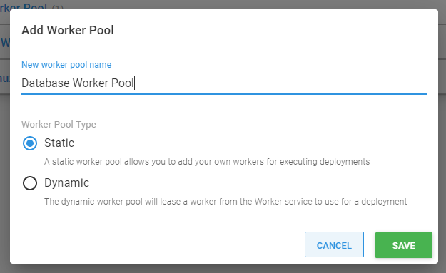

3. Next, add the VM the Tentacle was installed on by clicking **Add Worker**.
4. Select **Windows** and the Tentacle communication mode you plan to use.  It is up to you on which communication mode the worker will use.  There are pros and cons to each mode:

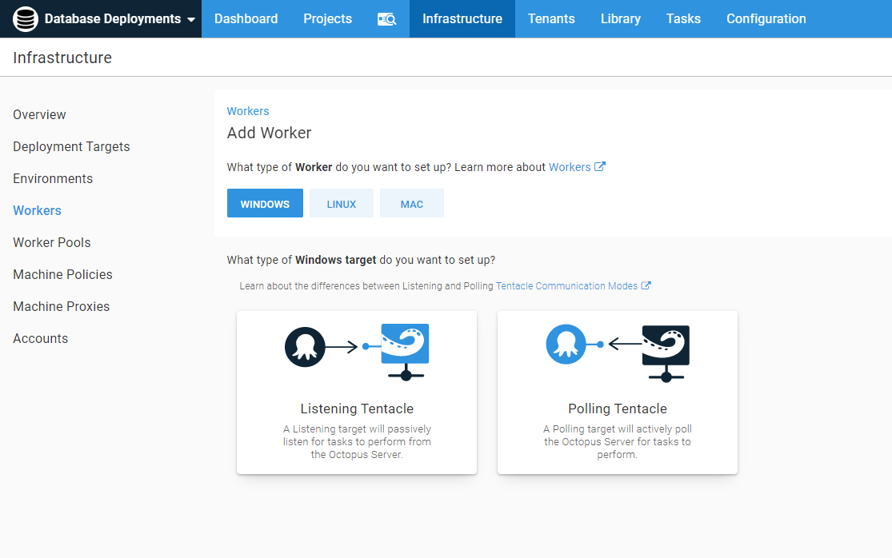

### Install the Tentacle on a Windows server {#install-the-tentacle-on-a-windows-server}

Next, install the Tentacle on a Windows server.  Aside from the latest version of .NET, no other software is required.  The Redgate tooling will be automatically downloaded during the deployment.  

:::highlight
The server needs to access the PowerShell gallery to download the Redgate tooling.  
:::

#### Listening Tentacles

Use the Octopus Web Portal to register a Listening Tentacle.  You will need to download the Tentacle onto the server and select Listening as the communication mode.

Follow the wizard.  The thumbprint for the server for this form can be found on the add worker screen or in {{Configuration,Thumbprint}}.  This is the thumbprint of the server's certificate.  The server and the tentacle will exchange the certificates to ensure a two-way trust is established.

:::highlight
The thumbprint in this screenshot is from a sample instance of Octopus Deploy.  Your thumbprint will be different.
:::

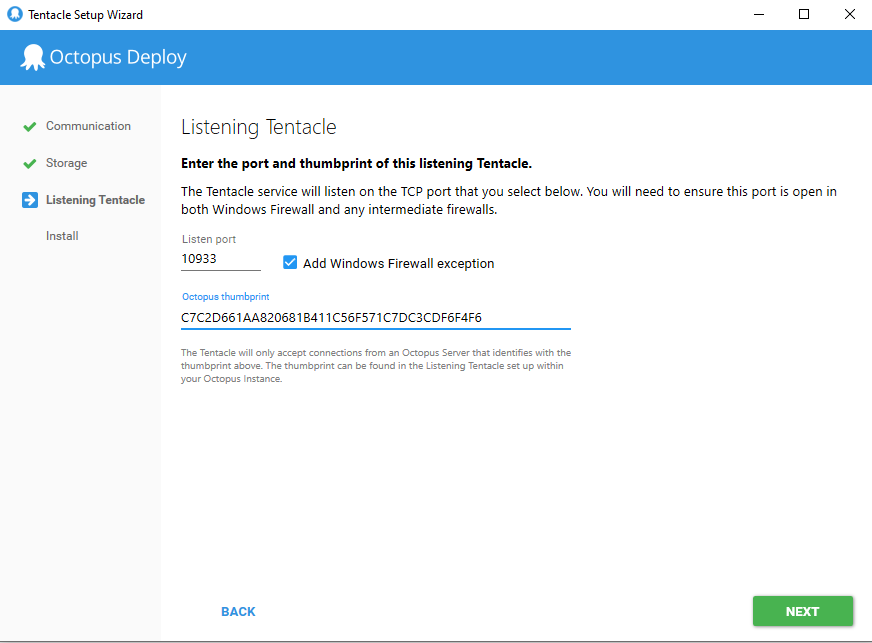

After the Tentacle is configured, enter in the IP address or the host name.

:::highlight
If you enter the host name of a private server, the Octopus Server will need to connect to your DNS server to find that host.  
:::

By default, the Listening Tentacle will listen on port `10933`.  If you configured a different port, enter the port on this form, and click **Next**.

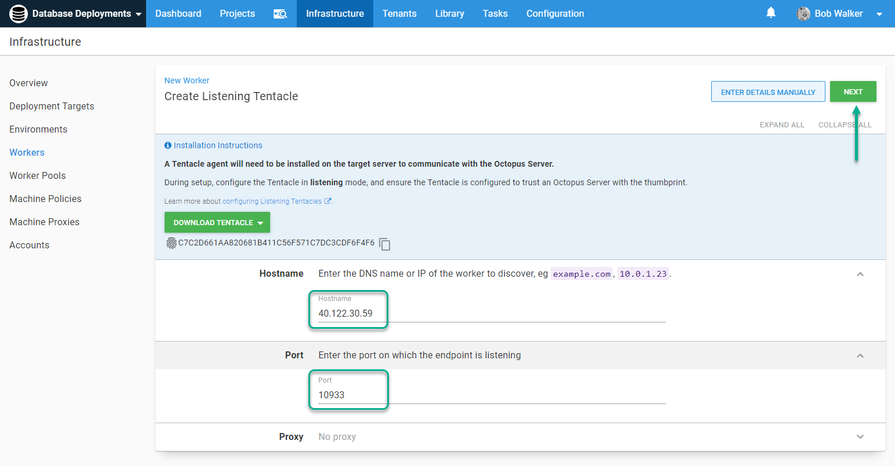

The Octopus Server will attempt to connect to the Tentacle.  The listening tentacle will only accept a connection if it the server's thumbprint matches.  After the communication is successful, provide a display name for the worker.  Depending on the screen this wizard was started from, the worker pool may or may not be pre-populated.  Click **Save** to save the worker to the database.

#### Polling Tentacles

The process to register Polling Tentacles as workers takes place in the **Tentacle Manager** on the server hosting the Tentacle.  Select the polling Tentacle to get started with the wizard.

On the credentials screen enter a username and password or the [API key](https://octopus.com/docs/octopus-rest-api/how-to-create-an-api-key) of a user who has permissions to add worker pools.  This account will only be used for registration.  

:::highlight
The registration process will connect to the RESTful API of the Octopus Server.  It will connect over port 80 or 443 using the http/https protocol.  After registration the default port the Tentacle will connect to is port 10943.
:::

After the credentials have been verified, select the worker option on the next screen.

:::highlight
Under the covers, there is nothing different between a worker and a target.  They are both Tentacles.  The difference is in how the Tentacle is registered with Octopus.  The Octopus Server treats workers differently than targets.
:::

Select the space, give the worker a display name, and select the worker pool.


Press **Install** to create the Tentacle and register it with the Octopus Server.

### Install step templates {#install-step-templates}

For this guide the following step templates will be used:

- [Redgate - Create Database Release (Worker Friendly)](https://library.octopus.com/step-templates/47d29b57-5bca-4205-ac62-ce10cdf8bab9/actiontemplate-redgate-create-database-release-(worker-friendly))
- [Redgate - Deploy from Database Release (Worker Friendly)](https://library.octopus.com/step-templates/adf9a009-8bbb-4b82-8f3b-6fb12ef4ba18/actiontemplate-redgate-deploy-from-database-release-(worker-friendly))

To install the steps from the library, navigate to {{Library,Step Templates}} and click **Browse**.

The list of categories is alphabetical.  Find the **Redgate** category, and select the first template, **Redgate - Create Database Release (Worker Friendly)**.

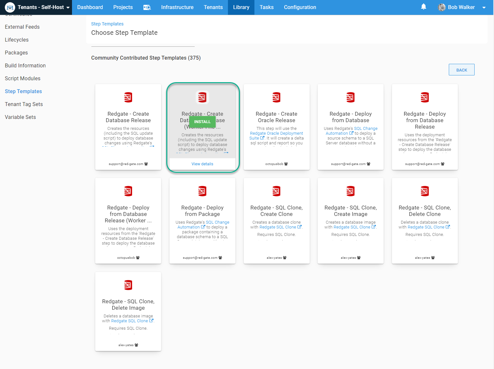

Repeat the same process for **Redgate - Deploy Database Release (Worker Friendly)**.  

:::highlight
The non-worker friendly version of these step templates are there for customers using a version of Octopus Deploy older than **2019.10.0**.  That version added the ability to provide a package variable in a step template.
:::

## Build Server

A build server, such as Jenkins, TeamCity, Azure DevOps, Bamboo, Bitbucket Pipelines, CircleCI, or GitHub actions is required.  A link to a number of build tools were provided at the start of this guide.  The build server will take the database which was saved to source control and create a .NuGet package for Octopus Deploy to consume.

Octopus Deploy and Redgate provide a number of plugins for several build servers.  

- Jenkins:
    - [Octopus plugin](https://plugins.jenkins.io/octopusdeploy/).
    - [Redgate plugin](https://plugins.jenkins.io/redgate-sql-ci).
- TeamCity:
    - [Octopus plugin](https://plugins.jetbrains.com/plugin/9038-octopus-deploy-integration).
    - [Redgate plugin](https://www.red-gate.com/dlmas/TeamCity-download).
- VSTS/TFS:
    - [Octopus plugin](https://marketplace.visualstudio.com/items?itemName=octopusdeploy.octopus-deploy-build-release-tasks).
    - [Redgate plugin](https://marketplace.visualstudio.com/items?itemName=redgatesoftware.redgateDlmAutomationBuild).
- Bamboo:
    - [Octopus plugin](https://marketplace.atlassian.com/apps/1217235/octopus-deploy-bamboo-add-on?hosting=server&tab=overview).
    - [Redgate plugin](https://marketplace.atlassian.com/apps/1213347/redgate-dlm-automation-for-bamboo?hosting=server&tab=overview).

### Azure DevOps

In Azure DevOps there are three steps to this process.

The first step builds the database package from source control.  The plugin provided by Redgate offers multiple operations, but for this step, select **Build a SQL Source Control project**.  The sub folder path is a relative path.  It needs to be the same directory configured in SQL Source Control.  Finally, configure the build number, we recommend specifying the build number using a **SemVer** versioning strategy.

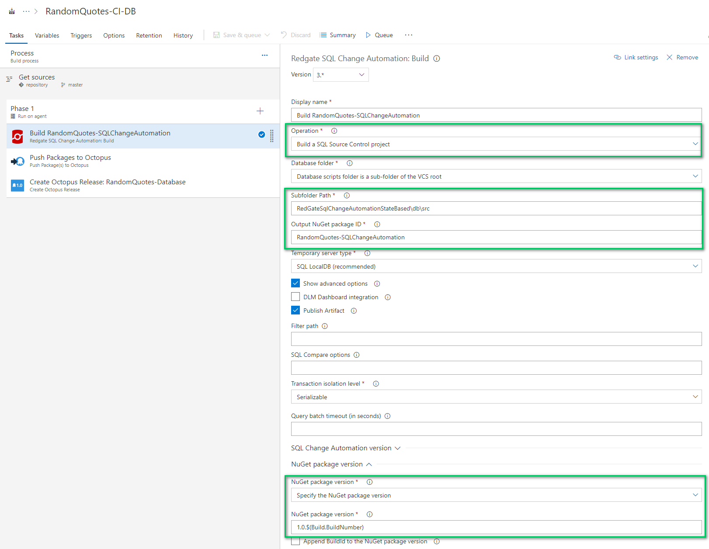

The push package to Octopus step can be a little tricky.  The folder where the package is saved is not very apparent in the previous step. In this example, the package was saved in `$(Build.Repository.Localpath)`.

The full path for this example is:

```
    $(Build.Repository.Localpath)\RandomQuotes-SQLChangeAutomation.1.0.$(Build.BuildNumber).nupkg
```

The Octopus Server must be configured in Azure DevOps.  The steps to do that are detailed in [this documentation](https://octopus.com/docs/packaging-applications/build-servers/tfs-azure-devops/using-octopus-extension#add-a-connection-to-octopus-deploy).

The last step is to create a release in Octopus Deploy and deploy it to dev using the plugin.  Select the project from the drop-down list, and enter the same build number as the package.  Expand the **Deployment** section and select an environment to deploy to.  Clicking _Show Deployment Progress_ will stop the build and force it to wait for Octopus to complete.

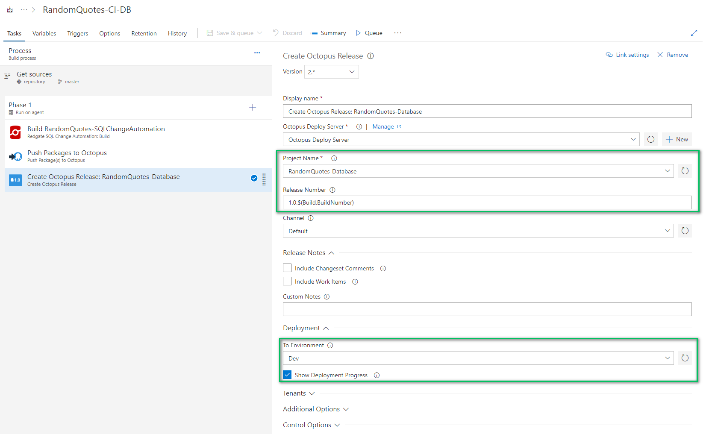

### TeamCity

The TeamCity setup is very similar to the Azure DevOps.  Only three steps are needed.


The first step is the build database package step. This step has similar options to Azure DevOps; provide the folder where the database is stored as well as the package version:

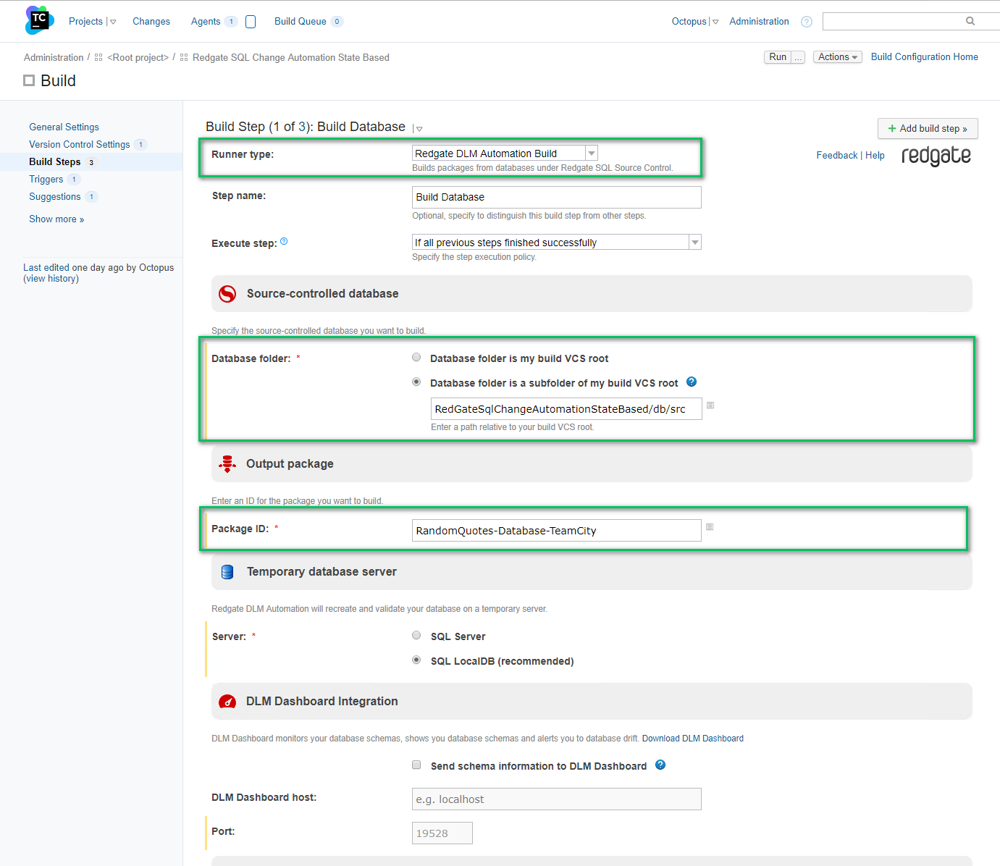

The package version only appears in the advanced options, and not setting it could result in `Invalid package version number` errors:


The publish package step requires all three of the options to be populated.  By default, the Redgate tool will create the NuGet package in the root working directory.

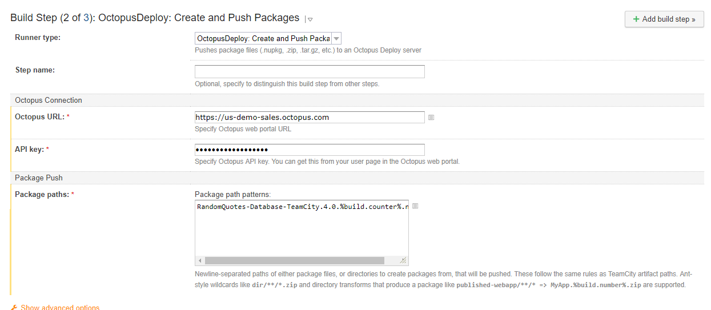

The final step is creating and deploying the release.  Very similar to before, provide the name of the project, the release number and the environment to deploy to:


## Create and configure the Octopus Deploy project

This guide will follow the [manual approvals process](/docs/deployment-examples/database-deployments/common-patterns/manual-approvals.md).  

The deployment process will be:

1. Create delta script using Redgate's tooling.
2. In **Staging** and **Production** notify DBAs of pending script.
3. In **Staging** and **Production** pause for manual approval of delta script.
4. Run delta script using Redgate's tooling.
5. Notify the team of the deployment status.
6. On failure, page the DBAs.

In Octopus Deploy, that process will look like the following screenshot.  This example uses **Slack** as the notification technology.  Octopus Deploy supports a number of different mechanisms to notify users, including email, Slack, Microsoft Teams, and Twilio to name a few.

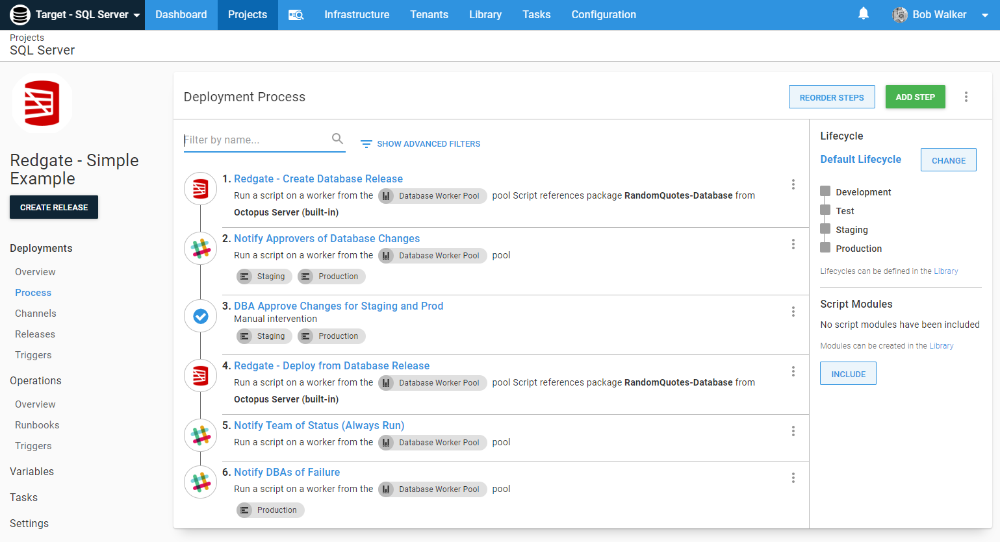

Before adding steps to the process, a number of variables need to be created.  We recommend namespacing the variables using [ProjectName].[Component].[Sub-component].

- **Project.Database.Name**: The name of the database on the SQL Server to deploy to.
- **Project.Database.Password**: The password of the user account who has permissions to deploy.  This is not required if you're using integrated security.
- **Project.Database.Server**: The SQL Server name or IP address to deploy to.
- **Project.Database.UserName**: The username of the user account who has permissions to deploy.  This is not required if you're using integrated security.
- **Project.Redgate.ExportPath**: Where the tooling will create and export the database release to.  Because this process uses workers, you need to save the files to a file share (or have one worker).

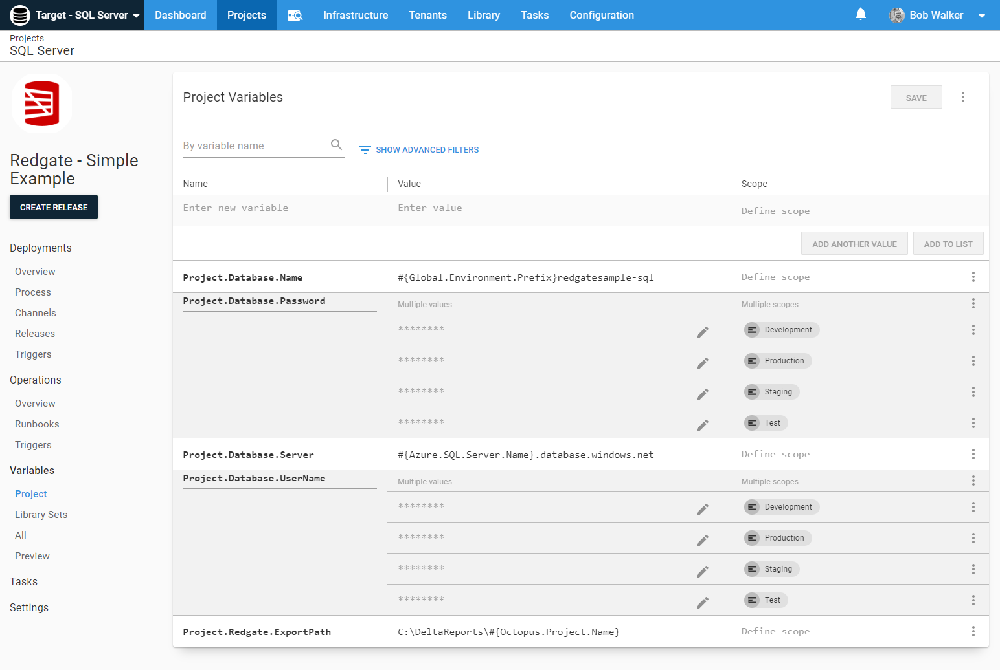

The first step in the deployment process, **Redgate - Create Database Release** will compare what is in the NuGet package and generate a delta script.  Only the highlighted parameters are required.  

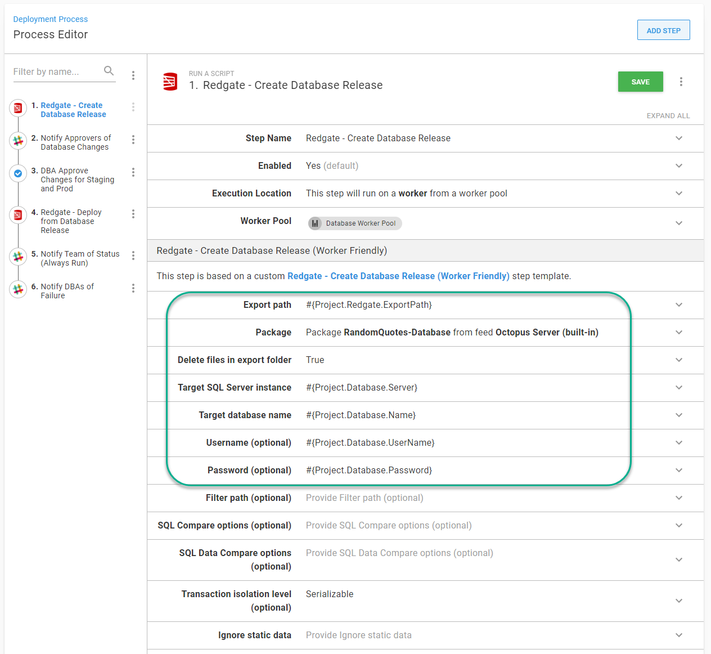

Configuring the notification step is dependent on the choice of technology.  That isn't covered for the guide.  For the manual intervention step, provide instructions, as well as the teams allowed to approve this release.  

:::highlight
The choice of two teams in this example was intentional.  The DBAs are the ones who should approve it.  The **Octopus Manager** team is there in the event of an emergency and the **Octopus Manager** needs to fix it.  
:::


The final step for this guide is **Redgate - Deploy Database Release**.  It takes the delta script created in the first step and runs it on the specified server.  The number of options on this step are limited compared to the create release step.  

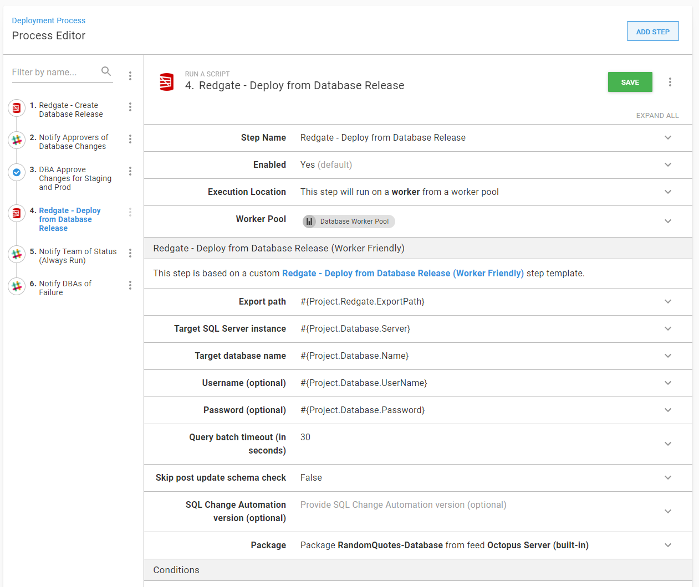

## Working example

An example of this process has been configured on the Octopus [samples instance](https://samples.octopus.app/app#/Spaces-106/projects/redgate-simple-example/deployments/process).