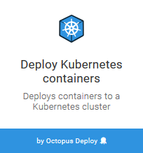

This featured was introduced as a prerelease in Octopus 2018.8.

:::warning
Kubernetes steps in Octopus are an alpha level quality, and have been made available for testing and feedback. They must not be used for production deployments, or enabled on production Octopus instances. The information provided here is subject to change at any point, and existing Kubernetes steps will most likely need to be deleted and recreated with Octopus upgrades.
:::

Octopus supports the deployment of Kubernetes resources through the `Deploy Kubernetes containers` step. This step exposes a UI that builds up a [Kubernetes Deployment resource](http://g.octopushq.com/KubernetesDeploymentResource), a [Service resource](http://g.octopushq.com/KubernetesServiceResource), and an [Ingress resource](http://g.octopushq.com/KuberntesIngressResource). The combination of these resources represents an opinionated view about what makes up a typical Kubernetes deployment.

## Deploy Kubernetes Containers Step

To begin, add the `Deploy Kubernetes containers` step to a project.

This step has three important sections that make up the combined objects that are deployed to Kubernetes.

The first section is the `Deployment`. This section is used to build of the [Kubernetes Deployment resource](http://g.octopushq.com/KubernetesDeploymentResource).

:::hint
Kubernetes terminology overlaps with a number of general concepts in Octopus. For example, Kubernetes has the notion of a Deployment, which is distinct from the act of performing a deployment in Octopus.

To distinguish between Kubernetes and Octopus terminology, we will reference to Kubernetes "resources" e.g. a Deployment resource or Pod resource.
:::

A Deployment resource provides a declarative interface for a [Pod resource](http://g.octopushq.com/KubernetesPodResource) and a [ReplicaSet resource](http://g.octopushq.com/KubernetesReplicaSetResource).

A Pod resource in turn configures one or more [Containers resources](http://g.octopushq.com/KubernetesContainer). Container resources reference a Docker container image, and provide all the additional configuration required for Kubernetes to deploy, run, expose, monitor and secure the Docker container.

A ReplicaSet resource monitors the Pod resources to ensure that the required number of instances are running.

### Deployment name

Each Deployment resource requires a unique `Deployment Name`. Kubernetes resources are identified by their names, so the name must be unique in the target [namespace](http://g.octopushq.com/KubernetesNamespace).

### Replicas

The desired number of Pod resources is set in the `Replicas` field. This is the number of replicas maintained by the ReplicaSet resource. This field is optional, and will default to a value of `1`.

### Progression deadline

An optional value that defines the maximum time in seconds for a deployment to make progress before it is considered to be failed. If this value is not specified, it will default to `600` seconds (or 10 minutes).

This value affects Blue/Green deployments, which will point the service to the new deployment only once the new deployments has succeeded.

### Add Label

Labels are custom key/value pairs that are assigned to Kubernetes resources. The labels defined in the `Deployment` section are applied to the Deployment, Pod, Service and Ingress resources.

The labels are optional, as Octopus will automatically add the tags required to manage the Kubernetes resources created as part of this step.

### Deployment style

Kubernetes exposes two native deployment strategies.

The first native deployment strategy is the [Recreate](http://g.octopushq.com/KubernetesRecreateStrategy) deployment. This strategy will kill all existing Pod resources before new Pod resources are created. This means that one Pod resource version is exposed at any time, but can result in downtime before the new Pod resources are fully deployed.

The second native deployment strategy is the [Rolling Update](http://g.octopushq.com/KubernetesRollingStrategy) deployment. This strategy will incrementally replace old Pod resources with new ones. This means that two Pod resource versions can be deployed and accessible at the same time, but can be performed in a way that results in no downtime.

The third deployment strategy, Blue/Green, is not native to Kubernetes. It is a deployment strategy that is achieved by the `Deploy Kubernetes containers` step by virtue of the step creating both the Deployment resource and the Service resource.

| Strategy   | No Downtime  | Multiple Deployed Versions  | Multiple Accessible Versions |
|-|-|-|-|
| Recreate   |   |   |  |
| Rolling Update   | *  | *  | * |
| Blue/Green   | *  | *  |   |
