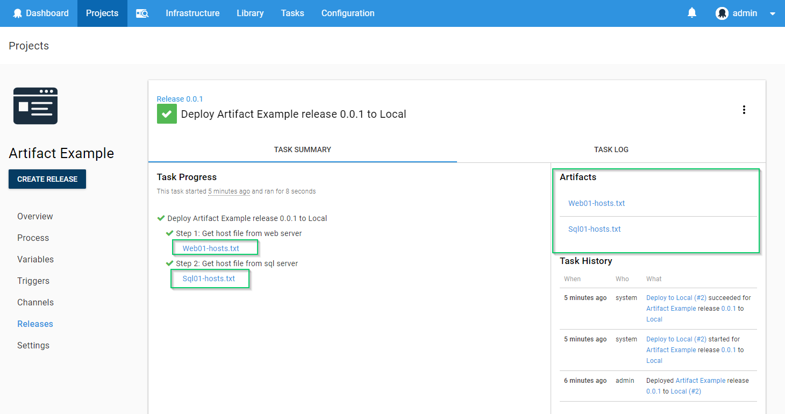

Artifacts in Octopus provide a convenient way to collect files from remote machines, and copy them to the Octopus Server, where they can then be viewed from the web interface. Examples of where artifacts may be useful are:

- Collecting log files from other programs.
- Copying configuration files so you can inspect to see if the right values were replaced.

Artifacts can be collected from anywhere that Octopus runs scripts - for example, the [Script Console](/docs/administration/script-console.md), or [package scripts and script steps](/docs/deployment-examples/custom-scripts/index.md) in a deployment.

:::hint
**Artifact Access**
Remember that whatever files you want to import into Octopus Deploy need to be accessible by the account performing the deployment. For example, the Tentacle process in Windows, or the SSH account in Linux.
:::

After the script runs the files will be uploaded to Octopus Server and made available as deployment artifacts which are available for download from the task output, or via the [Octopus API](https://github.com/OctopusDeploy/OctopusDeploy-Api/wiki/Artifacts).



## Collecting Artifacts Using Scripts {#Artifacts-Collectingartifactsusingscripts}

You can collect artifacts using any of the scripting languages supported by Octopus. In each case we make special functions available to your scripts by bootstrapping them with a template defined in the [open-source Calamari project](https://github.com/OctopusDeploy/Calamari).

### PowerShell {#Artifacts-PowerShell}

[PowerShell Bootstrapping](https://github.com/OctopusDeploy/Calamari/tree/master/source/Calamari.Shared/Integration/Scripting/WindowsPowerShell)

From a PowerShell script, you can use the PowerShell CmdLet `New-OctopusArtifact` to collect artifacts. The CmdLet takes two parameters:

- `[string]$path` - the local path to the file that will be made an artifact.
- `[string]$name` - an optional friendly name to give the artifact, usually to distinguish it if collecting multiple artifacts with the same name from different machines. Defaults to the file name in `$path`.

For example:

**PowerShell**

```powershell
New-OctopusArtifact -Path "C:\Windows\System32\drivers\etc\hosts" -Name "$([System.Environment]::MachineName)-hosts.txt"
```

### C# {#Artifacts-C#}

[ScriptCS Bootstrapping](https://github.com/OctopusDeploy/Calamari/tree/master/source/Calamari/Integration/Scripting/ScriptCS)

From a C# script, you can use the `public static void CreateArtifact(string path, string fileName = null)` method to collect artifacts. The method takes two parameters with the same purpose as the PowerShell CmdLet.

**C#**

```c#
Octopus.CreateArtifact(@"C:\Windows\System32\drivers\etc\hosts", System.Environment.MachineName + "-hosts.txt");
```

:::hint
**error CS1501: No overload for method &#39;CreateArtifact&#39; takes 2 arguments.**
The `fileName` optional parameter was [added](https://github.com/OctopusDeploy/Calamari/commit/2d5a5d27c9a0dc0c623e5e955a370c2b012fbdd4) in Calamari 3.1.24 which shipped as part of **Octopus 3.2.12**
:::

### Bash {#Artifacts-Bash}

[Bash Bootstrapping](https://github.com/OctopusDeploy/Calamari/tree/master/source/Calamari/Integration/Scripting/Bash)

In a Bash script you can use the `new_octopusartifact` function to collect artifacts. This function takes two positional parameters with the same purpose as the PowerShell CmdLet.

**Bash**

```bash
new_octopusartifact /etc/hosts $(hostname)-hosts.txt
```

### F# {#Artifacts-F#}

:::success
F# support introduced in **Octopus 3.4**.
:::

[FSharp Bootstrapping](https://github.com/OctopusDeploy/Calamari/tree/enhancement-fsharpscripts/source/Calamari/Integration/Scripting/FSharp)

From a F# script, you can use the `createArtifact : path:string -&gt; fileName:string option -&gt; unit` function to collect artifacts. The function takes two parameters with the same purpose as the PowerShell CmdLet.

**F#**

```fsharp
Octopus.createArtifact @"C:\Windows\System32\drivers\etc\hosts" (Some (System.Environment.MachineName + "-hosts.txt"))
```
