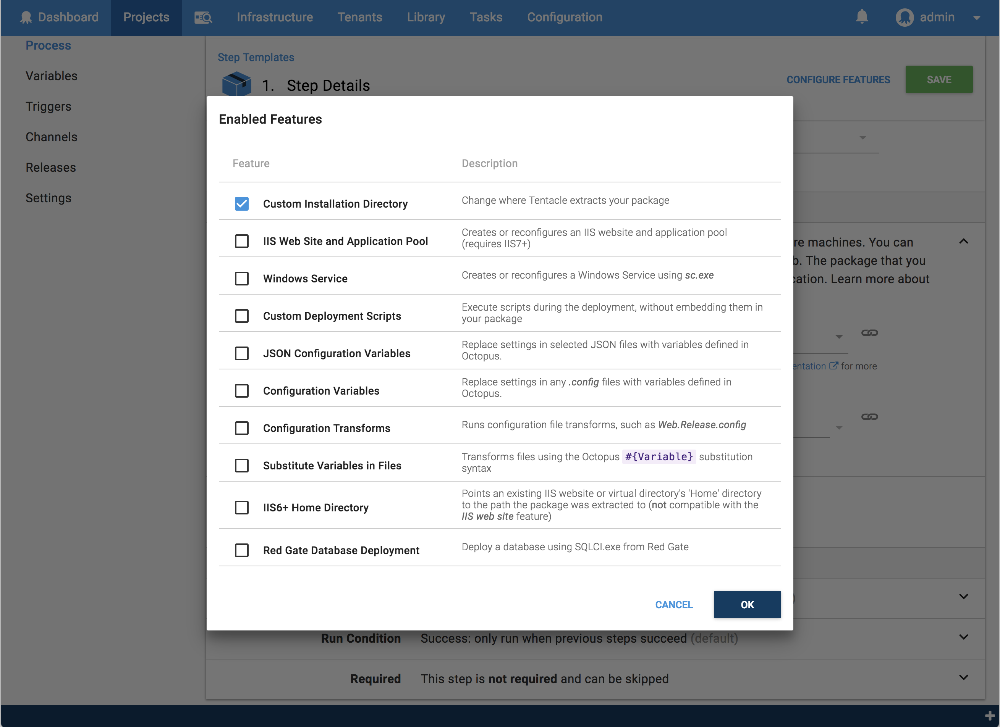

The Custom Installation Directory feature is one of the [configuration features](/docs/deployment-process/configuration-features/index.md) you can enable as you define the [steps](/docs/deployment-process/steps/index.md) in your [deployment process](/docs/deployment-process/index.md).

You can specify a custom installation directory for [package](/docs/deployment-examples/deploying-packages/index.md) and [IIS](/docs/deployment-examples/iis-websites-and-application-pools.md) steps. The custom installation directory feature deploys your package to a specific location on the target server. This feature helps when you are using a Content Management System (CMS) or another coordinating application that requires your files to be in specific locations.

Only use the *custom installation directory* feature when you really need it.

The standard convention for deploying packages eliminates problems caused by file locks and stale files being left in the deployment folder. It also provides smoother deployments and less downtime for Windows Services and Web Applications, so before you configure a custom installation directory, review the [package deployment convention](/docs/deployment-examples/deploying-packages/index.md) and [package deployment feature ordering](/docs/deployment-examples/deploying-packages/package-deployment-feature-ordering.md) to be certain that you need to configure a custom installation directory.

## Add a Custom Installation Directory

1. From your *Package Deploy* or *IIS* [step](/docs/deployment-process/steps/index.md), click the **Configure Features** link.
2. Check the **Custom Installation Directory** checkbox and click **Ok**.

When you return to your deployment process, you will see the **Custom Install Directory** option had been added to the **Features** section.

3. Add the [step](/docs/deployment-process/steps/index.md) details.
  - Enter a name for the step.
  - Select the targets where the step should run.
  - The [package feed](/docs/packaging-applications/package-repositories/index.md) where the package will be available.
  - The [package ID](/docs/packaging-applications/package-id.md) for the package to be deployed.
4. Enter the path for the **custom installation directory**, or you can insert a [variable](/docs/deployment-process/variables/index.md) if you have defined the path as a variable.

Defining a [variable](/docs/deployment-process/variables/index.md) with the directory path, means you can scope different values to different environments. For instance:

 | Variable Name    | Value     | Scope    |
 | ----------------------- | --------------- | -------- |
 | CustomInstallDirectory | \path\to\test\directory\ | Test |
 | CustomInstallDirectory | \path\to\production\directory\ | production |

 Read more about [variables](/docs/deployment-process/variables/index.md).

5. If you would like to remove existing files from the custom installation directory before your deployed files are copied to it, check the **Purge** checkbox.
6. If there are files you would like to exclude from the purge, add the files and directories you want to keep to the *Exclude from purge* list. This feature was introduced in `Octopus 3.13.8`.

The *Exclude from purge* list must be a newline-seperated list of file or directory names, relative to the installation directory. To exclude an entire directory specify it by name without a wildcard. Extended wildcard syntax is supported. For instance:

> appsettings.config
>
> Config
>
> Config\\*.config
>
> **\\*.config

7. Add any [conditions](/docs/deployment-process/conditions/index.md) you need to specify for the step, and then click **SAVE**.

Packages deployed to a custom installation directory are deployed in the same way as other package deploy steps. Read about [how packages are deployed](/docs/deployment-examples/deploying-packages/index.md#how-packages-are-deployed) for more information.
