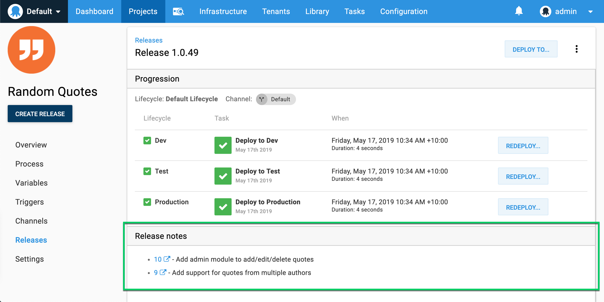

**Octopus 2019.4** introduced support to integrate Octopus with GitHub issues. The integration includes the ability to:
- Automatically add links to GitHub issues from releases and deployments in Octopus.
- Retrieve release notes from GitHub for automatic release note generation.

## How GitHub Integration Works


1. When you commit code, add a commit message containing one or more [GitHub issue references](#commit-messages).
2. The Octopus Deploy [plugin](/docs/packaging-applications/build-servers/index.md) for your build server [pushes the commits to Octopus](/docs/packaging-applications/build-servers/index.md#passing-build-information-to-octopus).  These are associated with a package ID and version (The package can be in the built-in Octopus repository or an external repository).
3. The GitHub issue-tracker extension in Octopus parses the commit messages and recognizes the issue references.
4. When creating the release which contains the package version, the issues are associated with the release.  These are available for use in [release notes](/docs/packaging-applications/build-servers/index.md#release-notes), and will be visible on [deployments](/docs/deployment-process/releases/deployment-notes.md).  




### Availability {#availability}

The ability to push the build information to Octopus, which is required for GitHub integration, is currently only available in the official Octopus plugins:

 - [JetBrains TeamCity](https://plugins.jetbrains.com/plugin/9038-octopus-deploy-integration)
 - [Atlassian Bamboo](https://marketplace.atlassian.com/apps/1217235/octopus-deploy-bamboo-add-on?hosting=server&tab=overview)
 - [Azure DevOps](https://marketplace.visualstudio.com/items?itemName=octopusdeploy.octopus-deploy-build-release-tasks)
 
We will be rolling this out for the Jenkins plugin soon.

## Configuring GitHub Integration

The following steps explain how to integrate Octopus with GitHub issues:  

1. [Configure your build server to push build information to Octopus.](#configure-your-build-server) This is required to allow Octopus to know which issues are associated with a release.  
2. [Configure the GitHub connection in Octopus Deploy.](#connect-octopus-to-github)

## Configure your Build Server to Push Build Information to Octopus {#configure-your-build-server}

To integrate with GitHub issues, Octopus needs to understand which issues are associated with a [release](/docs/deployment-process/releases/index.md). Octopus does this by inspecting commit messages associated with any packages contained in the release.

To supply the commit messages:

1. Install one of our official [build server plugins](#availability) with support for our metadata step.

2. Update your build process to add and configure the [Octopus Metadata step](/docs/packaging-applications/build-servers/index.md#build-information-step).

3. Ensure your Octopus Metadata step has set the 'Process commit messages' or 'Work Items Source' field.

## Connect Octopus to GitHub {#connect-octopus-to-github}

1. Configure the GitHub extension.

    In the Octopus web portal, navigate to **{{Configuration,Settings,GitHub Issue Tracker}}** and set the
    **GitHub Base URL**. This is required when resolving issue references that cross repository boundaries. For example, you might have a commit message with the following content:

    ```
    Fix bug with X

    Resolves MyOrg/SomeOtherRepo#1234
    ```

    `MyOrg/SomeOtherRepo#1234` refers to issue \#1234 in the `SomeOtherRepo` repository belonging to the `MyOrg` organization. While not all that common, this syntax is used when issues are tracked in a separate repo to the commit that resolves the issue.

    Ensure the **Is Enabled** property is set as well.

2. Configure the Release Note Options (optional).

    - **Username/password**: Set these values to allow Octopus to connect to GitHub and retrieve issue (work item) details from _private repositories_ when viewing packages or creating releases. If these are not provided, just the raw work item references will be used as the work item link descriptions. If they are provided the work item's title will be used as the work item link's description.

    The password should be a personal access token, rather than an actual password. You can create a token in your GitHub account settings in the 'Developer settings' area.

    - **Release Note Prefix**: If specified, Octopus will look for a comment that starts with the given prefix text and use whatever text appears after the prefix as the release note, which will be available in the [build information](/docs/packaging-applications/build-servers/index.md#build-information) as the issue's description. If no comment is found with the prefix then Octopus will default back to using the title for that issue.

    For example, a prefix of `Release note:` can be used to identify a customer friendly issue title vs a technical feature or bug fix title.

When configured, this integration will retrieve GitHub issue details and add details to your releases and deployments.

## Commit Messages {#commit-messages}

The parsing of the commit messages is based on the GitHub concepts around [closing issues using keywords](https://help.github.com/en/articles/closing-issues-using-keywords).

The Octopus extension looks for these same keywords, and ignores issue references where the keywords are not also present.

## Next

 - Learn about other [build information](/docs/packaging-applications/build-servers/index.md#build-information).
