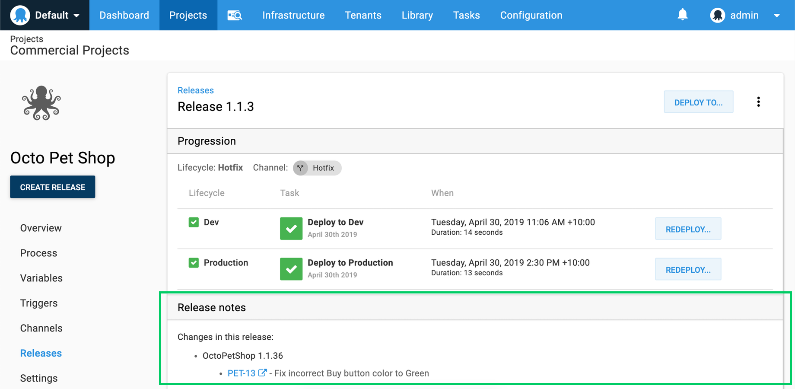
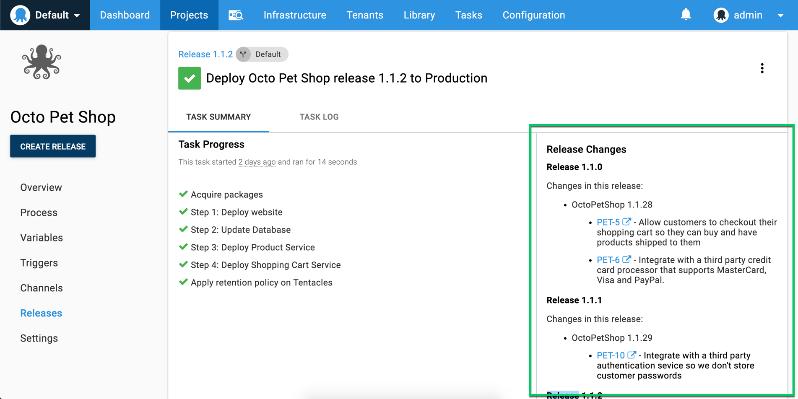

**Octopus 2019.4** introduced support to integrate Octopus with Jira Cloud and Jira Server. The integration adds links to Jira issues in the release details of your deployments, and adds release notes to Octopus from Jira to help automate the release note process. If you're using Jira Cloud, you can also view release and deployment details from Octopus directly in Jira issues, making it possible to see if the issue has been included in any deployments. 

## How Jira Integration Works 

1. Code is committed with a message containing one or more [Jira issue keys](https://confluence.atlassian.com/adminjiracloud/integrating-with-development-tools-776636216.html). 
2. The Octopus Deploy [plugin](/docs/packaging-applications/build-servers/index.md) for your build server [pushes the commits to Octopus](/docs/packaging-applications/build-servers/build-information.md#passing-build-information-to-octopus).  These are associated with a package ID and version (even if the package itself is pushed to an external repository, rather than the built-in Octopus repository). 
3. The Jira issue-tracker extension in Octopus parses the commit messages and recognizes the issue keys. 
4. When creating the release which contains the package version, the issues are associated with the release.
5. As the release is deployed to each environment, Octopus notifies Jira to update the issue. 

### Limitations

**Limited build server support**
The ability to push the build information to Octopus, which is required for Jira integration, is currently only available in the official Octopus [JetBrains TeamCity](https://plugins.jetbrains.com/plugin/9038-octopus-deploy-integration) and [Atlassian Bamboo](https://marketplace.atlassian.com/apps/1217235/octopus-deploy-bamboo-add-on?hosting=server&tab=overview) plugins.  We will be rolling this out to Azure DevOps and Jenkins plugins soon. 

**Jira cloud only**
The ability to update Jira issues with deployment information (i.e. step 5 above) is only available for Jira Cloud.
This is a Jira limitation; the [deployment module](https://developer.atlassian.com/cloud/jira/software/modules/deployment/) is not available for Jira Server. 

## Configuring Jira Integration

The following steps should be followed to integrate Octopus with Jira.

1. [Configure the Jira connection in Octopus Deploy.](#connect-octopus-to-jira)
2. [Configure your build server to push build information to Octopus.](#configure-your-build-server) This is required to allow Octopus to know which issues are associated with a release.  

##  Connect Octopus to Jira

This section describes how to configure Octopus Deploy to connect to Jira. 

Any Octopus instance, self-hosted or cloud-hosted, can be configured to use the Jira integration. The only network connectivity requirements are that your Octopus server and your browser can connect to the Jira instance.  Jira will never actively attempt to connect to Octopus. 

The process is slightly different depending on whether you are connecting to Jira Cloud or Jira Server. 

### Connecting Jira Server and Octopus Deploy

If you are using Jira Cloud, see [Connecting Jira Cloud and Octopus Deploy](#connecting-jira-cloud-and-octopus-deploy).

1. Configure the Jira extension in Octopus Deploy.

    In the Octopus web portal, navigate to **{{Configuration,Settings,Jira Issue Tracker}}** and enter the following values for your Jira instance:

    - **Jira Base URL**. This tells Octopus where your Jira instance is located and enables Octopus to render the links back to Jira issues. i.e., https://your-internal-jira-instance/

    Ensure the **Is Enabled** property is set as well.

2. In Octopus Deploy Configure the Release Note Options _(optional)_.

    - **Jira username/password**: Set these values to allow Octopus to connect to Jira and retrieve Jira issue (work item) details when viewing packages or creating releases. If these are not provided, just the raw work item references will be used as the work item link descriptions. If they are provided the work item's title will be used as the work item link's description.

    Note: This needs to be a username and password as Jira Server does not support API tokens.
    
    - **Release Note Prefix**: If specified, Octopus will look for a comment that starts with the given prefix text and use whatever text appears after the prefix as the release note, which will come through to the [release notes templates](/docs/packaging-applications/build-servers/metadata/release-notes-templates.md) as the work item link's description. If no comment is found with the prefix then Octopus will default back to using the title for that work item.

    For example, a prefix of `Release note:` can be used to identify a customer friendly issue title vs a technical feature or bug fix title.

When configured, this integration will retrieve Jira issue details and add details to your releases and deployments and generate release notes automatically. 

### Connecting Jira Cloud and Octopus Deploy

If you are using Jira Cloud, you can use the Octopus Deploy plugin for Jira, available from the [Atlassian Marketplace](https://marketplace.atlassian.com/apps/1220376/octopus-deploy-for-jira), to enable teams to view release and deployment details from Octopus directly in Jira issues. This section and the following steps describe how to configure this.

If you are using Jira Server, see [Connecting Jira Server and Octopus Deploy](#connecting-jira-server-and-octopus-deploy).

1. Install the Octopus Deploy plugin in your Jira Cloud instance.

    From the Atlassian Marketplace, add the [Octopus Deploy for Jira](https://marketplace.atlassian.com/apps/1220376/octopus-deploy-for-jira) app and click 'Get Started' to configure it. Alternately, the app is also available in Jira by navigation to **{{Jira Settings,Find new apps}}**.

    Note: Keep this configuration page open while you complete the next steps as you need to copy values between Octopus and Jira.

2. Configure the Jira extension in Octopus Deploy.

    In the Octopus web portal, navigate to **{{Configuration,Settings,Jira Issue Tracker}}** and copy the following values from the Jira App configuration page:

    - **Jira Base URL**. This tells Octopus where your Jira instance is located and enables Octopus to render the links back to Jira issues. i.e., https://your-jira-instance.atlassian.net.
    - **Jira Connect App Password**.

    Ensure the **Is Enabled** property is set as well.

3. In Octopus Deploy Configure the Release Note Options _(optional)_.

    - **Jira username/password**: Set these values to allow Octopus to connect to Jira and retrieve Jira issue (work item) details when viewing packages or creating releases. If these are not provided, just the raw work item references will be used as the work item link descriptions. If they are provided the work item's title will be used as the work item link's description.

    The password should be an API Token, rather than an actual password. You can create an API token from an Atlassian account in the 'Security' area.
    
    - **Release Note Prefix**: If specified, Octopus will look for a comment that starts with the given prefix text and use whatever text appears after the prefix as the release note, which will come through to the [release notes templates](/docs/packaging-applications/build-servers/metadata/release-notes-templates.md) as the work item link's description. If no comment is found with the prefix then Octopus will default back to using the title for that work item.

    For example, a prefix of `Release note:` can be used to identify a customer friendly issue title vs a technical feature or bug fix title.

4. Ensure the Octopus Server URL is set.

    If you are using Octopus Cloud, this value is automatically set for you. If you are not using Octopus Cloud, navigate to the **{{Configuration,Nodes}}** page and ensure you have set the Server URI field to your Octopus Server's base URL. i.e., https://my-company.octopus.app or https://my-company-internal-name
    Note: Octopus passes this value to Jira so it can build hyperlinks back to the deployments from the Jira UI. It never actually tries to connect to this URL itself.

5. Configure the Octopus plugin in Jira.

    Navigate to the **{{Configuration,Settings,Jira Issue Tracker}}** page in Octopus, copy the **Octopus InstallationID**, and add it to Jira App configuration.

6. In Octopus Deploy update your environment settings.

    Navigate to **{{Infrastructure,Environments}}** to map your Octopus environments to Jira environment types. This is required so Jira can understand Octopus environments and track issue progress.

    Note: Jira environment types are a fixed list that cannot be edited.

When configured, this integration will provide Jira with updates about the progress of Jira issues (work items) through the pipeline.

### Testing the integration

When the Jira issue tracker is enabled and configured with Connect App settings, you will see blocks similar to the following appear in the log during your deployments. These show the state updates Octopus is sending through to Jira, and if you expand them the details include information about the Jira issues for traceability.

:::hint
You must [configure your build server](#configure-your-build-server) to push commit information to Octopus. 
Without this, Octopus will not attempt to update Jira issues.
:::

The following illustrates where Octopus tried to send an _in_progress_, and then a _successful_, state change to Jira but was unable to.

_Note: This does not impact the Octopus deployment itself, it will still be considered a successful deployment._

When Octopus successfully sends state changes to Jira, the blocks will appear with green text just like the other blocks in the log.

##  Configure your build server to push build information to Octopus

To integrate with Jira issues Octopus needs to understand which issues are associated with a [release](/docs/deployment-process/releases/index.md).   
Octopus does this by inspecting commit messages associated with any packages contained in the release. 

To supply the commit messages: 

1. Install one of our official build server plugins with support for our metadata step. This list currently includes [JetBrains TeamCity](https://plugins.jetbrains.com/plugin/9038-octopus-deploy-integration) and [Atlassian Bamboo](https://marketplace.atlassian.com/apps/1217235/octopus-deploy-bamboo-add-on?hosting=server&tab=overview). We're currently working on adding support for the Azure DevOps and Jenkins plugins.

2. Update your build process to add and configure the Octopus Metadata step.

3. Ensure your Octopus Metadata step has set the 'Process commit messages' field.
