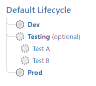
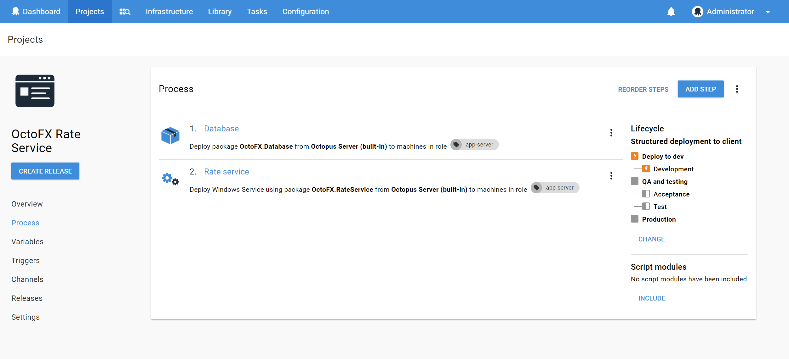

Lifecycles give you control over the way releases are promoted between environments. Lifecycles enable a number of advanced deployment workflow features:

- **Control the order of promotion**: for example, to prevent a release being deployed to *Production* if it hasn't been deployed to *Staging*.
- **Automate deployment to specific environments**: for example, automatically deploy to *Test* as soon as a release is created.
- **Retention policies**: specify the number of releases to keep depending on how far they have progressed through the lifecycle.

Lifecycles are defined by phases. A lifecycle can have one or many phases.

- Phases occur in order. One phase must have a complete successful deployment before the next phase will be deployed to.
- Phases have one or more environments.
- Environments in a phase can be defined as automatic deployment environments or manual deployment environments.
- Phases can have a set number of environments that must be released to, before the next phase is available for deployment.

## Managing Lifecycles

Lifecycles are managed by navigating to **{Library,Lifecyles}**.

### Create a New Lifecycle

1. From the Lifecycle page, click on the **ADD LIFECYCLE** button.
1. Give the Lifecycle a name and add a description.
1. Define the Retention Policy.

Retention policy defines how long releases are kept for, and how long extracted packages and files are kept on tentacles. The default for both is to keep all. Each phase will inherit the Lifecycle retention policy unless its own is defined.

Learn more about [Retention Policies](/docs/administration/retention-policies/index.md).

## Define the Phases

To add a phase click the **+ Add Phase** button.

Once you have named the phase, you can add environments.

You can define if this environment is automatically deployed to when the release enters the phase, or it is a manual deployment. Automatic deployment will send a release to the environment as soon as the phase becomes available for deployment. Automatic deployment environments are denoted by a lightning bolt icon next to the environment (see below).

:::hint
**Automatic Release Creation**
If you have a project setup with [Automatic Release Creation](/docs/deployment-process/releases/automatic-release-creation.md) and set your first phase and environment to automatically deploy, pushing a package to the internal library will trigger both a release, and a deployment to that environment. A hands off deployment triggered by a build server push!
:::

Once you have more than one environment defined in a phase you can gate the phase.

There is a setting for the phase called "Required to progress". This allows you to state how many environments within a phase must be deployed to before the next phase can be activated. If you have 5 environments and set this value to 2, only two environments must be deployed to before the next phase can be actively deployed to. If any environments within the next phase have automatic deployments set, they will trigger.

To configure this, click the **Change** button and select the option you would like to use.

Click **OK** to save your changes

Once all of your phases are defined your Lifecycle has a 'tree view'.

It shows the flow of the deployment in a visual way.

### Optional Phases {#Lifecycles-OptionalPhases}

Introduced in `3.12.8`, Optional Phases allow you to configure a phase to be optionally skipped when it is reached in the Lifecycle. This allows you to release to environments in the next phase without being required to deploy to _any_ in the optional phase. The standard Lifecycle progression and Automatic Deployment rules apply that determine when an optional phase is deployable.

This feature may be useful for scenarios such as the provision of a `Testing` phase that can optionally be deployed to, but isn't crucial to progressing on to `Production`. A previous work around for this feature would involve adding the `Testing` environment to the previous `Dev` phase with a specific minimum deployed environment count set, however this may result in the project being deployed to `Testing` _instead of_ the required `Dev` before progression.

### No Progression

If you want to be able to deploy to any environment at any time then simply create a single phase which has `Phase Progression` set to `All must complete` and includes all your environments.

## Lifecycles and Projects {#Lifecycles-LifecyclesandProjects}

A project can only be deployed to any environments defined in their lifecycle.

The overview for a project now shows where a release is up to on the deployment process.

You can see which environments have been released to and what is available for release via the Lifecycle tree.
