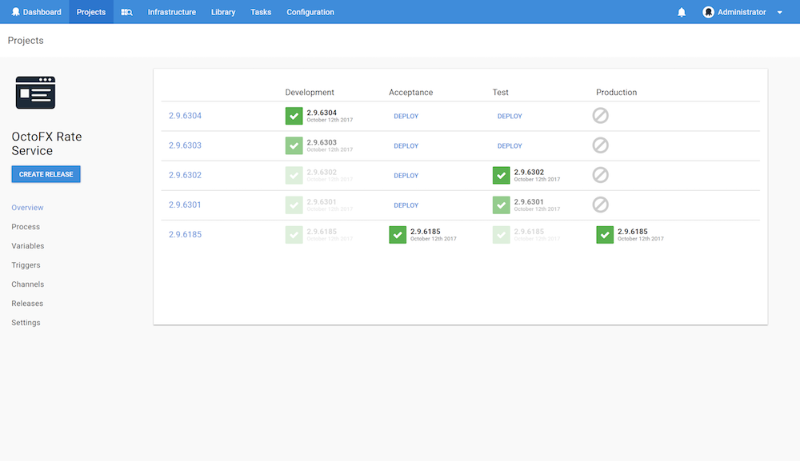

Projects let you manage multiple software projects from the **Octopus Web Portal**. For each project you have, you define a deployment process (the steps or actions required to deploy your software), configuration variables (for example, application settings, database connection strings), and the environments the software will be deployed to (for example, Development, Test, and Production).

Projects can consist of multiple steps and deliverable components, or they might only have a single step.

When deciding whether you need a single project or multiple projects, here are some points to consider:

- If the packages are delivered by different teams, or have different release schedules and deadlines, use separate projects.
- If the packages are always deployed at the same time, and there is good communication between the teams developing them (or they are the same team), use a single project.

For more options, see the [Coordinating Multiple Projects docs](/docs/deployment-process/projects/coordinating-multiple-projects/index.md).

## Managing Projects

Projects are managed from the **Projects** area of the **Octopus Web Portal**. From here you can see and manage all of your projects and [project groups](/docs/deployment-process/projects/index.md#project-groups).

The first time you navigate to the **Projects** area, you have the option to either [ADD PROJECT](/docs/deployment-process/projects/index.md#add-a-project) or [ADD GROUP](/docs/deployment-process/projects/index.md#add-a-project-group).

## Add a Project

Before you can define your deployment process, you must create a project.

1. Select **Projects** from the main navigation, and click **ADD PROJECT**.
1. Give the project a name that's meaningful to you, and anybody else who'll work on the project.
1. Add a description for the project.
1. If you want to change the [Project group](/docs/deployment-process/projects/index.md#project-group) select the project group from the dropdown menu.
1. If you want to change the [Lifecycle](/docs/deployment-process/lifecycles/index.md) select the lifecycle from the dropdown menu.
1. Click **Save** and you will be taken to the newly created project's overview page.

Now that you've created a project, you can configure your [Lifecycles](/docs/deployment-process/lifecycles/index.md) or start adding [steps](/docs/deployment-process/steps/index.md) to your project.

:::warning
If you are using Spaces as part of your Octopus Deploy installation, please remember that any projects you configure, will only be available to the space they are configured for.
:::

## Project Overview

The project overview page is where you access settings for the project and define the release process. After you've deployed a few releases, the overview page will give you a visual summary of the project's releases and which environments they've been deployed to.

## Project Settings

You can access the project settings menu from the project's overview page. From here it's possible to edit details about the project, such as the name, description, and the project group, add a logo, and control different aspects of the project's release behavior.

## Project Logo

If you are likely to have a lot of projects, in addition to giving them meaningful names you can also add a project logo, and make it easier to quickly locate them on the project's page.

1. From the project's overview page, select **settings**.
2. Click the **Logo** section of the settings page.
3. Click the file selector and select a file to upload.
4. Click **open** to upload your logo image, and click **Save**.

## Clone a Project

Projects can be cloned.

1. From the project's overview page, select **settings**.
2. Click the overflow menu, and select **Clone**.
3. Give the new project you are cloning from the original project a name.
4. Review the settings for the new project and when you are satisfied, click **SAVE**.

After you've cloned a project, you can see details about where your project was cloned from and which projects have been cloned from your project, by navigating to the project's overview page and selecting **Settings** and looking at the **Cloning History** section.

## Project Group

Project groups are a way of organizing your projects.

Note, the *Default Project* group contains all of the projects that have not been added to another group.

## Add a Project Group

1. From the Projects tab, click **ADD GROUP**.
1. Give the group a meaningful name and description.
1. Click *SAVE*.

When the group is first created, and doesn't have any projects associated with it, you will need to click **SHOW EMPTY GROUPS** on the projects page to see the group.

## Add Projects to a Group

After you have created a project group there are a number of ways you can add projects to the group:

- Navigate to the **Projects** page from the main navigation, find the group you want to add the project to, and click **ADD PROJECT**.
- Edit an existing project by navigating to the project, selecting **Settings** and editing the **Project Group**.
- Specify the **Project Group** under **Advanced Settings** when you create a new project.

### Edit or Delete Project Groups

To edit or delete a project group click the project group’s overflow menu and select **edit**. From there you can edit the groups name or description. If you need to delete the group, click the overflow menu again and select **Delete**.

## Project Permissions

For information about project permissions, see [managing users and teams](/docs/administration/managing-users-and-teams/index.md).
