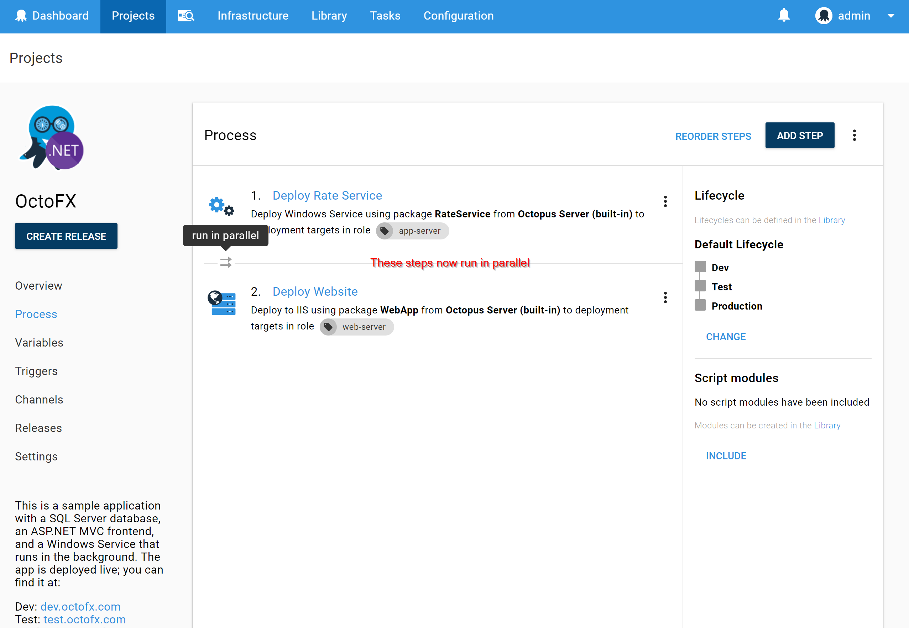

In Octopus 2.6 we added support to run steps in parallel. Before this feature, if you wanted to deploy many packages to different servers, you had to wait for step to finish before another one could start. By being able to run steps in parallel you can cut down your deployment time considerably in some scenarios.

To run steps in Parallel, simply create a deployment process with at least 2 steps:

Then edit the second step and change its *Start Trigger* to **Run in parallel with previous step.**

After you hit save, you'll notice that the two steps are now tied up together, meaning they will run at the same time during the deployment.

## Maximum Parallelism

To help your Octopus Server remain stable, we have defaulted the maximum number of steps you can run concurrently in any given deployment to `10`. You can configure any number of steps to run in parallel, and Octopus will roll through them as quickly as possible, but it will only run `10` of them at any one time by default.

### Overriding maximum parallelism

If you really want to change this behavior, you can! Set the `Octopus.Action.MaxParallelism` variable at the project-level to change how many steps will execute in parallel. This variable value controls:

1. the maximum number of steps which will execute at the same time during your deployment
2. the maximum number of deployment targets any step will be executed across at the same time

As we mentioned earlier, this acts like a window, where Octopus will roll through your parallel steps, and parallel deployment targets, up to `Octopus.Action.MaxParallelism` at any time.

## Steps in parallel on the same deployment target {#Runstepsinparallel-Stepsinparallelonthesametentacle}

For safety reasons, by default, Octopus runs only one step at the same time on a single deployment target. If you want to run multiple steps on a deployment target in parallel, [you'll need to enable that behavior](/docs/administration/run-multiple-processes-on-a-tentacle-simultaneously.md).

## Steps which depend on each other

Watch out not to run steps that depend on each other in parallel. If **Step2** depends on the success of **Step1**, it might not be the best idea to run them in parallel, but one after the other only if **Step1** was successful.

## Other ways to improve deployment time

We have written a comprehensive guide on [deployment performance](/docs/deployment-process/performance.md) which covers many other aspects which affect your deployment time in addition to running steps in parallel.
