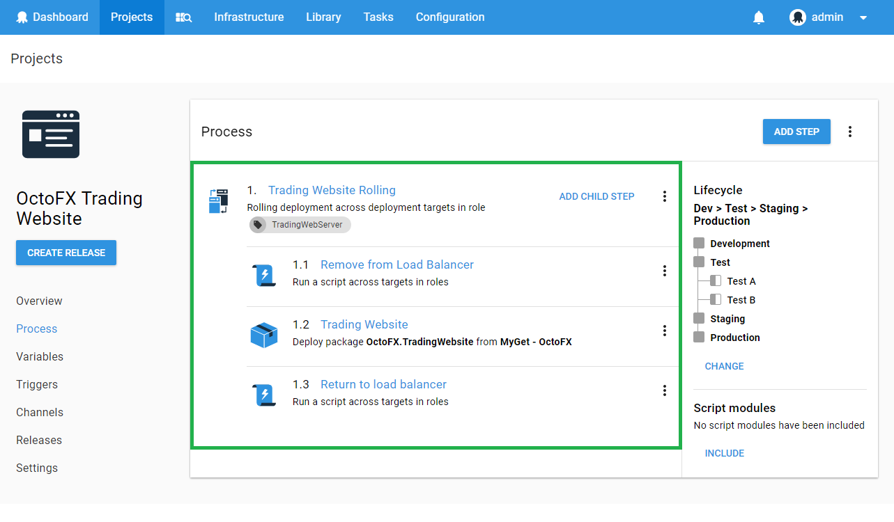

Steps contain the actions your deployment process will execute each time you create a release of your software to be deployed. Steps can contain multiple actions and deployment processes can include multiple steps. Steps are executed in sequence by default but they can be configure to [run in parallel](/docs/deployment-process/steps/conditions/run-steps-in-parallel.md).

Octopus includes built-in step templates that are powerful and flexible enough to handle the most common deployment scenarios. In addition to the built-in step templates, there are also [Community Step Templates](/docs/deployment-process/steps/community-step-templates.md) that have been contributed by the community. In addition to the built-in step templates and the community step templates, you can also use the built-in step templates as the base to create [custom steps templates](/docs/deployment-process/steps/custom-step-templates.md) to use across your projects.

## Adding Steps to Your Deployment Processes

1. Navigate to your [project's](/docs/deployment-process/projects/index.md) overview page by selecting **Projects** and clicking on the project you are working with.
2. Click the **DEFINE YOUR DEPLOYMENT PROCESS** button, and click **ADD STEP**.
3. Choose the step template you need.

At this point, you have the choice of choosing from the built-in **Installed Step Templates**, or from the [Community Contributed Step Templates](/docs/deployment-process/steps/community-step-templates.md). The built-in steps have been developed by the Octopus team to handle the most common deployment scenarios. If the built-in steps don't provide what you need, check the [community steps templates](/docs/deployment-process/steps/community-step-templates.md) or consider creating your own [custom step templates](/docs/deployment-process/steps/custom-step-templates.md).

4. Give the step a name.

Octopus community library integration makes it easy to find steps templates that work with the frameworks and technologies you use without the need for custom scripting.

Learn more about [Updating Step Templates](/docs/deployment-process/steps/updating-step-templates.md) and [Exporting Step Templates](/docs/deployment-process/steps/exporting-step-templates.md)

## Common Step Properties {#Deployingapplications-Commonstepproperties}

All steps have a name, which is used to identify the step.

:::success
**What&#39;s in a Name?**
Be careful when changing names! Octopus commonly uses names as a convenient identity or handle to things, and the steps and actions in a deployment process are special in that way. For example you can use [output variables](/docs/deployment-process/variables/output-variables.md) to chain steps together, and you use the name as the indexer for the output variable. For example: `#{Octopus.Action[StepA].Output.TestResult}`
:::

:::success
If a step you want isn't built-in you should check out the community contributed [step templates](/docs/deployment-process/steps/index.md). If you still don't find it, don't forget: *Octopus can do anything, as long as you can script the instructions*. Maybe you could contribute your scripts back to the community?
:::

## Example: A simple deployment process {#DeploymentProcesses-Example:Asimpledeploymentprocess}

In the example shown below there are three steps that will be executed from top to bottom. The first is a [manual intervention](/docs/deployment-process/steps/manual-intervention-and-approvals.md) which executes on the Octopus Server pausing the deployment until someone intervenes and allow the deployment to continue. This step will only execute when targeting the Production [environment](/docs/infrastructure/environments/index.md). The remaining steps both [deploy a package](/docs/deployment-process/steps/deploying-packages/index.md) and execute [custom scripts](/docs/deploying-applications/custom-scripts/index.md) on all of the [deployment targets](/docs/infrastructure/index.md) with the [role](/docs/infrastructure/target-roles/index.md) **web-server**.

## Example: A rolling deployment {#DeploymentProcesses-Example:Arollingdeployment} {#rolling-deployments}

Let's consider a more complex example like the one shown below. In this example we have configured Octopus to deploy a web application across one or more servers in a web farm behind a load balancer. This process has a single **step** and three **actions** which form a [rolling deployment](/docs/deployment-patterns/rolling-deployments.md).

