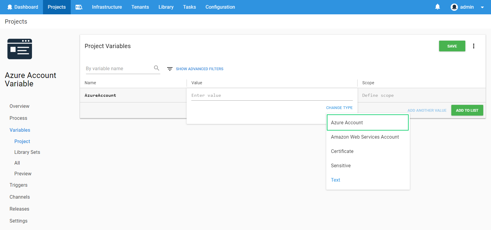
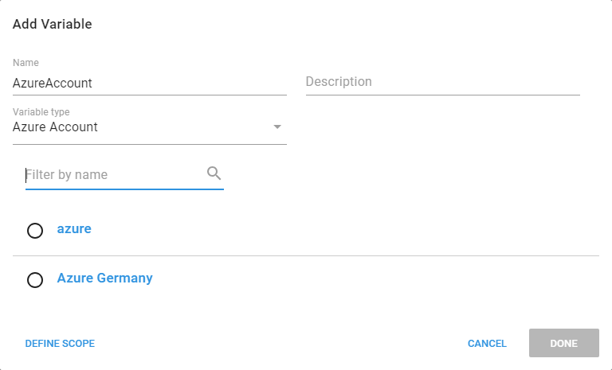

[Azure accounts](/docs/infrastructure/azure/creating-an-azure-account/index.md) can be referenced in a project through a project variable of the type `Azure Account`.

The [Azure PowerShell](/docs/deployment-examples/azure-deployments/running-azure-powershell/index.md) step will allow you to bind the account to an **Azure Account** variable, using the [binding syntax](/docs/deployment-process/variables/binding-syntax.md#Bindingsyntax-Referencingvariablesinstepdefinitions). By using an variable for the account, you can have different accounts used across different environments or regions using [scoping](/docs/deployment-process/variables/binding-syntax.md#Bindingsyntax-Referencingvariablesinstepdefinitions). 



The `Add Variable` window is then displayed and lists all the Azure accounts.

Select the account that was created in the previous step to assign it to the variable.



## Azure Account Variable Properties

The Azure Account Variable also exposes the following properties that you can reference in a PowerShell script:

### Service Principal

| Name and Description | Example |
| -------------------- | ------------------------|
| **`SubscriptionNumber`** <br/> The Azure Subscription Id | cd21dc34-73dc-4c7d-bd86-041284e0bc45 |
| **`Client`** <br/> The Azure Application Id | 57dfa713-f4c1-4b15-b21d-d14ff7941f7c |
| **`Password`** <br/> | correct horse battery staple |
| **`TenantId`** <br/> The Azure Active Directory Tenant Id | 2a681dca-3230-4e01-abcb-b1fd225c0982 | 
| **`AzureEnvironment`** <br/> The Azure environment | AzureCloud, AzureGermanCloud, AzureChinaCloud, AzureUSGovernment |
| **`ResourceManagementEndpointBaseUri`** <br/> Only set if explicitly set in the Account settings | https://management.microsoftazure.de/  |
| **`ActiveDirectoryEndpointBaseUri`** <br/> Only set if explicitly set in the Account settings | https://login.microsoftonline.de/ |

### Management Certificate

| Name and Description | Example|
| -------------------- | ------------------------|
| **`SubscriptionNumber`** <br/> The Azure Subscription Id | cd21dc34-73dc-4c7d-bd86-041284e0bc45 |
| **`CertificateThumbprint`** <br/> The thumbprint of the certificate | |
| **`ServiceManagementEndpointBaseUri`** <br/> | https://management.core.cloudapi.de |
| **`ServiceManagementEndpointSuffix`** <br/> | core.cloudapi.de  | 
| **`AzureEnvironment`** <br/> The Azure environment | AzureCloud, AzureGermanCloud, AzureChinaCloud, AzureUSGovernment |

### Accessing the properties in a script

Each of the above properties can be referenced in PowerShell. 

```powershell
# For an account with a variable name of 'azure account'

# Using $OctopusParameters
Write-Host 'AzureAccount.Id=' $OctopusParameters["azure account"]
Write-Host 'AzureAccount.Client=' $OctopusParameters["azure account.Client"]

# Directly as a variable
Write-Host 'AzureAccount.Id=' $azureAccount
Write-Host 'AzureAccount.Client=' $azureaccountClient
```
