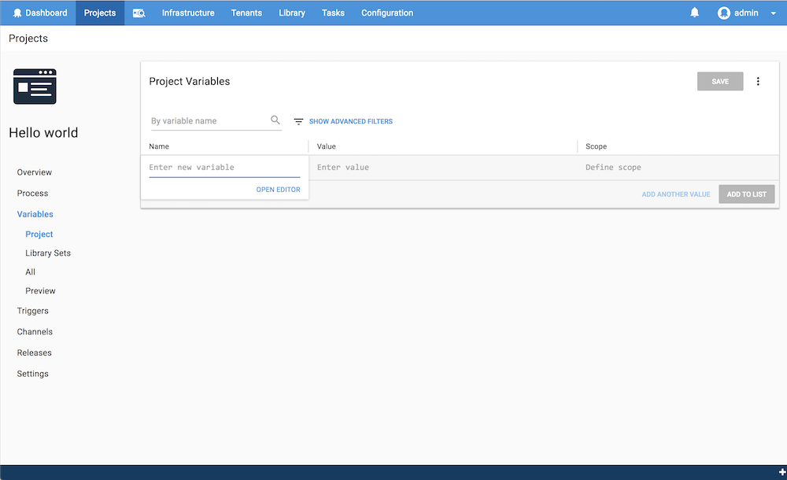
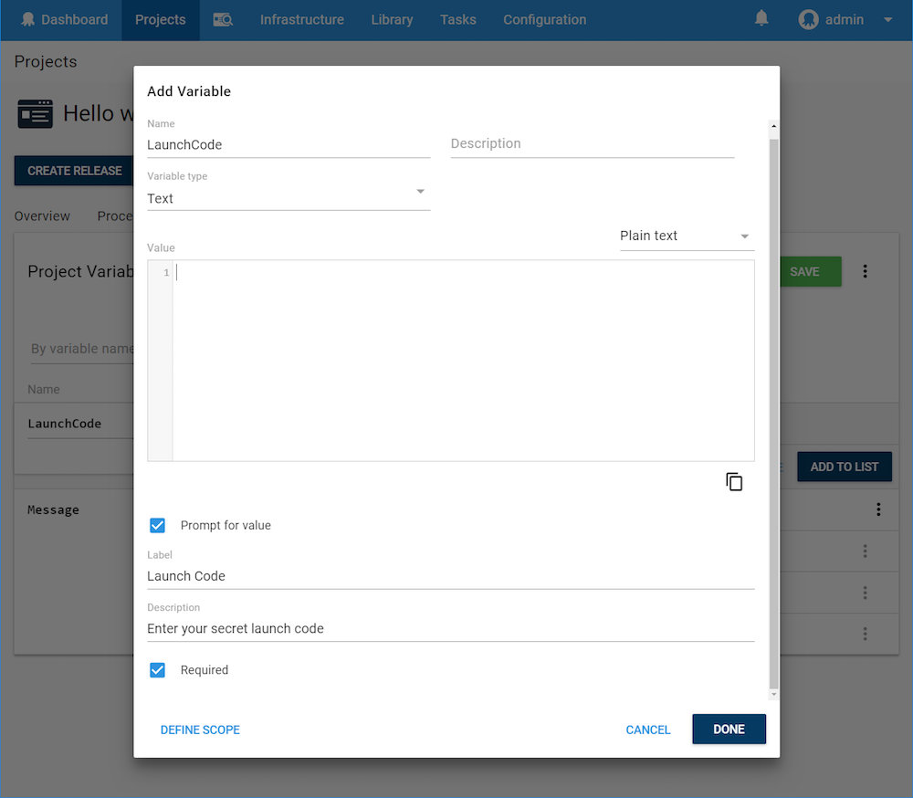
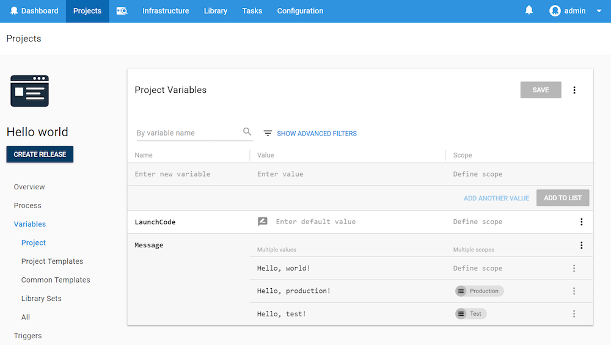
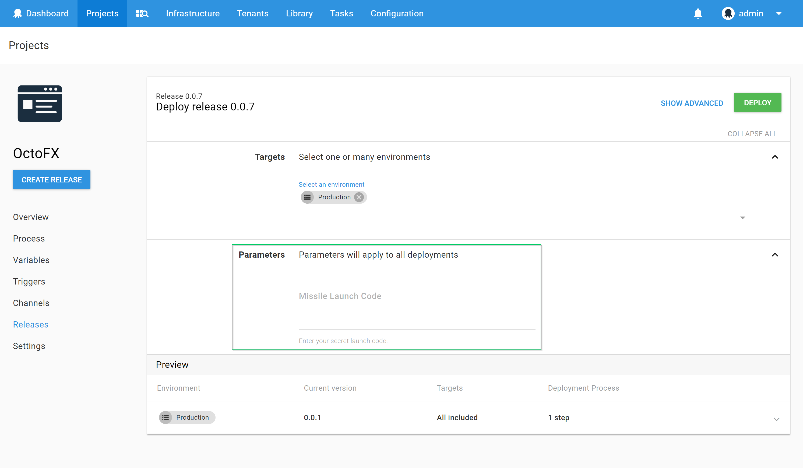

As you work with [variables](/docs/deployment-process/variables/index.md) in Octopus, there may be times when the value of a variable isn't known and you need a user to enter the variable at deployment time. Octopus can handle this using **Prompted variables**.

## Defining a Prompted Variable {#Promptedvariables-Definingapromptedvariable}

To make a variable a **prompted variable**, you need to enter the variable editor when you are creating or editing the variable. On any of the variable fields, click **OPEN EDITOR**:



When defining a prompted variable, you can provide a friendly name and description, and specify if the value is required. A required variable must be supplied when the deployment is created and must not be empty or white space.



You can identify prompted variables by looking for the icon next to the value:



## Providing a Value For the Variable {#Promptedvariables-Providingavalueforthevariable}

When deploying (not creating a release), you'll be prompted to provide a value for the variable:



A value can also be passed to a prompted variable when using `Octo.exe` through the `--variable` parameter of the [Create-Release](/docs/octopus-rest-api/octo.exe-command-line/create-release.md) or [Deploy-Release](/docs/octopus-rest-api/octo.exe-command-line/deploy-release.md) commands

```ruby
octo.exe create-release ... --variable "Missile launch code:LAUNCH123" --variable "Variable 2:Some value"
```

:::hint
Prompted variables can be combined with [sensitive variables](/docs/deployment-process/variables/sensitive-variables.md). They will appear with a password box when creating the deployment.
:::
