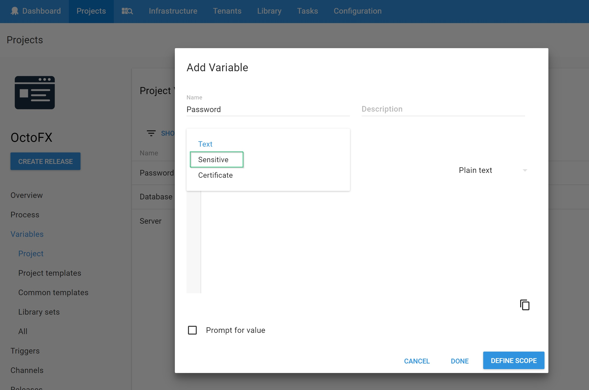

Most applications require some kind of configuration values that are considered as sensitive information that should be kept secret, but used as clear-text during deployment. Think of something like a password or API Key to an external resource. Octopus provides support for this scenario with Sensitive Variables.

## Configuring sensitive variables {#Sensitivevariables-Configuringsensitivevariables}

Variables such as passwords or API keys can be marked as being **sensitive**. Just like non-sensitive variables they can [reference other variables](docs/deployment-process/variables/binding-syntax.md#Bindingsyntax-Referencingvariablesinstepdefinitions) but be careful with any part of your sensitive variable that could [unintentionally be interpreted](docs/deployment-process/variables/sensitive-variables.md#Sensitivevariables-Avoidingcommonmistakes-SubstituionSyntax) as an attempted substitution.


:::hint
In Octopus version 3.11.0 we added an editor to the variables value section. Sensitive variables are now defined inside this section by selecting to enter a variable value, then selecting `Show editor`, see the below screenshot.
:::



## How Octopus handles your sensitive variables {#Sensitivevariables-HowOctopushandlesyoursensitivevariables}

:::hint
Learn more about [security and encryption](/docs/administration/security/data-encryption.md) in Octopus Deploy.
:::

When dealing with sensitive variables, Octopus will encrypt these values using **AES128 encryption** any time they are in transmission, or "at rest" like when they are stored in the Octopus database or staged on a deployment target as part of a deployment. You can use these sensitive values in your deployment process just like normal [variables](/docs/deployment-process/variables/index.md), with two notable exceptions:

- Once the variable is saved, Octopus will **never allow you to retrieve the value** via the [REST API](/docs/api-and-integration/api/index.md) or the Octopus web portal; and
- Whenever possible, Octopus will **mask these sensitive values in logs**.

:::success
**Use a password manager or key vault**
If you need to retrieve these values for other purposes, consider using a password manager or key vault. The support we provide in Octopus is to securely store values that will be used during deployment, and cannot be retrieved for any other purposes. There are plenty available, and some are free, like [KeePass](http://keepass.info/).
:::

## Avoiding common mistakes {#Sensitivevariables-Avoidingcommonmistakes}

Here are some common pitfalls to avoid:

- **Avoid logging your sensitive values**: you won't really get any benefit from logging your sensitive variables since they will be masked by Octopus. The masking is in provided in case a downstream system logs the sensitive value inadvertently logging it to the Octopus deployment logs.
- **Avoid short values:** only sensitive variables with length **greater than 3** characters will be masked. This is done to prevent false positives causing excessive obfuscation of the logs. Consider 8-30 characters depending on the requirements of your deployment.
- **Avoid common language**: see the example below of "broke", use a password generator with high entropy [like this one](http://passwordsgenerator.net/).
- **Avoid sequences that are interpreted by your scripting language of choice**: For example, certain escape sequences like `$^` will be misinterpreted by PowerShell potentially logging out your sensitive variable in clear-text.
- **Avoid sequences that are part of the variable substitution syntax** {#Sensitivevariables-Avoidingcommonmistakes-SubstituionSyntax}: For example, the sequence `##{` will be replaced by `#{` by logic that's part of [referencing variables](docs/deployment-process/variables/binding-syntax.md#Bindingsyntax-Referencingvariablesinstepdefinitions) so you would need to escape it by modifying it to be `###{` which will result in `##{`, see also [variable substitution syntax](docs/deployment-process/variables/variable-substitution-syntax.md).

- **Octopus is not a 2-way key vault**: use a password manager or key vault like [KeePass](http://keepass.info/).

## Logging {#Sensitivevariables-LoggingLogging}

:::success
Try to avoid logging sensitive values! Whilst Octopus will attempt to mask sensitive values, it is better there is no value to mask in the first place!
:::

Octopus/Tentacle will do its best to prevent sensitive values from inadvertently appearing in any logs. For example, if a custom PowerShell script accidentally did this:

```powershell
Write-Output "Hello, the password is $Password"
```

Octopus would mask the value from the deployment log, leaving:

```text
Hello, the password is *****
```

Note that this method isn't 100% foolproof. If your top secret password is "broke", and someone happened to deploy with a PowerShell script with:

```powershell
Write-Output "Or watch the things you gave your life to, broken"
```

Then the password might be given away when Octopus prints:

```powershell
Or watch the things you gave your life to, *******en
```

The obvious solution is: don't use passwords that are likely to be occur in normal logging/language, and avoid writing the values of your secure variables to logs anyway.
