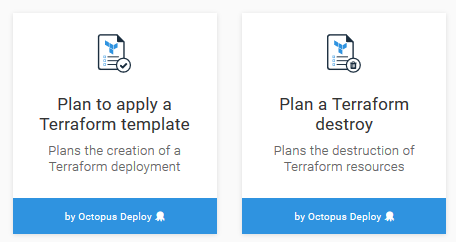
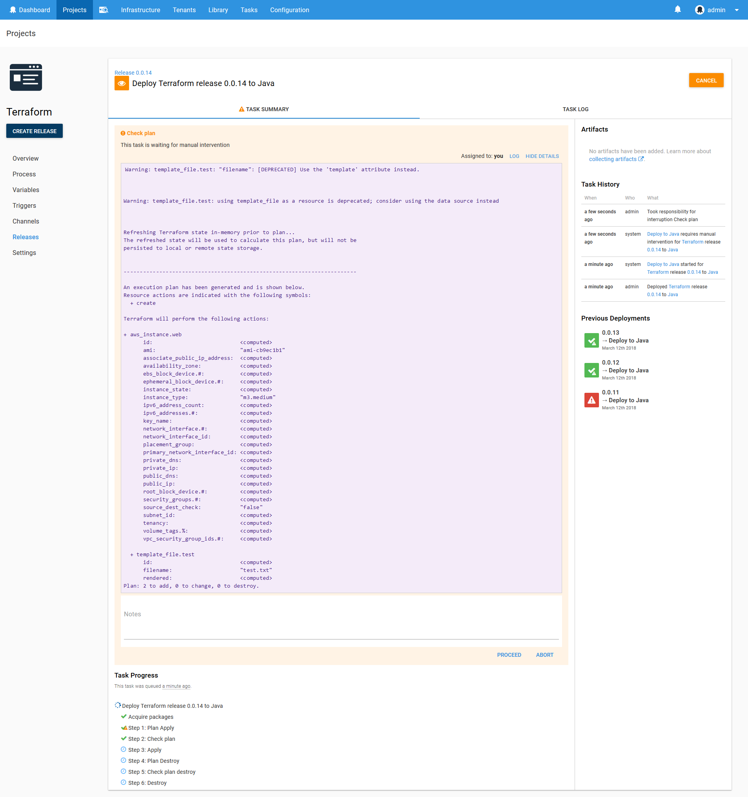

The Terraform `plan` command is used to identify changes that would be executed if a template was applied or destroyed. This information is useful to confirm the intended changes before they are executed.

Octopus has two steps that generate plan information: `Plan to apply a Terraform template` and `Plan a Terraform destroy`. As their names suggest, `Plan to apply a Terraform template` will generate a plan for the result of running `apply` on the template, while `Plan a Terraform destroy` will generate a plan for the result of running `destroy` on the template.



## Step options

The options for the planning steps are the same as those that are specified for the [Apply a Terraform template](../apply-terraform/index.md) and [Destroy Terraform resources](../destroy-terraform/index.md) steps. You can refer to the documentation for those steps for more details on the options for the plan steps.

:::warning
The plan steps do not support saving the plan to a file and applying that file at a later date. This means the plan information only makes sense when the same values are used in the plan and apply/destroy steps. Configuring shared variables for the step fields ensures that the same values will be used.
:::

## Plan outputs

When a plan steps is run, the output will include a line that looks like this:

```
Saving variable "Octopus.Action[Plan Apply].Output.TerraformPlanOutput" with the details of the plan
```

This log message indicates the output variable that was created with the plan text (the name of the step, `Plan Apply` in this case, will reflect the name you assigned to the plan step).

Selecting the **JSON output** option configures Terraform to generate JSON output for any planning steps. Each JSON blob is captured in a variable like `Octopus.Action[Plan Apply].Output.TerraformPlanLine[#].JSON`, with `#` replaced by a number.

This variable format can be used with Octostache loops:

```Powershell
#{each output in Octopus.Action[Plan Apply].Output.TerraformPlanLine}
Write-Host 'JSON Output line #{output}: #{output.JSON}'
#{/each}
```

The resource change counts are captured in the following variables:
* `Octopus.Action[Plan Apply].Output.TerraformPlanJsonAdd`
* `Octopus.Action[Plan Apply].Output.TerraformPlanJsonRemove`
* `Octopus.Action[Plan Apply].Output.TerraformPlanJsonChange`

## Manual intervention

Typically the result of a plan will be displayed in a Manual Intervention step. Because the plan text can contain markdown characters, the variable should be wrapped up in back ticks to display it verbatim.

    ```
    #{Octopus.Action[Plan Apply].Output.TerraformPlanOutput}
    ```


When run as part of a deployment, the plan output will be displayed like the image below.



### Special variables

Setting the variable `Octopus.Action.Terraform.CustomTerraformExecutable` to the absolute path of a custom Terraform executable will result in the step using that executable instead of the one shipped with Octopus. You can use this variable to force the Terraform steps to use a specific version of Terraform, or to use the x64 version if you wish.

For example, setting `Octopus.Action.Terraform.CustomTerraformExecutable` to `C:\Apps\terraform.exe` will cause the steps to execute `C:\Apps\terraform.exe` rather than the built in copy of Terraform.
