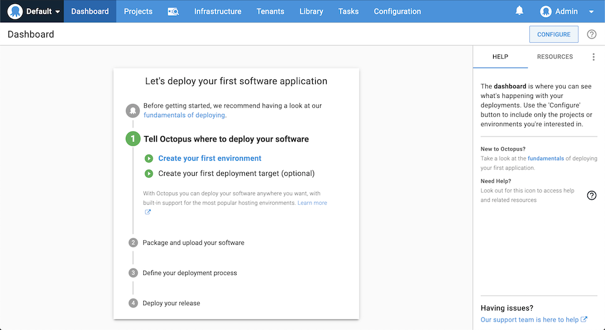

Whether you're self-hosting the Octopus Server or using Octopus Cloud, the Octopus Web Portal is where you manage your infrastructure, deployments, releases, runbooks, access the built-in repository, grant your team access to projects, and create your automated deployments and runbook processes.

## The Web Portal 

The first time you log into the Octopus Web Portal, you'll see some useful resources to help you navigate the portal and get started:

After you have configured your projects and deployments, the dashboard will display your projects and the status of the latest releases to the environments you've configured:

The **contextual help** panel on the right of the screen provides information about the screen you are currently viewing and the resources tab provides links to the related resources. You can hide or reveal the contextual help panel at any time by clicking the question mark icon.

The **Projects** tab is where you define your projects, deployments and runbook processes.

The **Infrastructure** tab is where you manage your environments and deployment targets.

The **Tenants** tab is where you can define multiple end users who will all receive versions of your software tailored to them.

The **Library** tab is where you can managed you assets, including the built-in repository.

The **Tasks** tab is where you can check on the status and history of the background tasks your Octopus Server is managing.

The **Configuration** tab is where you can access the audit logs, create teams, manage permissions, and alter the configuration of your Octopus Server.

:::success
Anything you can do with the Octopus Web Portal can also be done with the [Octopus REST API](/docs/octopus-rest-api/index.md).
:::

Next, learn how to [connect your deployment targets to Octopus](/docs/getting-started-guides/deployment-targets.md) or you can return to the [getting started guides](/docs/getting-started-guides/index.md).
