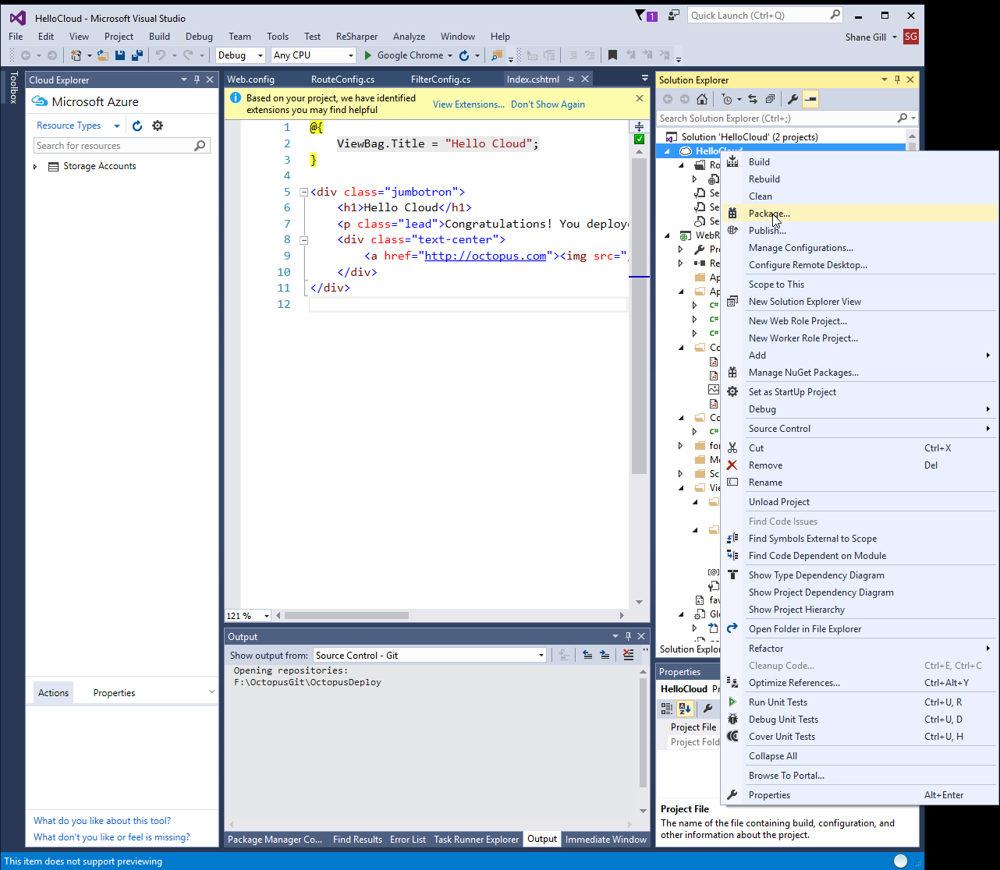
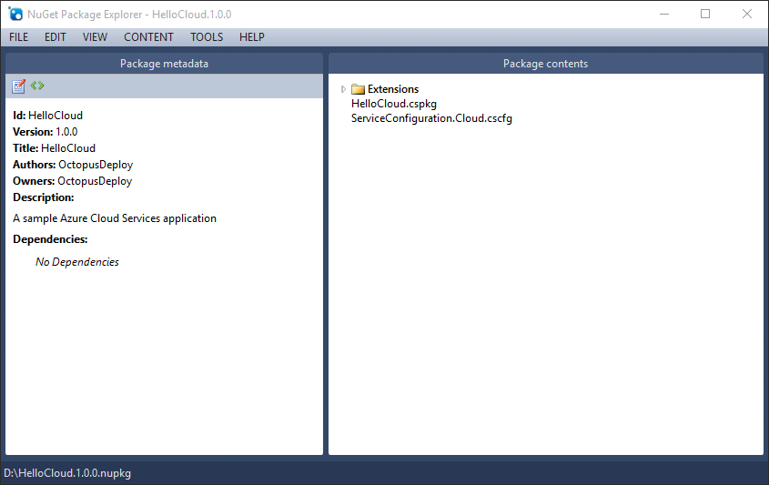

There are several core concepts involved in deploying Azure Web Apps.  Read on for more information.

## Packaging Cloud Services

In order to deploy Cloud Services they must be packaged into the Cloud Service .cspkg format and then packaged inside an Octopus compatible NuGet package.

### Generate a Cloud Service package {#CloudServiceConcepts-GenerateaCloudServicepackage}

Packaging into a .cspkg can be done in Visual Studio by right-clicking on the Cloud Service and selecting "Package...".  This action with generate a .cspkg and .cscfg file which can be deployed to Azure Cloud Services.



### Generate a NuGet package {#CloudServiceConcepts-GenerateaNuGetpackage}

Octopus requires additional metadata that is not present in the .cspkg file.  The .cspkg and .cscfg must be packaged into a NuGet package for use by Octopus. The easiest way generate a NuGet package is to use the [Octo.exe](/docs/packaging-applications/nuget-packages/using-octo.exe.md) command line tool:

**Packaging a Cloud Service with Octo.exe**

```powershell
Octo.exe pack --id=HelloCloud --basePath=C:\PathToAzureCloudService
```

Octo.exe will generate a NuGet package containing the .cspkg and .cscfg files:



Here is a sample Cloud Service NuGet package: [HelloCloud.1.0.0.nupkg](https://download.octopusdeploy.com/demo/HelloCloud.1.0.0.nupkg)

### Upload to a NuGet feed {#CloudServiceConcepts-UploadtoaNuGetfeed}

In order to make the NuGet package accessible to Octopus it needs to be uploaded to a [package repository](/docs/packaging-applications/package-repositories/index.md). The built-in Octopus package repository is accessible from Library > Packages and is a suitable place to upload your Cloud Service NuGet package:


## Cloud Service accounts {#CloudServiceConcepts-CloudServiceAccounts}

To set up a new Azure Management Certificate account, follow the directions in [Creating an Azure Management Certificate  Account](/docs/guides/azure-deployments/creating-an-azure-account/creating-an-azure-management-certificate-account.md).

## Cloud Service Deployment Step {#CloudServiceConcepts-CloudServiceDeploymentStep}

Octopus Deploy supports deployment of [Azure Cloud Services](http://azure.microsoft.com/en-us/services/cloud-services/). Note that the below deployment step was added in 3.1 and is not available in 3.0.

### Deployment Step {#CloudServiceConcepts-DeploymentStep}

Add a new "Deploy an Azure Cloud Service" step to your project. For information about adding a step to the deployment process, see the [add step](/docs/deploying-applications/adding-steps.md) section.


#### **Account** {#CloudServiceConcepts-Account}

Select the [account](#CloudServiceConcepts-CloudServiceAccounts) that Octopus will use to deploy the Cloud Service.

The 'Cloud service' and 'Storage account' fields will list the Cloud Services and Storage Accounts available to the Azure subscription associated with the chosen Account.

Refer to the [Azure documentation](https://azure.microsoft.com/en-us/documentation/) for instructions on creating a Cloud Service and Storage Account.

#### Slot {#CloudServiceConcepts-Slot}

You can choose to deploy to either the Staging or Production slots.

#### Swap {#CloudServiceConcepts-Swap}

The Cloud Service target may be configured to either:

- Always deploy
- Swap staging to production if possible

If 'Always deploy' is select, the package will always be deployed to the selected Slot.

If 'Swap staging to production if possible' is selected and the selected Slot is Production, then a swap will occur between Production and Staging (if there is a deployment in the Staging slot). See [VIP Swap](/docs/guides/azure-deployments/cloud-services/vip-swap.md) for more information on how to configure a VIP swap.

#### Instance count {#CloudServiceConcepts-Instancecount}

If you have scaled your Windows Azure service using the management portal (for example, changing the role count from 1 to 4), during a deployment Octopus can be configured to keep the existing instance counts rather than using the instance counts defined in your cloud service configuration file.

#### Variable-expressions {#CloudServiceConcepts-Variable-expressions}

Any of the fields above can be switched to use a custom expression by clicking the control next to the field:


### Deployment process {#CloudServiceConcepts-Deploymentprocess}

Deployment to an Azure Cloud Service target proceeds as follows (more details provided below):

1. Download the NuGet package from the NuGet server
2. Extract the NuGet package on the Octopus server to a temporary location
3. Extract the Cloud Service package (`.cspkg`) to a temporary location
4. Any configured or packaged `PreDeploy` scripts are executed
5. Variable substitutions in Cloud Service configuration file (`.cscfg`)
6. Substitute variables in files (if configured)
7. [XML configuration transformations](/docs/deploying-applications/configuration-files/index.md) (if configured) are performed
8. [XML configuration variables](/docs/deploying-applications/configuration-files/index.md) (if configured) are replaced
9. Any configured or package `Deploy` scripts are executed
10. Re-package the Cloud Service Package
11. Upload the Cloud Service Package to Azure Storage
12. Deploy the Cloud Service Package (see 'Customizing the deployment process' section below)
13. Any configured or packaged `PostDeploy` scripts are executed

#### Extract the Cloud Service Package {#CloudServiceConcepts-ExtracttheCloudServicePackage}

Cloud Service Package files are extracted during deployment, in order to make available features such as Configuration Transforms and Variable Substitution.

To extract the Cloud Service Package, it is first converted to the CTP format (also known as V20120315). This is the format described by Microsoft [documentation](https://msdn.microsoft.com/en-us/library/azure/jj151522.aspx), but is not used by default by the [CSPack](https://msdn.microsoft.com/en-us/library/azure/gg432988.aspx) utility (passing the `/useCtpPackageFormat` switch is required for this format to be used).  This is just an implementation detail, but the documented archive layout gives a good starting point to understanding the layout of the extracted package.

Setting the `Octopus.Action.Azure.LogExtractedCspkg` variable to `true` will cause the layout of the extracted package to be written into the Task Log. This may assist with finding the path to a particular file.

#### Variable substitutions in Cloud Service configuration file {#CloudServiceConcepts-VariablesubstitutionsinCloudServiceconfigurationfile}

Octopus will attempt to modify your `.cscfg` file. For example, take the following configuration:

```xml
<ServiceConfiguration serviceName="Humpty" xmlns="http://schemas.microsoft.com/ServiceHosting/2008/10/ServiceConfiguration" osFamily="2" osVersion="*" schemaVersion="2012-10.1.8">
  <Role name="Humpty.Web">
    <Instances count="1" />
    <ConfigurationSettings>
      <Setting name="Microsoft.WindowsAzure.Plugins.Diagnostics.ConnectionString" value="UseDevelopmentStorage=true" />
      <Setting name="HelloMessage" value="Hello world! This is a web role!" />
    </ConfigurationSettings>
  </Role>
  <Role name="Humpty.Worker">
    <Instances count="1" />
    <ConfigurationSettings>
      <Setting name="Microsoft.WindowsAzure.Plugins.Diagnostics.ConnectionString" value="UseDevelopmentStorage=true" />
      <Setting name="HelloMessage" value="Hello world! This is a worker!" />
    </ConfigurationSettings>
  </Role>
</ServiceConfiguration>
```

If a variable named `HelloMessage` is defined in your Octopus project variables, Octopus will automatically update it in the configuration file. You can also name the variable `Humpty.Worker/HelloMessage` to scope the setting to a specific web/worker role.

#### Customizing the deployment process {#CloudServiceConcepts-Customizingthedeploymentprocess}

The deployment is performed using a PowerShell script called `DeployToAzure.ps1`. If a file with this name exists within your NuGet package, Octopus will invoke it. Otherwise, Octopus will use a bundled version of the script as a default. You can **[view the bundled script here](https://github.com/OctopusDeploy/Calamari/blob/ce3b69e94b60c8c73619bc584eca52e11c68930a/source/Calamari.Azure/Scripts/DeployAzureCloudService.ps1)**, and use it as a basis for creating your own custom deployment script.

### PowerShell {#CloudServicedeploymentstep-PowerShell}

PowerShell executed against an Azure Cloud Service target will have the Azure PowerShell module loaded, and the subscription from the chosen account will be selected.
