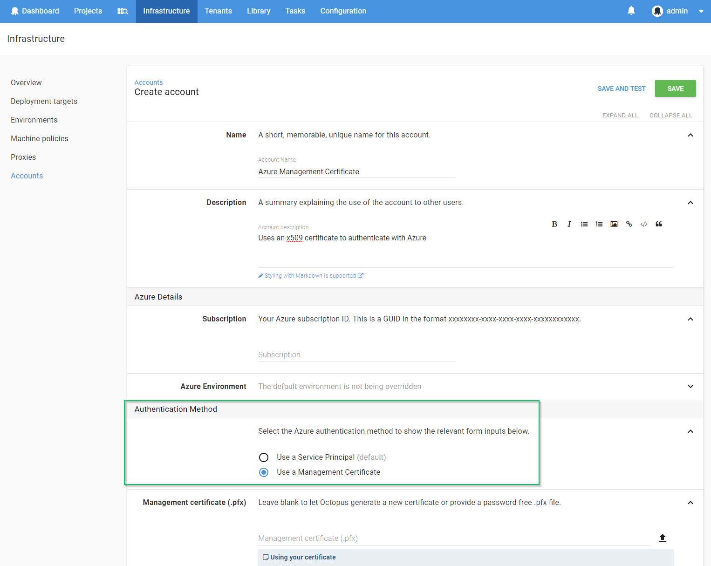
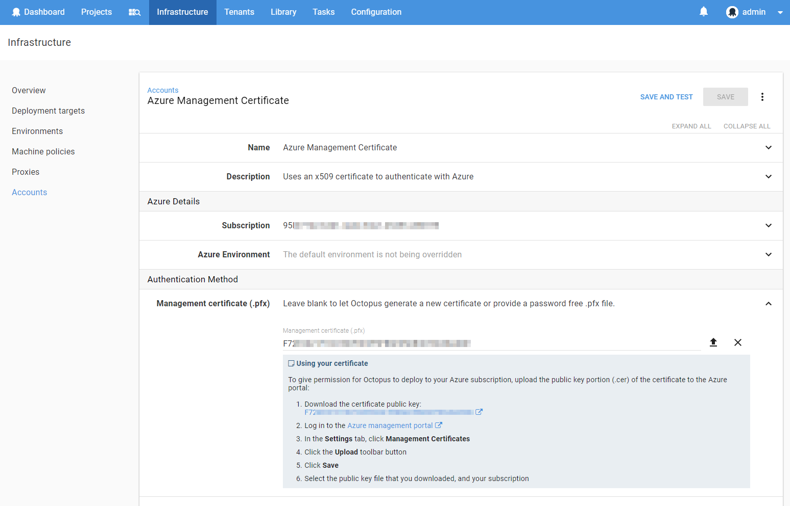

:::hint
**Azure Management Certificate Accounts Work with the Azure Service Management API only**
Prior to Octopus Deploy 3.3, [Azure Management Certificate Accounts](/docs/key-concepts/environments/accounts/azure-subscription-account.md) (previously known simply as "Azure Subscription Accounts") were the only type of Azure Account available.

Azure Management Certificate Accounts are only able to interact with the legacy Azure interface known as the "Azure Service Management API", which is used when Octopus deploys [Cloud Services](/docs/deploying-applications/deploying-to-azure/deploying-a-package-to-an-azure-cloud-service/index.md) and [Azure Web Apps](/docs/deploying-applications/deploying-to-azure/deploying-a-package-to-an-azure-web-app/index.md).

To interact with Azure Resource Manager (ARM), like when Octopus deploys a [Resource Group Template](/docs/guides/azure-deployments/resource-groups/index.md), you must use an [Azure Service Principal Account](/docs/guides/azure-deployments/creating-an-azure-account/creating-an-azure-service-principal-account.md).
:::

To create an Azure Management Certificate Account, select Management Certificate as the Authentication Method.



## Step 1: Subscription ID {#CreatinganAzureManagementCertificateAccount-Step1:SubscriptionID}

The Subscription Id can be found on the *Settings* tab of the Azure Management portal.


## Step 2: Management Certificate {#CreatinganAzureManagementCertificateAccount-Step2:ManagementCertificate}

When using *Management Certificate* as the *Authentication Method*, Octopus Deploy authenticates with Azure using an X.509 certificate.  You can either upload an existing certificate (`.pfx`), or leave the field blank and Octopus Deploy will generate a certificate. Keep in mind that since Octopus Deploy securely stores the certificate internally, there is no need to upload a password protected `.pfx` file. If you would like to use one that is password protected, you will need to first remove the password. This can be done with the following commands.

**Remove .pfx password**

```powershell
openssl pkcs12 -in AzureCert.pfx -password pass:MySecret -nodes -out temp.pem
openssl pkcs12 -export -in temp.pem -passout pass -out PasswordFreeAzureCert.pfx
del temp.pem
```

If you allow Octopus Deploy to generate your certificate, you will need to upload the certificate to the Azure Management Portal.  After clicking 'Save', the Account settings page provides instructions for downloading the certificate public-key from Octopus Deploy, and uploading it into the Azure Management Portal.


Uploaded certificates can be viewed on the 'Management Certificates' tab of the 'Settings' page in the Azure Portal.



The certificate will be named `Octopus Deploy -``{Your Account Name}.`

## Step 3: Save and Test {#CreatinganAzureManagementCertificateAccount-Step3:SaveandTest}

Click the Save and Test button and if the test succeeds, you should be able to configure Octopus to deploy anything to Azure via the Azure Service Management (ASM) API.

:::hint
**What is actually tested?**
When you click the Save and Test button, Octopus will attempt to use the account credentials to access the Azure Service Management (ASM) API and list the Hosted Services in that subscription. You may need to whitelist the appropriate IP Addresses for the Azure Data Center you are targeting. See [deploying to Azure via a Firewall](/docs/deploying-applications/deploying-to-azure/index.md) for more details.
:::
