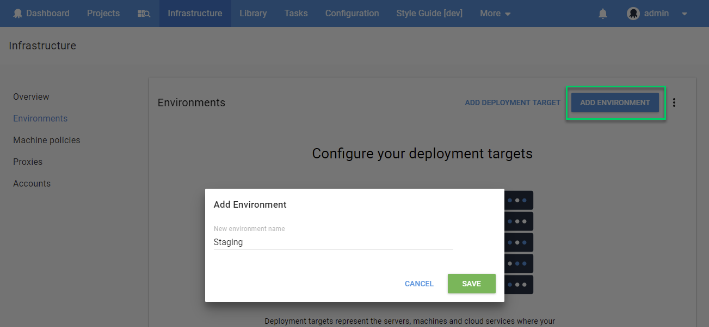

## Create an account {#GettingstartedwithAzureWebApps-Createanaccount}

To set up a new Azure account, follow the directions in [Creating an Azure Account](/docs/guides/azure-deployments/creating-an-azure-account/index.md).

## Create an environment {#GettingstartedwithAzureWebApps-Createanenvironment}

In order to deploy a Web App we require an Octopus environment to deploy to. Create a new environment called "Staging":

## Create a project {#GettingstartedwithAzureWebApps-Createaproject}

Now have the NuGet package we want to deploy, the account we are going to use for the deployment and an environment to deploy to.  Now all we need is a project to do all the work.  Create a new project:

In the project's process add a new Deploy an Azure Web App step. Select the NuGet package that you are going to deploy and the Azure account to use for the deployment. The settings for this step should look something like this:

Save the step and create a release for your project. Deploy the release to the Staging environment:

Grab a coffee and by the time you get back your application should be deployed to Azure Web Apps.
