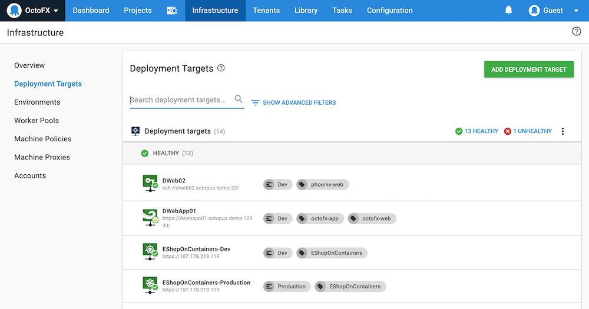

!include <deployment-targets>

You can manage your deployment targets by navigating to **{{Infrastructure,Deployment Targets}}** in the Octopus Web Portal:

From the **Deployment Targets** tab you can add new deployment targets, disable or delete deployment targets, check on the status of your targets, and run health checks.

## Adding Deployment Targets

Deployment targets are added in different ways, depending on the type of target you are adding and how the target will communicate with the Octopus Deploy server. For instructions, see:

- [Listening and Polling Windows Tentacles](/docs/infrastructure/deployment-targets/windows-targets/index.md)
- [Linux SSH Connection](/docs/infrastructure/deployment-targets/linux/index.md)
- [Linux Tentacle](docs/infrastructure/deployment-targets/linux/tentacle/index.md)
- [Azure Web App](/docs/infrastructure/deployment-targets/azure/web-app-targets/index.md)
- [Azure Cloud Service](/docs/infrastructure/deployment-targets/azure/cloud-service-targets/index.md)
- [Azure Service Fabric Cluster](/docs/infrastructure/deployment-targets/azure/service-fabric-cluster-targets/index.md)
- [AWS](/docs/infrastructure/deployment-targets/aws/index.md)
- [Kubernetes Target](/docs/infrastructure/deployment-targets/kubernetes-target/index.md)
- [Offline Package Drop](/docs/infrastructure/deployment-targets/offline-package-drop.md)
- [Cloud Regions](/docs/infrastructure/deployment-targets/cloud-regions.md)

## Accounts

In addition to the deployment targets above, you may also need to configure accounts to use in conjunction with your infrastructure during your deployments.

You can configure the following accounts:

- [Username and Passwords accounts](/docs/infrastructure/deployment-targets/username-and-password.md)
- [Tokens](/docs/infrastructure/deployment-targets/tokens.md)

## Target Roles {#target-roles}

!include <target-roles>

### Creating Target Roles {#create-target-roles}

Roles are created and saved in the database as soon as you assign them to a deployment target.

Decide on the naming convention you will use before creating your first target role as it's not possible to change the case after the role has been created, for instance, all lowercase to camel case.

1. Register a deployment target or click on an already registered deployment target and go to **Settings**.
2. In the **Target Roles** field, enter the target role you'd like to use (no spaces).
3. Save the target settings.

The role has been created and assigned to the deployment target and can be added to other deployment targets.

You can check all the roles assigned to your deployment targets from the **Infrastructure** tab.

## Dynamic Infrastructure

You can use scripts to create Azure Service Principal Accounts, Azure Web Apps, Azure Service Fabric, Azure Cloud Services and Kubernetes targets.

Learn about [Managing resources with scripts](/docs/infrastructure/deployment-targets/dynamic-infrastructure/index.md).

## See Also

 - [Machine Policies](/docs/infrastructure/deployment-targets/machine-policies.md)
 - [Proxy Support](/docs/infrastructure/deployment-targets/proxy-support.md)
