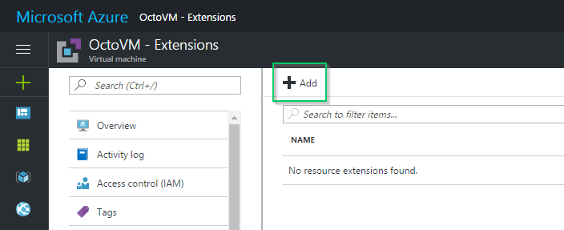
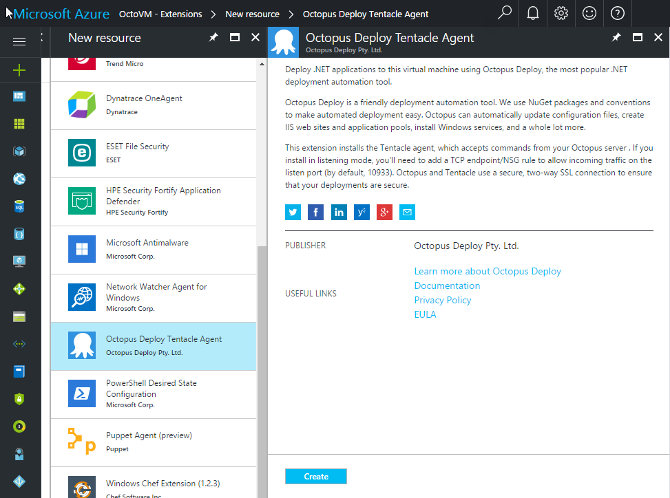
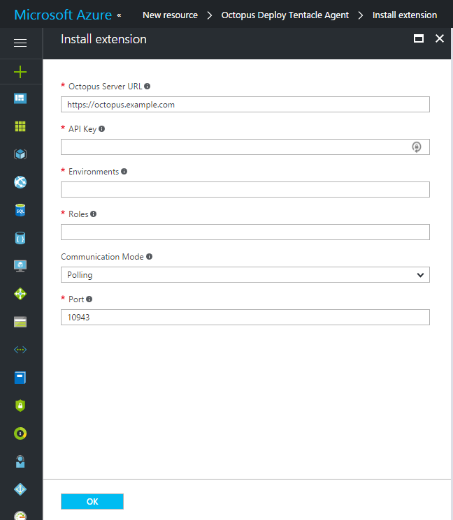

!include <azure-vm-extension-deprecated>

After creating a virtual machine on Azure using the management portal, browse to the virtual machine, then click on **Extensions**:

Click **Add** to add a new extension.

Select the **Octopus Deploy Tentacle Agent** extension, and click **Create**.

Fill in the settings, and click **OK**.

A deployment will be initiated which adds the extension to your virtual machine.

## Settings

The settings for the extension are:

**Octopus Server URL**: URL to your Octopus Server. You'll need your own Octopus Server (possibly also running on Azure), and you should [consider using HTTPS](/docs/security/exposing-octopus/expose-the-octopus-web-portal-over-https.md). The extension will use the [Octopus REST API](/docs/octopus-rest-api/index.md) against this URL to register the machine.

**API Key**: [Your API key](/docs/octopus-rest-api/how-to-create-an-api-key.md). This key will only be used when registering the machine with the Octopus Server; it isn't used for [subsequent communication](/docs/security/octopus-tentacle-communication/index.md).

**Environments**: The name of the [environment](/docs/infrastructure/environments/index.md) to add the machine to. You can specify more than one by using commas; for example: `UAT1,UAT2`.

**Roles**: The roles to give to the machine. Again, separate them using commas for more than one, for example: `web-server,app-server`.

**Communication Mode**: How the Tentacle will communicate with the server - it will either use **Polling** to reach out to the server, or **Listening** to wait for connections from the server.

**Port**: The port on which the server should contact the Tentacle (if Tentacle is set to Listen), or the port on which the Tentacle should contact the server (if in Polling mode). in Polling mode, the default value is 10943. In Listening mode, the The default value is 10933.

**Public Hostname Configuration**: When in **Listening** mode, you can specify how the Server should address the Tentacle. You can specify **Public IP** to use the public IP address (as returned from <https://api.ipify.org>), **FQDN** to use the fully qualified domain name (useful for Active Directory networks), **ComputerName** to use the local hostname, or **Custom** to specify your own value.

**Custom Public Hostname**: When in **Listening** mode, and the **Public Hostname Configuration** is set to **Custom**, you can supply the dns name/ip address the Server should use.

After entering the extension settings, click **OK**, and the extension will be installed.

After a few minutes, the machine should appear in the environments tab of your Octopus Server. If it doesn't, please read the [Diagnosing issues](/docs/infrastructure/deployment-targets/windows-targets/azure-virtual-machines/diagnosing-issues.md) section.

:::hint
If you need the ability to customize more of the installation, the [CLI](via-the-azure-cli.md), [PowerShell](via-powershell.md) and [ARM Template](via-an-arm-template.md) methods expose more options than the Azure Portal. For even more customization, you might want to consider using the [Azure Desired State Configuration (DSC) extension](https://docs.microsoft.com/en-us/azure/virtual-machines/virtual-machines-windows-extensions-dsc-overview) in conjunction with the [OctopusDSC](https://www.powershellgallery.com/packages/OctopusDSC) resource.
:::
