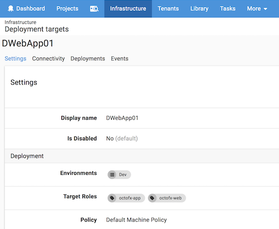

All of the environments that you work with, for instance, Development, Test, or Production, will likely have multiple deployment targets. In production, your web sites and Windows Services might run on different physical servers; perhaps dozens of them. However, unless you are extremely lucky, it's unlikely that you have the budget to have an equal number of servers in any of your pre-production environments. When testing your software in a test environment, you might only have a single virtual machine which will run all of the web sites and services on the same machine.

Octopus handles these differences by applying roles to the deployment targets within your environments.

For instance, you might the following roles:

- web-server
- app-server
- db-server

Instead of saying:

> The trading website ASP.NET application should be deployed to PWEB01, PWEB02, ...

We say:

> The trading website ASP.NET application should be deployed to machines that are tagged with the **web-server** role.

In production, perhaps you have 10 machines with the web-server role. In staging, perhaps you have only 4. In test, perhaps there is a single machine. Roles make defining your deployment process much easier.

You can define as many environments, deployment targets, and roles as you need; it all depends on how your applications are deployed.

## Creating a Role and Assigning it to a Deployment Target {#MachineRoles-CreatingaroleandassigningittoaTarget}

Roles are created and saved in the database the moment you assign them to a deployment target. Decide on the naming convention you will use, before creating your first role as it is not possible to change the case after the role has been created, for instance, all lowercase to camel case.

1) Register a deployment target or click on an already registered target and go to **Settings.**

2) On the **Roles** field, type in a single word without spaces and hit enter. This word will be the role name.

3) Save the target settings.

The role has been created and assigned to the deployment target and is available to other targets.

On the screenshot below we've created the roles **octofx-app** and **octofx-web** and assigned them to our target **DWebApp01**.

You can check all the roles assigned to your machines from the **Infrastructure** screen.
