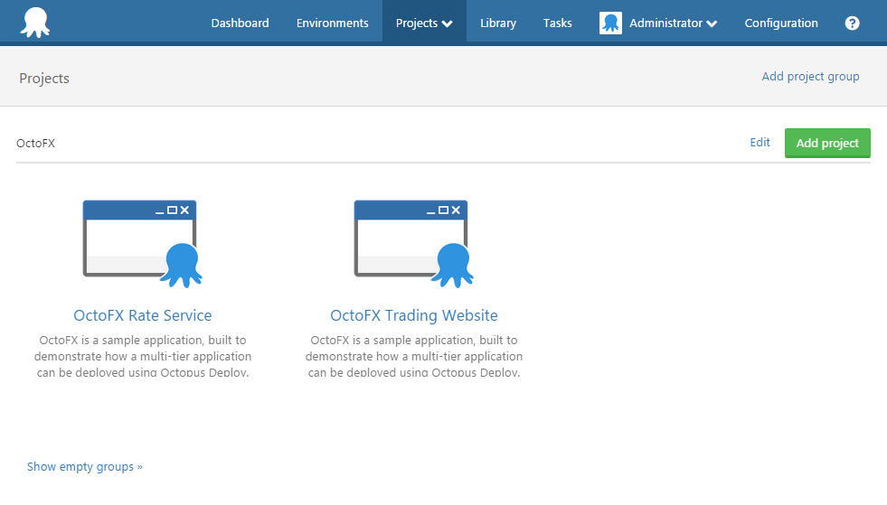
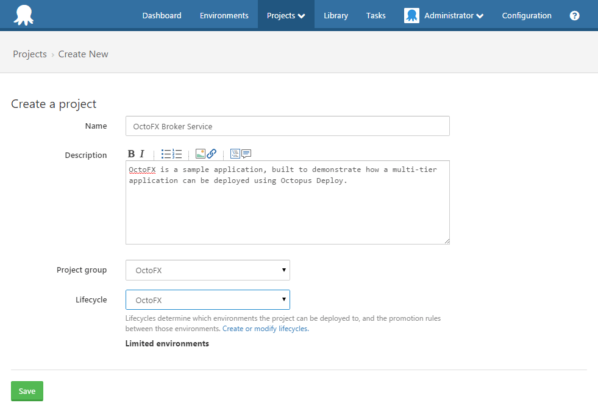
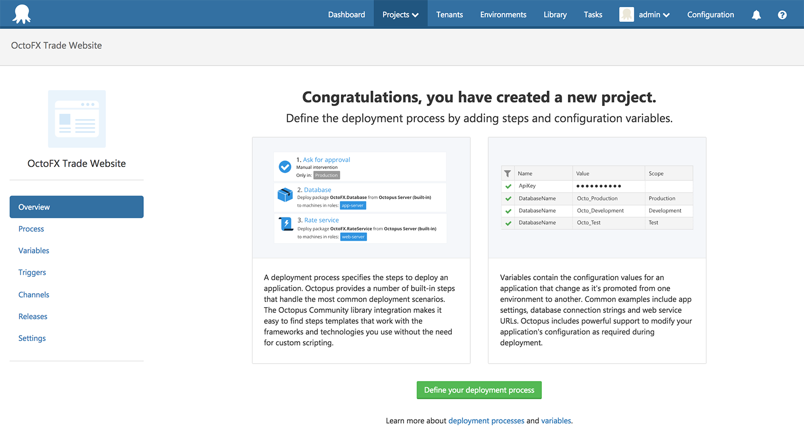

Once you've [packaged your applications for deployment](/docs/packaging-applications/index.md), and defined the [environments](/docs/key-concepts/environments/index.md) that you are deploying to, you will need to create projects.

A project is a collection of [deployment steps](/docs/deploying-applications/index.md) that you want Octopus and Tentacle to run, and [variables](/docs/deploying-applications/variables/index.md) to configure it. A project is like a recipe - you define how your software is deployed, and then you create many releases to deploy different versions of that software.

## Managing projects {#Projects-Managingprojects}

You can add or view a list of all projects by going to the **Projects** tab and choosing **All** within the Octopus Web Portal.

The Projects tab presents a list of all projects grouped in their project groups.

You can create projects by clicking on the **Add project** button.

## Project permissions {#Projects-Projectpermissions}

You can control who has access to view or edit environments, as well as who has access to deploy to environments, by assigning users to Teams and assigning roles to those teams. For more information, see the section on [managing users and teams](/docs/administration/managing-users-and-teams/index.md).

:::hint
**Assigning projects to project groups**
To set retention policies and the environments a project can be deployed to, as well as to apply some grouping in the dashboard and elsewhere, projects can be [assigned to project groups](/docs/key-concepts/project-groups.md).
:::

## Do I need one or many projects?  {#Projects-DoIneedoneormanyprojects?}

It can be hard to decide whether to create lots of single-step projects in Octopus, or one big project. Here are two rules of thumb that may help:

- If the packages are delivered by different teams, or have different release schedules and deadlines, use separate projects
- If the packages are always deployed at the same time, and there is good communication between the teams developing them (or they are the same team), use a single project

**Example: OctoFX**

For example, the OctoFX example organization might be split into two delivery teams. One team builds a currency rate service, and another team builds the online trading website. Each team works to different deadlines and release schedules. For them, it makes sense to use two separate projects:

Alternatively, there may only be one team, who work on both the rate service and the trading website together. When a new version of the product is released, they will always deploy both at the same time. In this example, it makes sense to use a single project, with multiple steps:

## Cloning projects {#Projects-Cloningprojects}

You can clone a project by opening an existing project, and then selecting the settings tab and clicking the **Clone** link on the right side bar

On the **Create project** page you will now see an additional control specifying what project is used to clone from

Cloning a project will copy the deployment process and variables, but not the release history.
