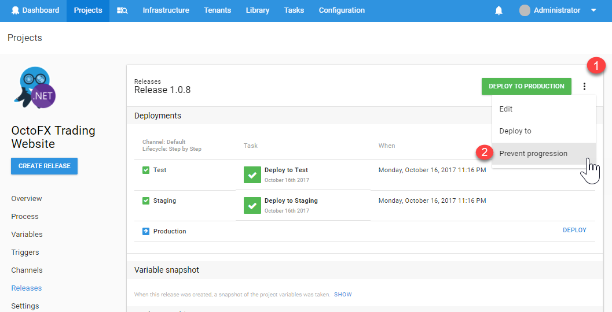
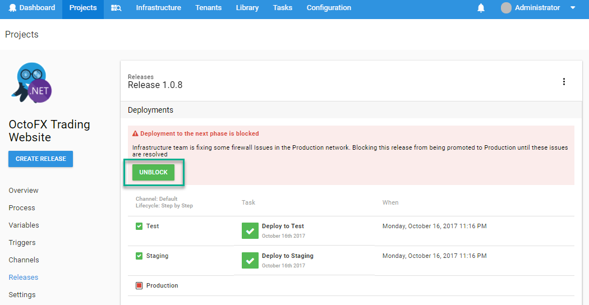

Sometimes you may want to block your Project from deploying a specific Release. Perhaps you just want to temporarily block the Release, or you need to fix some variables before proceeding? Perhaps the Release itself is bad, but you don't want to delete the Release for auditing purposes?

The basic rules that apply when a release is blocked is as follows:
- If a phase has _no successful_ deployments then _no_ deployments to that phase can take place.
- If a phase has _only failed_ deployments, then _no_ deployments to that phase can take place.
- If a phase has _a successful_ deployment, then deployments to any environment in that phase _can_ take place.
- The first phase can always be deployed to even if the release is blocked before any deployment has taken place.
- Optional phases are treated like any other phase and so the above rules apply, even if its previous phase is complete.
- The above rules apply to each Tenant individually with respect to the relevant phase that they have reached.

Essentially, a blocked release is about blocking progression to undeployed phases, not about deploying to phases you have already started deploying to. This allows you to, for example, block deployments to the Production phase due to a problem uncovered in UAT-1, while still deploying to UAT-2 for further analysis.

## Block deployment {#BlockingDeployments-BlockDeployment}

You can block a Release of a Project from being used in any future deployments, no matter which phase the Release is currently on. This can be done from the release page of the project you're wishing to block.

Select the option to "**Block deployment**."

Input a reason why you're blocking it, so your team is aware and on the same page, and hit "**Block**."

## Resolve and unblock {#BlockingDeployments-ResolveandUnblock}

Once you're happy with the deployment process continuing, go back to the release page of the project, and select "**Resolve and unblock**."

## Permissions {#BlockingDeployments-Permissions}

There are two permissions required for the act of blocking and unblocking your deployments, which you'll have to assign to the user performing the task:

- **DefectReport**: Allows a user to block a release from progressing to the next lifecycle phase.
- **DefectResolve**: Allows a user to unblock a release so it can progress to the next phase.

:::hint
**What is a defect?**
When you block a release from being deployed, we actually use the Octopus API to create a "Defect" for that Release with the reason you provided for blocking future Deployments from using that Release.
:::

## Learn more

- [Managing roles and permissions](/docs/administration/managing-users-and-teams/user-roles.md).

