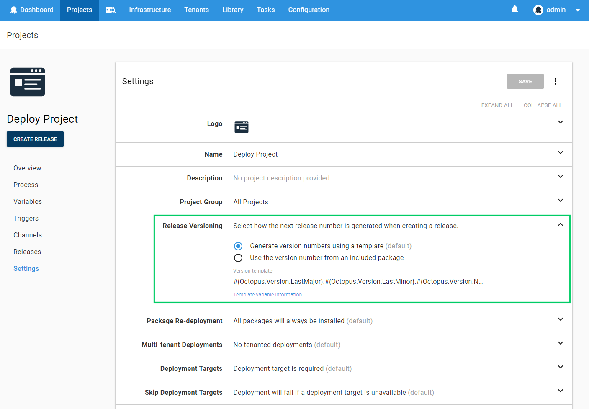

Under Project settings there's a section for Release Versioning where you can select how the next release number is generated when creating a release.

    
You can use variables from the project (un-scoped or scoped only to a channel). In addition, some special variables are provided - example:
    

    <pre>1.2.#{"{"}Octopus.Version.NextPatch{"}"}-pre</pre>
    
These special variables take the form:

    <pre>Octopus.Version.(Last|Next)(Major|Minor|Patch|Build|Revision|Suffix)</pre>
    
If you are using channels, channel-specific special variables are
        also available: 

    <pre>Octopus.Version.Channel.(Last|Next)(Major|Minor|Patch|Build|Revision|Suffix)</pre>
    
Version components from other channels in the project can be
        referenced using the channel name as the index:

    <pre>Octopus.Version.Channel[ChannelName].(Last|Next)(Major|Minor|Patch|Build|Revision|Suffix)</pre>
    
The channel name can also be used (generally as part of the
        suffix):

    <pre>Octopus.Release.Channel.Name</pre>
    
The version can also include Octopus <em>semantic version mask</em> characters
        i and c referring to the <strong>i</strong>ncremented
        and <strong>c</strong>urrent values of the version, respectively. For example:
    

    <pre>2.1.c.i</pre>
    
Finally, date fields can be also be used, for example: 

    <pre>#{"{"}Octopus.Date.Year}.#{"{"}Octopus.Date.Month{"}"}.#{"{"}Octopus.Date.Day{"}"}</pre>
    
These take the form:

    <pre>Octopus.Date.(Day|Month|Year|DayOfYear) Octopus.Time.(Hour|Minute|Second)</pre>

